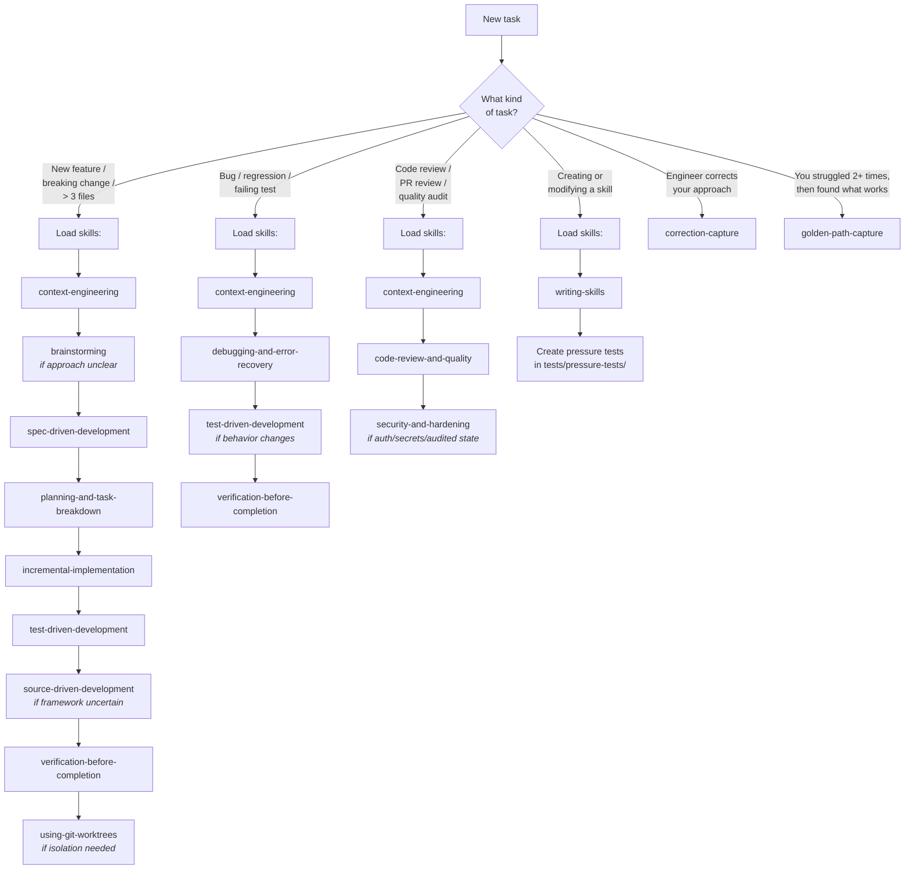
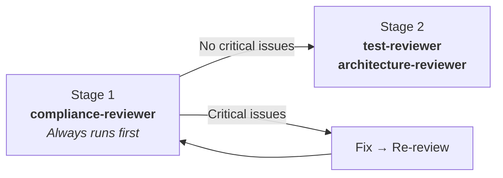

# MTK Agent Routing Guide

The compact routing tables live in `AGENTS.md` (the canonical constitution). This guide holds
the detail: the full decision tree, the composition of every routed workflow, the skills the
model loads on its own, and the mechanics behind review output, evals, and reference loading.

Read this when you need to know *how* a workflow composes. For "which command do I run", the
tables in `AGENTS.md` are enough.

---

## Routing Decision Tree

---

## Routed Workflow Skills

Not directly invocable; reached via `/mtk <description>`.

| Workflow | Composition |
|:---|:---|
| fix | debugging/error recovery → focused verification |
| batch-fix | corrective batch of multiple small independent fixes (>3 files, no new contract) → findings list + spec stub + one gate → per-finding TDD → inline impl → proportional review; between `fix` and `implement` |
| implement | brainstorm *(optional)* → context → spec *(+ JSON sidecar)* → task breakdown → TDD → source-driven impl → **spec-drift-detection** → two-stage review → simplification |
| pre-commit-review | static linter pass *(confidence 100)* → AI review *(confidence-scored)*, merged via `.claude/references/review-finding-schema.md` |
| context-report | diagnostic snapshot of active MTK configuration |
| setup-refresh | drift-scoped refresh of all generated setup artifacts (reached via `/mtk-setup --refresh`) — staleness plan → scoped regen → diff proposals for engineer-edited files |
| setup-converge | judges the codebase against agreed `architecture-principles.md`/`conventions.md` and reports drift as graded, read-only work items (reached via `/mtk-setup --converge`) — never auto-fixes |
| repo-health | 12-asset AI-readiness scorecard → PR review mining (last N merged PRs) |
| mtk-doctor | install health check across core files, components, hooks, integrity — PASS/WARN/FAIL, `--json`, `--fix` |
| toolkit-health | usage stats and adoption signals from analytics.json, with anomaly diagnostics |
| research-context | cited external research brief (library best-practices, version-specific behavior) grounded in named project files |
| instructions-audit | quality-rubric audit of the instructions file (`AGENTS.md` first, then shims) → minimal append-only diffs |
| instructions-capture | end-of-session capture of discovered commands/gotchas into the instructions file, apply only with approval |
| pr-review-mining | mine recurring reviewer-feedback phrases from merged PRs as suggest-only [MINED:feedback] candidates |
| promote-lesson | promote a personal lesson (personal lessons store or Claude Code native memory) to the team-wide lessons file; optionally open a validated contribute-back PR |
| lesson-mining | sweep recent session transcripts for durable lesson/memory candidates (reject-by-default rubric, suggest-only) |
| lesson-refresh | audit the lessons stores for staleness — Keep/Update/Consolidate/Retire, suggest-only |

---

## Model-Invoked Skills

Not user-invocable — loaded automatically when triggered:

- `handoff` — capture session state when context is tight or work is paused mid-stream
- `correction-capture` — capture engineer corrections as reusable lessons
- `golden-path-capture` — capture a working approach you found after struggling 2+ times with the same sub-problem in-session (no engineer correction required)
- `prior-work-check` — before approving a spec or multi-file work, confirm no existing skill/helper/handler/lesson already covers it
- `subagent-implementation` — replaces incremental-implementation for 3+ batches, 6+ non-mechanical files, or non-none security_impact; one fresh implementer subagent per batch
- `code-simplification` — after a verified fix/feature, reduce complexity and remove dead code without changing behavior
- `workflow-artifacts` — durable workflow state under `.mtk/workflows/` so orchestration survives compaction, crash, and handoff

---

## Review Routing (Two-Stage)

**Stage 1 (spec compliance):** Always runs first.
- Security/compliance-sensitive work → `compliance-reviewer`

**Stage 2 (quality and coverage):** Only after Stage 1 passes with no Critical issues.
- Test completeness or missing coverage → `test-reviewer`
- Architecture or slice boundary concerns → `architecture-reviewer`
- Error-handling diff (catch/except/`?.`/`??`/eslint-disable/Skip) → `silent-failure-hunter` (runs in parallel with `compliance-reviewer` in Stage 1 when triggered)

---

## Review Output Schema (v5.5+)

All review entry points emit a markdown table plus a fenced JSON block per
`.claude/references/review-finding-schema.md`. Findings carry
`source: "linter" | "ai" | "drift"`, a severity, and a confidence (0–100).
Default threshold 80 (configured in `.claude/review-config.json`; override
via a local review-config override file, which is gitignored).

## Eval Pipeline

Ship-path skills (`security-and-hardening`, `pre-commit-review`,
`verification-before-completion`) have positive / negative / adversarial
evals under `evals/`. Run via `bash scripts/run-evals.sh` — manual
mode by default; set `EVAL_EXECUTOR` / `EVAL_GRADER` for automation.

## Path-Scoped Reference Loading

Reference entries in `.claude/manifest.json` may declare an `applyTo`
glob array. `context-engineering` matches touched files against these
globs and loads only the matching references, avoiding session-wide
context bloat.
