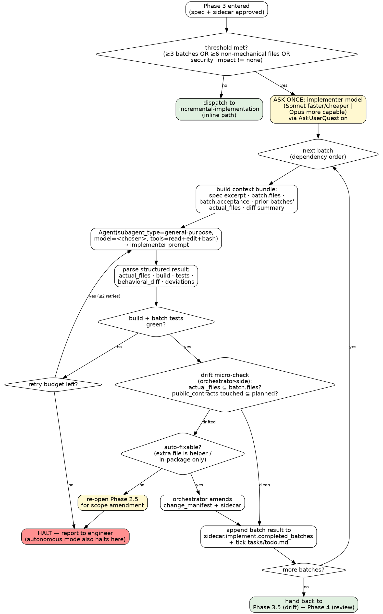

# Dynamic-Workflow Dispatch — Decision Graph & Runtime Path

## Decision Graph

The orchestrator never edits source. The implementer subagent never spawns further subagents. The drift check is fast and orchestrator-side — no reviewer agent per batch.



## Dynamic-workflow path

Use this when the `Workflow` tool is available. It moves the per-batch dispatch loop into a generated JS script that the native runtime executes in the background, so the orchestrator's main context stays light. **What does NOT move into the workflow:** the drift micro-check, sidecar amendment, cumulative churn check, and Phase 4 review. Those stay orchestrator-side, exactly as in the manual path. The workflow is a faster, runtime-managed replacement for steps 3.1–3.4 only.

1. **Threshold gate + model pick.** Identical to manual steps 1–2. The model chosen (Sonnet/Opus) is passed as the `model` option on each `agent()` call in the script.
2. **Build the batch schedule (waves from `depends`).** The plan's `depends` arrays are the single source of truth (`planning-and-task-breakdown` requires them, and requires an edge between any two batches that touch the same file). The template derives each batch's **wave** as its topological level — a batch with no dependencies is wave 0, a batch is one level after the deepest batch it depends on — so batches in the same wave share no ordering edge and run concurrently; waves run strictly in order. A wave wider than `MTK_BATCH_WAVE_MAX` (default 3; pass it as `args.waveMax`) is split into chunks so one run cannot fan out past the org's concurrency or spend guard. Correctness still beats wall-clock: if a `depends` list looks incomplete (two batches touch the same file, or a later batch reads a type an earlier one creates, with no edge), **fix the plan first** — add the edge — rather than hand-serializing in the script; the plan is what the receipt and the drift check read.
3. **Generate the workflow script.** Adapt `templates/workflows/subagent-implementation.workflow.js`. Each batch becomes one `agent()` call that:
   - receives the **same self-sufficient prompt** as the manual path (see "Implementer prompt template" — repo root, CLAUDE.md, tech stack skill path, the single batch object, spec excerpt, full `change_manifest`, `out_of_scope`, and prior-batch summaries),
   - passes the batch-result JSON schema as the `schema` option so the runtime validates structured output and retries on mismatch (this replaces the manual JSON-parse-failure retry),
   - sets `model` to the chosen tier and a `label` of `batch:<id>`.
   Waves run in a sequential `for…await` loop; each wave of two or more runs its batches with `parallel()`. Every result carries `ts_dispatched` / `ts_returned` (added outside the validated schema) and the model tier. The script returns the array of structured batch results, in batch order.
4. **Run it via the `Workflow` tool.** The native runtime shows its own plan-approval gate (the planned phases + Yes / View raw script / No). Because MTK Phase 2.5 has **already** approved the spec and scope, this gate is a transparency checkpoint, not a re-litigation: in interactive mode let the engineer see/approve the script; in autonomous mode (Phase 2.5 returned `Approve & run until done`) proceed without re-prompting, governed by the session permission mode. Do not author a second scope question here.
5. **On return, run the orchestrator-side gates per batch, in order** — these did NOT run inside the workflow:
   - **Replay timing first.** Before anything else, replay each result's `ts_dispatched` / `ts_returned` onto the workflow artifact in **one** call, so the receipt's per-batch timing exists even if a later gate halts the run:
     ```bash
     "$WFA" batch "$MTK_WF_UUID" \
       event agent_dispatched --ts <ts_dispatched> --data '{"agent":"batch:B1","source":"workflow-replay"}' -- \
       event agent_returned   --ts <ts_returned>   --data '{"agent":"batch:B1","source":"workflow-replay","status":"completed"}' -- \
       event agent_dispatched --ts <ts_dispatched> --data '{"agent":"batch:B2","source":"workflow-replay"}' -- \
       event agent_returned   --ts <ts_returned>   --data '{"agent":"batch:B2","source":"workflow-replay","status":"completed"}'
     ```
     A `killed` result replays `agent_dispatched` + `agent_returned --ts <ts_killed>` with `"verdict":"killed"`. `source: workflow-replay` marks the timestamps as captured by the runtime and copied, not observed by the orchestrator.
   - **Build/test/inconclusive gate.** Inspect each result's `status` and `build.ok` / `tests.ok`. `status: inconclusive` (or a result the runtime could not validate against the schema) → respawn once with narrowed scope; a second inconclusive halts and reports. Any `build.ok`/`tests.ok == false` (`status: blocked`, after the runtime's own retries) → halt and report, exactly as the manual path. An inconclusive or failing batch poisons later ones — never count it as pass.
   - **Killed `agent()` call.** A batch slot whose `agent()` rejected or the runtime reports as aborted — spend/rate limit, model unavailable, harness kill — is **not** `inconclusive`: its partial work is on disk. Run the manual path's *killed-mid-batch recovery* for that batch (inventory partial files → build → respawn to finish, or revert the batch's own files and restart; tier drops to `default` when the kill was tier unavailability, and stays there for the remaining batches). Record the incident in `results.dispatch_incidents[]` **before** the replacement dispatch. When the killed batch was mid-wave, the rest of that wave's results are still gated normally; batches in later waves that had not started are re-run in a fresh `Workflow` call (or by hand) on the fallback tier — never re-run the whole script over already-accepted batches.
   - **Drift micro-check, once per wave.** For each wave, take the union of its batches' `actual_files` and check it against the union of their `batch.files`, and public contracts touched ⊆ planned. Clean → persist. Auto-fixable (in-package, no new contract, security unchanged) → amend sidecar. Otherwise → re-open Phase 2.5. When a wave drifts, attribute the extra file to the batch whose `actual_files` lists it before deciding. The subagent is too close to its own diff; drift is judged here, never inside the workflow.
   - **Persist.** Append `{batch_id, actual_files, build, tests, behavioral_diff, deviations, implementer_model}` to `sidecar.implement.completed_batches[]`; tick `tasks/todo.md`; record progress in the **same** shell call as the sidecar write or the next checkpoint command (`… && "$WFA" set "$MTK_WF_UUID" results.batches_completed=<n>`), never as a standalone turn.
   - **Cumulative churn check.** Same thresholds as the manual subagent path (600/1000 non-generated lines at HIGH/MAX, or `MTK_CHURN_REVIEW_LINES` / `MTK_CHURN_HALT_LINES` overrides).
6. **After all batches:** write the aggregated `behavioral_diff`, emit `phase_exit_gate pass` (or `fail` and stop), and hand back to `implement/SKILL.md` Phase 3.5 → Phase 4. **Unchanged.**

If the `Workflow` tool errors, is denied, or is unavailable mid-run, fall back to the manual Agent-loop path for the remaining batches — do not abandon the per-batch discipline.
