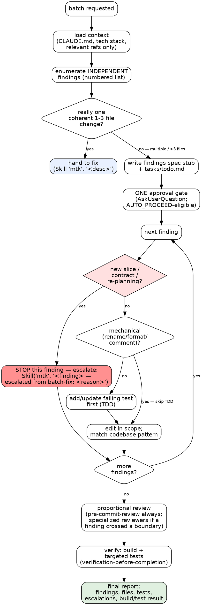

# MTK Batch-Fix — Corrective Batch Loop

## MTK File Resolution

MTK skills and shared references live either in the project (local install) or the plugin cache (marketplace install). Resolve once:

1. If `$MTK_HELPER_ROOT` is set, prefix `.claude/skills/` and `.claude/references/` reads with it — a pinned checkout wins over every other source.
2. Otherwise, if `$CLAUDE_PLUGIN_ROOT` is set, prefix them with that.
3. Otherwise, if `.claude/skills/context-engineering/SKILL.md` exists locally → project-relative paths work as-is.
4. Otherwise, fall back to `find ~/.claude/plugins -maxdepth 8 -name "SKILL.md" -path "*/mtk/*/context-engineering/*" -type f 2>/dev/null | sort -V | tail -1 | sed 's|/.claude/skills/context-engineering/SKILL.md||'`. If empty, MTK skills are unavailable — warn the engineer and proceed with `CLAUDE.md` only.

Always project-relative (never prefixed): `CLAUDE.md`, `.claude/tech-stack`, `.claude/rules/`, `tasks/`, `docs/`, `.claude/references/architecture-principles.md`, `.claude/references/pre-commit-review-list.md`, `.mtk/` (workflow state). Resolve skills and scripts from the same root: a split (skills from a local dev checkout, scripts from the plugin cache) risks version drift — anchor both the same way.

---

## Overview

A lightweight loop for a **corrective batch** — several small, INDEPENDENT fixes applied together (e.g. "apply these 5 review findings", "fix these things"). It sits between `fix` (1-3 files, one coherent change) and `implement` (new behavior, public contract, or architecture).

`batch-fix` is deliberately NOT an `implement` rigor tier: `implement` makes the full spec/plan/approval apparatus mandatory at every level, so lightweight mode lives here as a sibling. The lightness is fixed: a short findings-list **spec stub** + `tasks/todo.md`, **one** approval gate on the list, inline execution (no subagent-per-batch), no `docs/plans/` plan file, and proportional review. Any finding that grows into a new slice, contract, or re-planning escalates **that finding** to `implement` (see Scope Guard).

Source of truth for the composed workflow:

- `.claude/skills/context-engineering/SKILL.md`
- `.claude/skills/debugging-and-error-recovery/SKILL.md` — for each behavioral finding
- `.claude/skills/test-driven-development/SKILL.md` — when a finding changes behavior
- `.claude/skills/source-driven-development/SKILL.md` — when framework behavior is uncertain
- `.claude/skills/security-and-hardening/SKILL.md` — when a finding touches auth, audited state, secrets, or infra
- `.claude/skills/pre-commit-review/SKILL.md` — always, before completion
- `.claude/skills/verification-before-completion/SKILL.md` — before reporting done
- `.claude/skills/tech-stack-{stack}/SKILL.md` — loaded based on `.claude/tech-stack`

## When To Use

- Applying a batch of review findings ("apply these findings", "apply the review comments")
- A corrective batch of several distinct, unrelated small fixes ("fix these 5 things")
- Cleanup sweeps that touch more than 3 files but introduce no new behavior

Use `batch-fix` when the work is **more than `fix`** (>3 files OR multiple distinct fixes) but **less than `implement`** (introduces NO new public contract and needs NO architectural re-planning).

**Proportionality check.** If, after enumeration, the batch is almost entirely mechanical (renames, formatting, i18n/string deletes, comment moves) with no behavioral or boundary-crossing finding, the stub + gate scaffolding buys little. Prefer plain `fix` for the low-risk cosmetic sweep even if it stretches past 3 files, or keep the stub to one line per finding — the full ceremony earns its keep on batches where at least one finding is behavioral or crosses a boundary.

Do NOT use it when:

- The whole change is one coherent edit in 1-3 files → that's `fix`.
- Any finding needs a new handler/entity/slice, a new/changed public contract, or architectural re-planning → that finding goes to `implement` (Scope Guard).
- Findings are actually interdependent steps of one feature → that's `implement`.

## Workflow

Follow the phases in order. Each phase loads only what it needs.

### Decision Graph

The per-finding scope guard is the part that gets skipped most. This graph makes escalation explicit — any `yes` on a red diamond means STOP editing that finding and escalate it, not "expand quietly."



**Red flags inside the loop:**

| Rationalization | Reality |
|---|---|
| "It's just another small fix, I'll add the new endpoint too" | A new contract/slice is not a fix. Escalate THAT finding to implement. |
| "The batch is approved, I'll add finding #6 I just noticed" | The gate approved a list. New findings re-open the list — amend the stub + todo, don't smuggle. |
| "They said fix all, so the escalation/merge doesn't need re-asking" | Approval attaches to the *enumeration*. Escalating, narrowing, or merging a finding changes the deliverable — re-ask on the amended list (Phase 3). |
| "These files were already dirty, I'll just edit on top" | Pre-existing edits in a target file are a gate input. Name them and let the engineer choose — after the fact, nothing separates their work from yours. |
| "This finding changes behavior but it's tiny, skip the test" | Only mechanical findings (rename/format/comment) skip TDD. Behavioral findings get a failing test first. |
| "All of these actually need contracts" | Then it's not a corrective batch — route the whole thing to implement. |
| "It's really one change in two files" | Then it's `fix`, not `batch-fix`. Hand it down. |

**Op-cost:** each behavioral finding is roughly 3 tool ops (read test → edit test → edit source).

**Grouping (batches beyond ~5 findings).** Past ~5 findings a flat list can exhaust a context or op budget mid-loop. Do not answer that with "checkpoint and hope" — **group the approved list and checkpoint per group**:

1. **Form groups** of 2-4 findings that share a file, a subsystem, or a verification command. Label them `A`, `B`, `C`… in `tasks/todo.md` as sub-headings over the existing per-finding items. Grouping is an *execution* device: it re-orders and clusters the approved list, it never changes what was approved.
2. **Order groups** so each one ends at a green build: put findings that share a verification command together, and land mechanical groups before behavioral ones that depend on them.
3. **Checkpoint after each group** — run that group's targeted verification, tick its items off `tasks/todo.md`, and emit one progress line (`Group B done — 3/8 findings, tests green`). A checkpoint is *not* a new approval gate; Phase 3 already approved the list, and re-asking per group re-litigates it.
4. **Only a budget warning turns a checkpoint into a stop.** If one fires, stop at the last completed group boundary — never mid-group — and `handoff` from there. A group boundary is the only place where the tree is coherent and the todo is truthful.

If grouping shows the findings cannot be separated into independently-verifiable clusters, they were never independent — that is `implement`, not a batch.

### Phase 1: Load Context (Progressive Disclosure)

1. Follow `.claude/skills/context-engineering/SKILL.md`.
2. Read `CLAUDE.md`. If missing, stop and tell the engineer to run `/mtk-setup`.
3. Load the active tech stack: resolve it with `bash scripts/resolve-tech-stack.sh --check <all target file paths>` — **polyglot-monorepo aware** (subproject `.claude/tech-stack` → root `.claude/tech-stack.map` glob → root file), so a batch touching a differently-stacked subtree gets that subtree's commands. `--check` additionally warns when the resolved stack disagrees with the files the batch will touch (e.g. resolves `dotnet` but the findings are all `.tsx`); the warning is advisory — if it fires, declare the subtree rather than pushing on with the wrong build/test commands. Then read `.claude/skills/tech-stack-{stack}/SKILL.md` (build/test commands, stack reference paths). If nothing resolves, do not halt: infer via `bash scripts/setup-detect.sh --json` (read-only) and load the matching `tech-stack-{stack}` skill; if inference is empty, announce **degraded mode** (stack build/test commands unavailable) and proceed with `CLAUDE.md`-only context.
4. Read only what the batch needs — the coding guidelines always; the ORM checklist if a finding touches the data layer; `.claude/references/security-checklist.md` if a finding touches auth/secrets/financial; `.claude/references/testing-patterns.md` when adding tests; `.claude/references/pre-commit-review-list.md` before commit. Resolve each via the File Resolution block (project → `$CLAUDE_PLUGIN_ROOT` → plugin cache); if a needed reference resolves nowhere, announce degraded mode for that check rather than skipping it silently — in particular, if `pre-commit-review-list.md` is absent the pre-commit gate still runs, AI-review-only (degraded), and must say so.
5. Resolve and scan relevant lessons. Prefer the structured query when present:
   ```bash
   LS="$([ -n "${MTK_HELPER_ROOT:-}" ] && echo "$MTK_HELPER_ROOT/scripts/learnings.sh" || ([ -f scripts/learnings.sh ] && echo scripts/learnings.sh || echo "${CLAUDE_PLUGIN_ROOT:-.}/scripts/learnings.sh"))"
   bash "$LS" query --phase implement --files "<all target file paths>" --max 8
   ```
   Falls back to scanning `tasks/lessons.md` when the script is absent.

**Parallel loading:** independent reference reads go out in one message. See `docs/parallelism-patterns.md`.

### Phase 2: Enumerate Findings + Write Stub

1. Triage the batch into a **numbered list of independent findings**. Each finding gets: a one-line description, the file(s) it touches, whether it is behavioral or mechanical, and whether it crosses a boundary (auth/secrets/data-layer/public surface). Independence is a precondition — if findings are ordered steps of one change, this is `implement`, not a batch.
2. If the whole thing collapses to one coherent 1-3 file change, hand it to `fix` instead (`Skill(skill: "mtk", args: "<desc>")`) and stop.
3. **Resolve the batch slug — resumed vs. new.** The SessionStart recovery pointer and any existing `docs/specs/*-batch.md` may belong to a *prior* batch on the same feature, not this one. Before writing anything, list existing `docs/specs/*-batch.md` stubs; if one exists, compare its enumerated findings to this batch's. If they match, **resume** it (reuse the slug, reconcile `tasks/todo.md`). If they differ, this is a **new** batch — mint a distinct slug (`<slug>-batch-2`, `-batch-3`, …) and do not overwrite the prior stub. Never silently adopt a recovered spec whose findings you did not just enumerate.
4. Write a **short findings-list spec stub** to `<artifact-root>/docs/specs/YYYY-MM-DD-<slug>-batch.md`, where the artifact root comes from `bash scripts/resolve-artifact-root.sh "<a file the batch touches>"` — a subtree that owns its own `docs/specs/` (plus a `CLAUDE.md`) keeps its artifacts there instead of having them written to the repo root. Single-root repos resolve to the repo root, unchanged. The stub contains: the enumerated findings and a one-line scope note (`no new public contract; no architectural change`). This is a stub, **not** a full executable feature spec — no change_manifest apparatus, no batches, no `docs/plans/` file, and no JSON sidecar. Then drop a **scope-guard skip pointer** so the `PreToolUse` guard does not fire on every edit (batch-fix scopes by the findings list, not a file manifest):
   ```bash
   D="${CLAUDE_PROJECT_DIR:-$(git rev-parse --show-toplevel 2>/dev/null || pwd)}"
   mkdir -p "$D/.mtk" && printf '%s\n' "batch-fix: <slug> — scopes by findings list, not a file manifest" > "$D/.mtk/scope-guard-skip"
   ```
   If a shell-permission classifier blocks the `>` redirect, run just `mkdir -p "$D/.mtk"; echo "$D"` (no redirect) and write the same one-line content to `<printed $D>/.mtk/scope-guard-skip` with the Write tool. The guard reads the pointer's content and location, not the mechanism that produced it — so the Write-tool path is equivalent, and it still anchors under the resolved `$D` (not a bare project-relative path, which would miss the target from a worktree cwd).
   Anchor `.mtk/` the same way workflow state does (`$CLAUDE_PROJECT_DIR` → git top-level → cwd) so the guard hook finds the pointer even from a worktree or sub-dir cwd. `scope-guard.sh` no-ops while this pointer is fresh, regardless of which spec sidecar is newest. (An earlier version wrote a "freshest sidecar" JSON marker instead; that mis-fired on every edit whenever a concurrent feature spec was newer than the batch stub, so the guard anchored to the wrong spec's manifest.) Remove the pointer in the Final Report; it also ages out on its own (4h) if the run is interrupted.
5. Write `tasks/todo.md`: one checkable item per finding, plus post-batch review/verify items.

**Baseline the working tree before editing.** Snapshot what is *already* dirty so review can tell your work apart from it: run `git status --porcelain` (read-only) and record the files already modified/untracked that this batch does **not** touch. When the tree starts dirty, `git diff HEAD` is *not* "this batch's changes" — pre-existing edits would otherwise be attributed to the batch and draw false "missing test / missing X" findings for code you did not write (Phase 5 scopes review to the batch's own files using this baseline).

### Phase 3: Single Approval Gate (STOP HERE)

Exactly **one** gate for the whole batch. Render the findings list and `tasks/todo.md` inline in the terminal (don't just cite paths), then ask via `AskUserQuestion`:

- **Question:** "Batch of N independent fixes enumerated. Proceed?"
- **Options:** `Approve & run until done` / `Approve (interactive)` / `Edit first` / `Revise`.

Cite the stub and `tasks/todo.md` paths at the end as bare repo-relative paths.

**`MTK_AUTO_PROCEED` opt-in.** If `MTK_AUTO_PROCEED=1` is set, the recommended option may be defaulted without an `AskUserQuestion` round-trip **only** when the findings list has zero open decisions and zero unresolved `[ASSUMED]` claims, and no finding is flagged as boundary-crossing/escalation-bound. Otherwise fall back to `AskUserQuestion`.

**Gate already satisfied by an explicit directive.** The gate approves *this enumerated list*. If the engineer has already given an explicit, unambiguous go-ahead on the exact list this batch enumerated — e.g. they said "do all N in one commit" in direct response to the same numbered findings (whether you wrote them to the stub this phase or enumerated them in a prior turn the engineer then approved) — the gate is **satisfied**, not skipped. Record it satisfied in the stub/todo (cite the approving message) and proceed to Phase 4 without re-firing `AskUserQuestion`; re-asking re-litigates a decision the engineer already made. This is narrow: it holds only when the approval names or directly answers the *same* findings list. A vague "just fix it" on the original request is **not** approval of a list you produced afterward — that still gets the gate. (Inferring approval from a vague request is what Critical Rule 1 forbids; honoring an explicit directive on the enumerated list is not that.)

**An approved list can go stale — material changes re-open it.** The gate approves *an enumeration*, so if that enumeration changes materially the approval no longer covers it, **even when the original directive was explicit**. Material = the deliverable changes:

- a finding **escalates** out to `implement` (the engineer expected it fixed; it won't be)
- a finding **narrows** to materially less than what was approved
- two or more findings **merge**, or a **new** finding appears
- a finding's blast radius grows into files outside what the list implied

Not material (proceed without re-asking): renumbering, splitting one finding into sub-steps of the same scope, tightening a description, or grouping per the section above. When something material changes, state exactly what changed and re-ask **on the amended list only** — do not re-litigate the parts that did not move.

**Dirty-tree overlap is a gate input, not a detail.** If the Phase 2 baseline shows pre-existing modifications in files this batch will touch, surface that *at the gate*, naming the overlapping files. The engineer is otherwise approving edits stacked on work they may not remember making, and neither `git diff HEAD` nor a revert will cleanly separate the two afterwards. Offer the choice explicitly — proceed on top of the existing edits, stash them first, or drop the overlapping findings from the batch. Never silently edit on top of an overlap.

If `AskUserQuestion` is deferred, load it with `ToolSearch select:AskUserQuestion`. If the harness does not expose it, stop and print the four options as one line and wait. Until the engineer answers: read-only Bash only, no edits. Do not start Phase 4 until an approval answer.

### Phase 4: Execute Per Finding (Inline)

Work the findings **inline** in the main context — no subagent-per-batch. batch-fix does not assume a frozen tree: **re-read each target file immediately before editing it** — a concurrent human edit, or an earlier finding touching the same file, may have moved it since Phase 2. For each finding, in order:

1. **Scope Guard first** (see below). If the finding needs a new slice/contract/re-planning, escalate it and move on — do not edit it here.
2. **Behavioral finding:** follow `.claude/skills/debugging-and-error-recovery/SKILL.md` to confirm the cause, then `.claude/skills/test-driven-development/SKILL.md` — write the failing test first, then the fix.
3. **Mechanical finding** (rename, format, comment, dead-code removal with no behavior change): skip TDD; make the edit and rely on the existing suite + build.
4. Match the local codebase pattern; do not gold-plate unrelated code.
5. Check the finding off in `tasks/todo.md`.

### Phase 5: Proportional Review

Scale review to what the batch actually touched:

- **Always:** run `.claude/skills/pre-commit-review/SKILL.md` (or the `.claude/references/pre-commit-review-list.md` gate) over the files this batch changed — the enumerated findings' files plus any touched during the run — not a blanket `git diff HEAD`.
- **`test-reviewer`** (agent, `.claude/agents/test-reviewer.md`) — only if a finding introduced or changed public behavior.
- **`architecture-reviewer`** (agent, `.claude/agents/architecture-reviewer.md`) — only if a finding crossed a boundary/slice (rare in a batch; a finding that genuinely needs one should already have escalated).
- **`security-and-hardening`** (skill, not an agent — `.claude/skills/security-and-hardening/SKILL.md`) — only if a finding touched auth, audited state, secrets, or infra.

A pure mechanical batch (renames/formatting) gets the pre-commit gate and nothing heavier.

**When subagents are unavailable, run the pass inline — never drop it.** The Agent tool may be absent, disabled, or forbidden by a standing engineer instruction. A reviewer named above is a *pass to perform*, not a dispatch mechanism: read the agent's own `.md` (or the skill) and apply its checklist yourself against this batch's changed-file set. Inline costs context isolation, not coverage. Record which passes ran inline in the Final Report's "review performed" line.

**Scope reviewers to this batch's changes.** Hand every reviewer the batch's own changed-file set (the findings' files + any edited during the run) and exclude the Phase 2 pre-existing-dirty baseline. When the tree started dirty, a reviewer given `git diff HEAD` will attribute pre-existing edits to this batch — e.g. a "missing test" finding for code you never wrote. State the in-scope files explicitly in each reviewer's prompt.

### Scope Guard

For each finding, if any of these become true, **escalate THAT finding to `/mtk implement`** — do not expand it in place:

- it needs a new handler/entity/slice
- it adds or changes a public contract
- it requires architectural re-planning

**Per-finding escalation procedure:**

1. Summarize the finding, files identified, and why it exceeds a batch fix.
2. Invoke the router with the finding description plus the discovered scope, using the marker the router catches:
   ```
   Skill(skill: "mtk", args: "<finding description> — escalated from batch-fix: <short reason>")
   ```
3. Do NOT edit that finding here. Record it in the stub/todo as `escalated → implement` and continue the remaining findings.
4. If MOST findings need contracts/slices, the work is not a corrective batch — escalate the **whole** batch to implement rather than piecemeal.

De-escalation: if the batch collapses to one coherent 1-3 file change, hand it to `fix` instead (see Phase 2 step 2).

### Phase 6: Verify

Follow `.claude/skills/verification-before-completion/SKILL.md`. Using the active tech stack's commands:

- run the build command
- run the tests for every changed area (fresh execution evidence, not a claim)
- remove the scope-guard skip pointer now that edits are done: `rm -f "${CLAUDE_PROJECT_DIR:-$(git rev-parse --show-toplevel 2>/dev/null || pwd)}/.mtk/scope-guard-skip"`

### Final Report

Report briefly:

- the numbered findings and their disposition (fixed / escalated → implement)
- files changed
- tests added or updated
- review performed (which reviewers ran, why, and for each whether it ran as a subagent or inline)
- build + test result

## Critical Rules

1. One approval gate on the findings list before any edit — never infer approval from a vague request. The gate is *satisfied* (not skipped) only when the engineer has already given an explicit go-ahead on the exact enumerated list, and a **material** change to that list (escalation, narrowing, merge, new finding) re-opens it; see Phase 3.
2. Findings must be INDEPENDENT; interdependent steps of one feature are `implement`.
3. A finding that needs a new slice/contract/re-planning escalates to implement — it is never "just another small fix."
4. Behavioral findings get a failing test first; only mechanical findings skip TDD.
5. Read before editing; match the codebase pattern; do not gold-plate.
6. No `docs/plans/` plan file and no subagent-per-batch — that ceremony belongs to `implement`.

## Verification

- [ ] Findings enumerated as an independent, numbered list before editing
- [ ] Batch slug resolved against existing `*-batch.md` stubs / recovery pointer — a differing prior batch got a distinct slug, not an overwrite
- [ ] Short findings spec stub and `tasks/todo.md` written; `.mtk/scope-guard-skip` pointer dropped for the run and removed on completion; no `docs/plans/` plan file, no JSON sidecar
- [ ] Exactly one approval gate ran before edits (AskUserQuestion; AUTO_PROCEED when eligible; or satisfied by an explicit engineer directive on the exact enumerated list)
- [ ] Any material change to the approved enumeration (escalation, narrowing, merge, new finding) was re-asked on the amended list; cosmetic changes were not
- [ ] Dirty-tree overlap between the baseline and this batch's target files was named at the gate, not silently edited over
- [ ] Batches past ~5 findings were grouped with a checkpoint per group; any budget stop landed on a group boundary, never mid-group
- [ ] Each behavioral finding has a failing-first test; mechanical findings correctly skipped TDD
- [ ] Any new-slice/contract/re-planning finding was escalated with the `escalated from batch-fix` marker, not absorbed
- [ ] Proportional review ran (pre-commit-review always; specialized reviewers only where a finding warranted), scoped to the batch's changed files — pre-existing dirty-tree changes were not attributed to the batch
- [ ] Build is clean and tests pass with fresh execution evidence
- [ ] Final report lists findings + disposition, files, tests, review, and verification evidence
