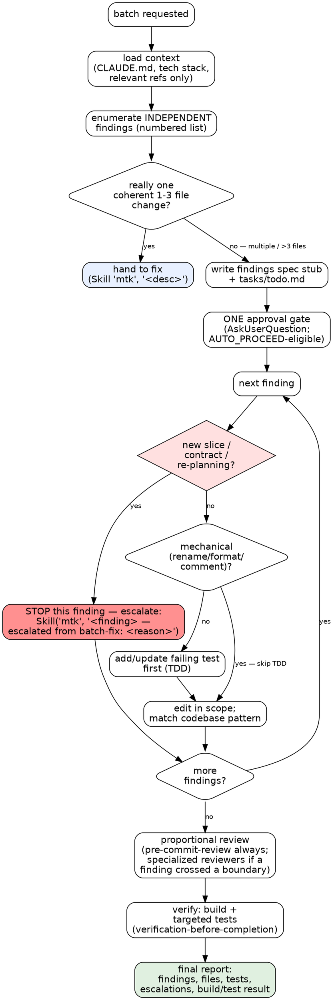

# MTK Batch-Fix — Corrective Batch Loop

## MTK File Resolution

MTK skills and shared references live either in the project (local install) or the plugin cache (marketplace install). Resolve once:

1. If `$CLAUDE_PLUGIN_ROOT` is set, prefix `.claude/skills/` and `.claude/references/` reads with it.
2. Otherwise, if `.claude/skills/context-engineering/SKILL.md` exists locally → project-relative paths work as-is.
3. Otherwise, fall back to `find ~/.claude/plugins -maxdepth 8 -name "SKILL.md" -path "*/mtk/*/context-engineering/*" -type f 2>/dev/null | sort -V | tail -1 | sed 's|/.claude/skills/context-engineering/SKILL.md||'`. If empty, MTK skills are unavailable — warn the engineer and proceed with `CLAUDE.md` only.

Always project-relative (never prefixed): `CLAUDE.md`, `.claude/tech-stack`, `.claude/rules/`, `tasks/`, `docs/`, `.claude/references/architecture-principles.md`, `.claude/references/pre-commit-review-list.md`, `.mtk/` (workflow state). Resolve skills and scripts from the same root: a split (skills from a local dev checkout, scripts from the plugin cache) risks version drift — anchor both the same way.

---

## Overview

A lightweight loop for a **corrective batch** — several small, INDEPENDENT fixes applied together (e.g. "apply these 5 review findings", "fix these things"). It sits between `fix` (1-3 files, one coherent change) and `implement` (new behavior, public contract, or architecture).

`batch-fix` is deliberately NOT an `implement` rigor tier: `implement` makes the full spec/plan/approval apparatus mandatory at every level, so lightweight mode lives here as a sibling. The lightness is fixed: a short findings-list **spec stub** + `tasks/todo.md`, **one** approval gate on the list, inline execution (no subagent-per-batch), no `docs/plans/` plan file, and proportional review. Any finding that grows into a new slice, contract, or re-planning escalates **that finding** to `implement` (see Scope Guard).

Source of truth for the composed workflow:

- `.claude/skills/context-engineering/SKILL.md`
- `.claude/skills/debugging-and-error-recovery/SKILL.md` — for each behavioral finding
- `.claude/skills/test-driven-development/SKILL.md` — when a finding changes behavior
- `.claude/skills/source-driven-development/SKILL.md` — when framework behavior is uncertain
- `.claude/skills/security-and-hardening/SKILL.md` — when a finding touches auth, audited state, secrets, or infra
- `.claude/skills/pre-commit-review/SKILL.md` — always, before completion
- `.claude/skills/verification-before-completion/SKILL.md` — before reporting done
- `.claude/skills/tech-stack-{stack}/SKILL.md` — loaded based on `.claude/tech-stack`

## When To Use

- Applying a batch of review findings ("apply these findings", "apply the review comments")
- A corrective batch of several distinct, unrelated small fixes ("fix these 5 things")
- Cleanup sweeps that touch more than 3 files but introduce no new behavior

Use `batch-fix` when the work is **more than `fix`** (>3 files OR multiple distinct fixes) but **less than `implement`** (introduces NO new public contract and needs NO architectural re-planning).

Do NOT use it when:

- The whole change is one coherent edit in 1-3 files → that's `fix`.
- Any finding needs a new handler/entity/slice, a new/changed public contract, or architectural re-planning → that finding goes to `implement` (Scope Guard).
- Findings are actually interdependent steps of one feature → that's `implement`.

## Workflow

Follow the phases in order. Each phase loads only what it needs.

### Decision Graph

The per-finding scope guard is the part that gets skipped most. This graph makes escalation explicit — any `yes` on a red diamond means STOP editing that finding and escalate it, not "expand quietly."



**Red flags inside the loop:**

| Rationalization | Reality |
|---|---|
| "It's just another small fix, I'll add the new endpoint too" | A new contract/slice is not a fix. Escalate THAT finding to implement. |
| "The batch is approved, I'll add finding #6 I just noticed" | The gate approved a list. New findings re-open the list — amend the stub + todo, don't smuggle. |
| "This finding changes behavior but it's tiny, skip the test" | Only mechanical findings (rename/format/comment) skip TDD. Behavioral findings get a failing test first. |
| "All of these actually need contracts" | Then it's not a corrective batch — route the whole thing to implement. |
| "It's really one change in two files" | Then it's `fix`, not `batch-fix`. Hand it down. |

### Phase 1: Load Context (Progressive Disclosure)

1. Follow `.claude/skills/context-engineering/SKILL.md`.
2. Read `CLAUDE.md`. If missing, stop and tell the engineer to run `/mtk-setup`.
3. Load the active tech stack: read `.claude/tech-stack` and `.claude/skills/tech-stack-{stack}/SKILL.md` (build/test commands, stack reference paths).
4. Read only what the batch needs — the coding guidelines always; the ORM checklist if a finding touches the data layer; `.claude/references/security-checklist.md` if a finding touches auth/secrets/financial; `.claude/references/testing-patterns.md` when adding tests; `.claude/references/pre-commit-review-list.md` before commit.
5. Resolve and scan relevant lessons. Prefer the structured query when present:
   ```bash
   LS="scripts/learnings.sh"; [ -f "$LS" ] || LS="${CLAUDE_PLUGIN_ROOT:-.}/scripts/learnings.sh"
   bash "$LS" query --phase implement --files "<all target file paths>" --max 8
   ```
   Falls back to scanning `tasks/lessons.md` when the script is absent.

**Parallel loading:** independent reference reads go out in one message. See `docs/parallelism-patterns.md`.

### Phase 2: Enumerate Findings + Write Stub

1. Triage the batch into a **numbered list of independent findings**. Each finding gets: a one-line description, the file(s) it touches, whether it is behavioral or mechanical, and whether it crosses a boundary (auth/secrets/data-layer/public surface). Independence is a precondition — if findings are ordered steps of one change, this is `implement`, not a batch.
2. If the whole thing collapses to one coherent 1-3 file change, hand it to `fix` instead (`Skill(skill: "mtk", args: "<desc>")`) and stop.
3. Write a **short findings-list spec stub** to `docs/specs/YYYY-MM-DD-<slug>-batch.md`: the enumerated findings and a one-line scope note (`no new public contract; no architectural change`). This is a stub, **not** a full executable feature spec — no change_manifest apparatus, no JSON sidecar, no batches, no `docs/plans/` file.
4. Write `tasks/todo.md`: one checkable item per finding, plus post-batch review/verify items.

### Phase 3: Single Approval Gate (STOP HERE)

Exactly **one** gate for the whole batch. Render the findings list and `tasks/todo.md` inline in the terminal (don't just cite paths), then ask via `AskUserQuestion`:

- **Question:** "Batch of N independent fixes enumerated. Proceed?"
- **Options:** `Approve & run until done` / `Approve (interactive)` / `Edit first` / `Revise`.

Cite the stub and `tasks/todo.md` paths at the end as bare repo-relative paths.

**`MTK_AUTO_PROCEED` opt-in.** If `MTK_AUTO_PROCEED=1` is set, the recommended option may be defaulted without an `AskUserQuestion` round-trip **only** when the findings list has zero open decisions and zero unresolved `[ASSUMED]` claims, and no finding is flagged as boundary-crossing/escalation-bound. Otherwise fall back to `AskUserQuestion`.

If `AskUserQuestion` is deferred, load it with `ToolSearch select:AskUserQuestion`. If the harness does not expose it, stop and print the four options as one line and wait. Until the engineer answers: read-only Bash only, no edits. Do not start Phase 4 until an approval answer.

### Phase 4: Execute Per Finding (Inline)

Work the findings **inline** in the main context — no subagent-per-batch. For each finding, in order:

1. **Scope Guard first** (see below). If the finding needs a new slice/contract/re-planning, escalate it and move on — do not edit it here.
2. **Behavioral finding:** follow `.claude/skills/debugging-and-error-recovery/SKILL.md` to confirm the cause, then `.claude/skills/test-driven-development/SKILL.md` — write the failing test first, then the fix.
3. **Mechanical finding** (rename, format, comment, dead-code removal with no behavior change): skip TDD; make the edit and rely on the existing suite + build.
4. Match the local codebase pattern; do not gold-plate unrelated code.
5. Check the finding off in `tasks/todo.md`.

### Phase 5: Proportional Review

Scale review to what the batch actually touched:

- **Always:** run `.claude/skills/pre-commit-review/SKILL.md` (or the `.claude/references/pre-commit-review-list.md` gate) over the whole diff.
- **`test-reviewer`** — only if a finding introduced or changed public behavior.
- **`architecture-reviewer`** — only if a finding crossed a boundary/slice (rare in a batch; a finding that genuinely needs one should already have escalated).
- **`security-and-hardening`** — only if a finding touched auth, audited state, secrets, or infra.

A pure mechanical batch (renames/formatting) gets the pre-commit gate and nothing heavier.

### Scope Guard

For each finding, if any of these become true, **escalate THAT finding to `/mtk implement`** — do not expand it in place:

- it needs a new handler/entity/slice
- it adds or changes a public contract
- it requires architectural re-planning

**Per-finding escalation procedure:**

1. Summarize the finding, files identified, and why it exceeds a batch fix.
2. Invoke the router with the finding description plus the discovered scope, using the marker the router catches:
   ```
   Skill(skill: "mtk", args: "<finding description> — escalated from batch-fix: <short reason>")
   ```
3. Do NOT edit that finding here. Record it in the stub/todo as `escalated → implement` and continue the remaining findings.
4. If MOST findings need contracts/slices, the work is not a corrective batch — escalate the **whole** batch to implement rather than piecemeal.

De-escalation: if the batch collapses to one coherent 1-3 file change, hand it to `fix` instead (see Phase 2 step 2).

### Phase 6: Verify

Follow `.claude/skills/verification-before-completion/SKILL.md`. Using the active tech stack's commands:

- run the build command
- run the tests for every changed area (fresh execution evidence, not a claim)

### Final Report

Report briefly:

- the numbered findings and their disposition (fixed / escalated → implement)
- files changed
- tests added or updated
- review performed (which reviewers ran and why)
- build + test result

## Critical Rules

1. One approval gate on the findings list before any edit — never infer approval from the request.
2. Findings must be INDEPENDENT; interdependent steps of one feature are `implement`.
3. A finding that needs a new slice/contract/re-planning escalates to implement — it is never "just another small fix."
4. Behavioral findings get a failing test first; only mechanical findings skip TDD.
5. Read before editing; match the codebase pattern; do not gold-plate.
6. No `docs/plans/` plan file and no subagent-per-batch — that ceremony belongs to `implement`.

## Verification

- [ ] Findings enumerated as an independent, numbered list before editing
- [ ] Short findings spec stub and `tasks/todo.md` written; no `docs/plans/` plan file, no JSON sidecar
- [ ] Exactly one approval gate ran before edits (AskUserQuestion, or AUTO_PROCEED when eligible)
- [ ] Each behavioral finding has a failing-first test; mechanical findings correctly skipped TDD
- [ ] Any new-slice/contract/re-planning finding was escalated with the `escalated from batch-fix` marker, not absorbed
- [ ] Proportional review ran (pre-commit-review always; specialized reviewers only where a finding warranted)
- [ ] Build is clean and tests pass with fresh execution evidence
- [ ] Final report lists findings + disposition, files, tests, review, and verification evidence
