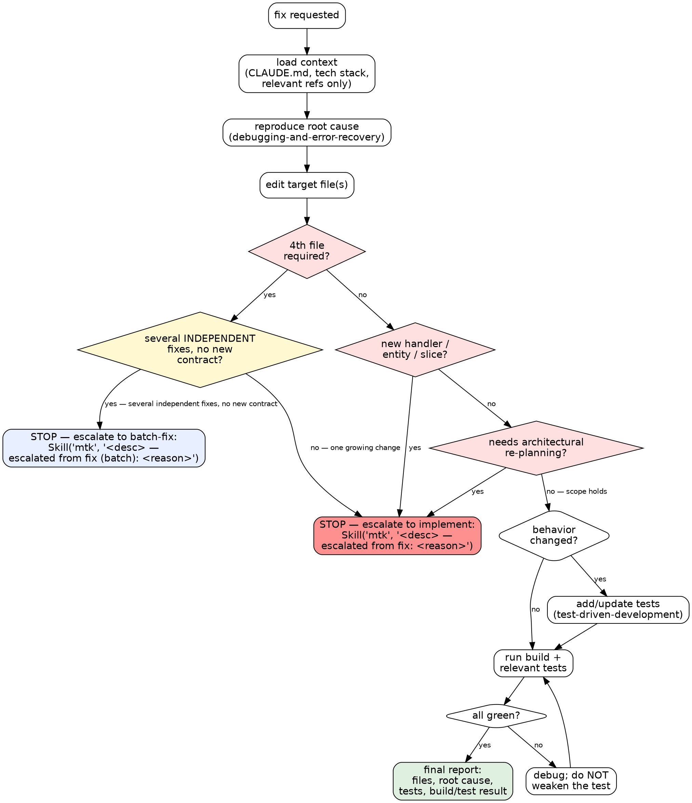

# MTK Fix — Lightweight Task Loop

## MTK File Resolution

MTK skills and shared references live either in the project (local install) or the plugin cache (marketplace install). Resolve once:

1. If `$MTK_HELPER_ROOT` is set, prefix `.claude/skills/` and `.claude/references/` reads with it — a pinned checkout wins over every other source.
2. Otherwise, if `$CLAUDE_PLUGIN_ROOT` is set, prefix them with that.
3. Otherwise, if `.claude/skills/context-engineering/SKILL.md` exists locally → project-relative paths work as-is.
4. Otherwise, fall back to `find ~/.claude/plugins -maxdepth 8 -name "SKILL.md" -path "*/mtk/*/context-engineering/*" -type f 2>/dev/null | sort -V | tail -1 | sed 's|/.claude/skills/context-engineering/SKILL.md||'`. If empty, MTK skills are unavailable — warn the engineer and proceed with `CLAUDE.md` only.

Always project-relative (never prefixed): `CLAUDE.md`, `.claude/tech-stack`, `.claude/rules/`, `tasks/`, `docs/`, `.claude/references/architecture-principles.md`, `.claude/references/pre-commit-review-list.md`, `.mtk/` (workflow state). Resolve skills and scripts from the same root: a split (skills from a local dev checkout, scripts from the plugin cache) risks version drift — anchor both the same way.

---

## Overview

A lightweight, bounded fix loop for 1-3 file changes. Composes context-engineering, debugging-and-error-recovery, targeted TDD, and scope-guarded verification without the full feature planning overhead. Invoked by the `/mtk` router when the user says "fix", "bug", "broken", or similar.

Source of truth for the composed workflow:

- `.claude/skills/context-engineering/SKILL.md`
- `.claude/skills/debugging-and-error-recovery/SKILL.md`
- `.claude/skills/test-driven-development/SKILL.md` when behavior changes
- `.claude/skills/source-driven-development/SKILL.md` when framework behavior is uncertain
- `.claude/skills/security-and-hardening/SKILL.md` when the fix touches auth, audited state, secrets, or infra
- `.claude/skills/tech-stack-{stack}/SKILL.md` — loaded based on `.claude/tech-stack`

## When To Use

- Bug fixes
- Validation tweaks
- Query fixes
- Small config changes
- Renames or narrow refactors that stay within 1-3 files

If the work grows beyond 3 files, introduces new architecture, or needs a formal change manifest, stop and switch to the implement workflow (via `/mtk <description>`).

## Workflow

Follow the phases below in order. Each phase loads what it needs and no more.

### Decision Graph

The scope guard is the part that gets skipped most. This graph makes the escalation triggers explicit — any `yes` on the red diamonds means STOP and escalate, not "expand quietly."



**Red flags inside the loop:**

| Rationalization | Reality |
|---|---|
| "Just one more file and I'm done" | That's the 4th file. Stop. Several independent fixes, no new contract → escalate to batch-fix; one growing change or new slice → escalate to implement. |
| "I'll add the new handler quickly, it's still a fix" | New slice = new feature. Escalate to implement. |
| "The test fails but the fix is right, I'll relax the assertion" | Debug the implementation, don't weaken the test. |
| "Scope grew but the engineer wants it fast" | Escalation is faster than a half-broken sprawl. The router still routes; you just hand off. |

### Load Context (Progressive Disclosure)

1. Follow `.claude/skills/context-engineering/SKILL.md`.
2. Read `CLAUDE.md`. If missing, stop and tell the engineer to run `/mtk-setup`.
3. Load the active tech stack: resolve it with `bash scripts/resolve-tech-stack.sh "$PWD"` — **polyglot-monorepo aware** (subproject `.claude/tech-stack` → root `.claude/tech-stack.map` glob → root file), so a differently-stacked subtree gets its own commands instead of the root's. When the fix targets a subtree, pass a representative file path instead of `$PWD`. Then read `.claude/skills/tech-stack-{stack}/SKILL.md` for build/test commands and stack-specific reference paths.
4. Read only what the fix needs:
   - **Always:** the coding guidelines from the tech stack's `## Reference Files`
   - **If fix touches data layer/ORM:** the ORM checklist from the tech stack's `## Reference Files`
   - **If fix touches auth/secrets/financial:** `.claude/references/security-checklist.md`
   - **If adding tests:** `.claude/references/testing-patterns.md` plus the testing supplement from the tech stack
   - **Before commit:** `.claude/references/pre-commit-review-list.md` if present
5. Resolve and scan relevant lessons. When `scripts/learnings.sh` is present, prefer the structured query (5-layer filter — proximity / recurrence / severity / validity / phase) over the flat markdown file:
   ```bash
   # Resolve the script: project copy first, else the plugin's copy.
   LS="$([ -n "${MTK_HELPER_ROOT:-}" ] && echo "$MTK_HELPER_ROOT/scripts/learnings.sh" || ([ -f scripts/learnings.sh ] && echo scripts/learnings.sh || echo "${CLAUDE_PLUGIN_ROOT:-.}/scripts/learnings.sh"))"
   bash "$LS" query --phase implement --files "<target file paths>" --max 8
   ```
   Falls back to scanning `tasks/lessons.md` directly when the script is absent from both the project and the plugin (older repos).
6. Read the target file and its closest neighbors before editing.

**Progressive disclosure principle:** Small fixes do not need all references loaded. Load what's relevant to the specific fix, then load additional references if the scope shifts.

**Parallel loading:** Independent reference reads go out in one message, not sequentially. See `docs/parallelism-patterns.md`.

### Execute The Fix Workflow

Follow `.claude/skills/debugging-and-error-recovery/SKILL.md`.
Use `.claude/skills/test-driven-development/SKILL.md` for regression coverage when behavior changed.

Minimum verification (using build/test commands from the active tech stack skill):

- run the build command
- run the relevant tests for the changed area

If behavior changed, add or update tests.

### Scope Guard

If scope grows past 1-3 files, **stop and self-escalate** instead of expanding in place. Where it escalates depends on *why* it grew:

- **Several independent trivial fixes, no new contract** — the growth is just more small unrelated fixes (e.g. a review threw up 5 nits across 5 files) → escalate to **`batch-fix`**.
- **One growing change past 3 files, a new handler/entity/slice, a new/changed public contract, or architectural re-planning** → escalate to **`implement`**.

**Self-escalation procedure:**

1. Summarize what's been discovered so far (root cause, files identified, why the scope grew).
2. Invoke the router with the original fix description plus the discovered scope, using the marker the router catches:
   - To batch-fix: `Skill(skill: "mtk", args: "<original description> — escalated from fix (batch): <short reason>")`
   - To implement: `Skill(skill: "mtk", args: "<original description> — escalated from fix: <short reason>")`
3. Do NOT continue editing. The router picks the target from the escalation marker.
4. If the engineer prefers to keep the fix narrow, they can override by re-invoking `/mtk fix` with a scoped-down description.

Silent scope creep past 3 files is a red flag — always escalate rather than quietly expanding.

### Final Report

Report briefly:

- files changed
- root cause
- tests added or updated
- build result
- relevant test result

## Critical Rules

1. Read before editing.
2. Match the local codebase pattern.
3. Do not gold-plate unrelated improvements.
4. Escalate instead of letting a quick fix become a hidden feature project.

## Verification

- [ ] Root cause was reproduced before fixing (per `debugging-and-error-recovery`)
- [ ] Change stayed within 1-3 files; escalated to batch-fix (several independent fixes) or implement (new slice/contract/re-planning) if scope grew
- [ ] Tests added or updated for the regression
- [ ] Build is clean and relevant tests pass
- [ ] Final report lists files changed, root cause, tests, and verification evidence
