# MTK — Unified Entry Point

You are a router. Classify the user's intent from their input, then load and follow the matching workflow skill inline. Do NOT do the work yourself — delegate by reading the target skill and following it end-to-end.

## Routing Decision Graph

This graph is the canonical decision flow. The Route Table below is the lookup; this graph is the order. Walk the diamonds top to bottom; first match wins.

```dot
digraph mtk_routing {
  rankdir=TB;
  node [shape=box, style=rounded, fontname="Helvetica"];
  edge [fontname="Helvetica", fontsize=10];

  start    [label="user input"];
  empty    [label="empty / help?", shape=diamond];
  help     [label="print help", style="rounded,filled", fillcolor="#e8f0ff"];
  bfesc    [label="contains\n'escalated from fix (batch)'?", shape=diamond];
  esc      [label="contains 'escalated from fix'\nor 'escalated from batch-fix'?", shape=diamond];
  setup    [label="setup / bootstrap /\naudit / init / first time?", shape=diamond];
  redirect [label="redirect: /mtk-setup", style="rounded,filled", fillcolor="#e8f0ff"];
  rev      [label="review / commit /\nstaged / pre-commit?", shape=diamond];
  pcr      [label="pre-commit-review", style="rounded,filled", fillcolor="#e0f0e0"];
  rhlth    [label="repo-health / readiness /\nscorecard / ai-ready?", shape=diamond];
  rh       [label="repo-health", style="rounded,filled", fillcolor="#e0f0e0"];
  prm      [label="mine prs /\npr mining?", shape=diamond];
  prmine   [label="pr-review-mining", style="rounded,filled", fillcolor="#e0f0e0"];
  doc      [label="doctor / broken /\nintegrity / install health?", shape=diamond];
  mdoc     [label="mtk-doctor", style="rounded,filled", fillcolor="#e0f0e0"];
  hlth     [label="usage / stats /\nanalytics / adoption?", shape=diamond];
  th       [label="toolkit-health", style="rounded,filled", fillcolor="#e0f0e0"];
  rsch     [label="research / best practice /\ncurrent way / latest version?", shape=diamond];
  rc       [label="research-context", style="rounded,filled", fillcolor="#e0f0e0"];
  fixv     [label="fix / bug / broken /\nerror / typo / failing?", shape=diamond];
  feat     [label="add / create / build /\nfeature / implement / new?", shape=diamond];
  ambig    [label="ALSO matches feature\n(e.g. 'fix the auth feature')?", shape=diamond];
  ask      [label="ask ONE Q:\nsmall fix (1-3 files),\nbatch of small independent fixes,\nor larger feature?", style="rounded,filled", fillcolor="#fff8d0"];
  bfixv    [label="multiple independent small\nfixes / corrective batch,\nno new contract?", shape=diamond];
  fix      [label="fix", style="rounded,filled", fillcolor="#e0f0e0"];
  bfixkw   [label="explicit batch-fix keywords?\n('batch fix' / 'apply review\nfindings' / 'corrective batch')", shape=diamond];
  bfix     [label="batch-fix", style="rounded,filled", fillcolor="#e0f0e0"];
  impl     [label="implement", style="rounded,filled", fillcolor="#e0f0e0"];
  stat     [label="status / report /\nwhat's loaded / diagnostic?", shape=diamond];
  cr       [label="context-report", style="rounded,filled", fillcolor="#e0f0e0"];
  cmd      [label="audit claude.md /\nclaude.md stale?", shape=diamond];
  cma      [label="claude-md-audit", style="rounded,filled", fillcolor="#e0f0e0"];
  cmc      [label="capture session\nlearnings to claude.md?", shape=diamond];
  cmcap    [label="claude-md-capture", style="rounded,filled", fillcolor="#e0f0e0"];
  prom     [label="promote / share\na lesson?", shape=diamond];
  plsn     [label="promote-lesson", style="rounded,filled", fillcolor="#e0f0e0"];
  ho       [label="hand off / save state /\nsnapshot session?", shape=diamond];
  hoff     [label="handoff", style="rounded,filled", fillcolor="#e0f0e0"];

  start -> empty;
  empty -> help [label="yes"];
  empty -> bfesc [label="no"];
  bfesc -> bfix  [label="yes (internal marker)"];
  bfesc -> esc   [label="no"];
  esc   -> impl  [label="yes (internal marker)"];
  esc   -> bfixkw [label="no"];
  bfixkw -> bfix [label="yes"];
  bfixkw -> rev  [label="no"];
  rev   -> pcr  [label="yes"];
  rev   -> rhlth [label="no"];
  rhlth -> rh   [label="yes"];
  rhlth -> prm  [label="no"];
  prm   -> prmine [label="yes"];
  prm   -> doc  [label="no"];
  doc   -> mdoc [label="yes"];
  doc   -> hlth [label="no"];
  hlth  -> th   [label="yes"];
  hlth  -> rsch [label="no"];
  rsch  -> rc   [label="yes"];
  rsch  -> fixv [label="no"];
  fixv  -> ambig [label="yes"];
  ambig -> ask  [label="yes"];
  ambig -> fix  [label="no"];
  ask   -> fix  [label="user: small fix"];
  ask   -> bfix [label="user: batch of small fixes"];
  ask   -> impl [label="user: larger feature"];
  fixv  -> bfixv [label="no"];
  bfixv -> bfix  [label="yes"];
  bfixv -> feat  [label="no"];
  feat  -> impl [label="yes"];
  feat  -> stat [label="no"];
  stat  -> cr   [label="yes"];
  stat  -> cmd  [label="no"];
  cmd   -> cma  [label="yes"];
  cmd   -> cmc  [label="no"];
  cmc   -> cmcap [label="yes"];
  cmc   -> prom [label="no"];
  prom  -> plsn [label="yes"];
  prom  -> ho   [label="no"];
  ho    -> hoff [label="yes"];
  ho    -> setup [label="no"];
  setup -> redirect [label="yes"];
  setup -> help [label="no match → help"];
}
```



**Red flags while routing:**

| Rationalization | Reality |
|---|---|
| "User said 'fix' so just route to fix" | Check for feature-sized nouns first ("fix the auth system") — that's the ambig branch, ask once. |
| "Setup-ish wording, I'll route to implement" | Setup is `/mtk-setup` only. Always redirect, never absorb. |
| "I'll summarize what they want before routing" | Pass the original description through verbatim (Rule 6). |
| "Two diamonds match, I'll just pick one" | If both match with similar specificity, ask one Q. Silent guessing = wrong half the time. |
| "Several small fixes, so route to implement" | Multiple independent fixes with no new contract is `batch-fix`, not implement's full apparatus. |

## Route Table

Match the user's input against these patterns. Check from top to bottom; first match wins.

**Order matters — do not "tidy" it.** `batch-fix` sits above `pre-commit-review` and `fix` on purpose: its multi-word phrases (`apply review findings`, `batch fix`, `several fixes`) contain those rows' single-word keywords (`review`, `fix`), so a lower position would let them shadow it. `scripts/run-fixtures.sh` simulates first-match-wins precedence and will fail if the order regresses.

| Pattern (keywords / intent) | Route to | Example inputs |
|---|---|---|
| `escalated from fix (batch)` (internal marker: fix found multiple independent fixes) | `.claude/skills/batch-fix/SKILL.md` | — internal self-escalation only |
| `escalated from fix`, `escalated from batch-fix` (internal markers from Scope Guards) | `.claude/skills/implement/SKILL.md` | — internal self-escalation only |
| `batch fix`, `apply findings`, `apply review findings`, `corrective batch`, `several fixes`, `multiple fixes` | `.claude/skills/batch-fix/SKILL.md` | "apply these review findings", "run a batch fix over these nits" |
| `review`, `check`, `commit`, `staged`, `pre-commit`, `before I commit` | `.claude/skills/pre-commit-review/SKILL.md` | "review before commit", "check staged changes" |
| `repo-health`, `repo health`, `readiness`, `scorecard`, `ai-ready`, `ai ready`, `repo report` | `.claude/skills/repo-health/SKILL.md` | "is this repo AI-ready?", "run repo-health" |
| `mine prs`, `pr mining` | `.claude/skills/pr-review-mining/SKILL.md` | "mine the last 10 PRs", "what do reviewers keep repeating?" |
| `doctor`, `broken`, `integrity`, `install health` | `.claude/skills/mtk-doctor/SKILL.md` | "run mtk doctor", "is the install broken?" |
| `usage`, `stats`, `analytics`, `adoption` | `.claude/skills/toolkit-health/SKILL.md` | "toolkit usage", "show usage stats" |
| `research`, `best practice`, `best-practice`, `current way`, `latest version`, `up to date`, `migration guide`, `upgrade guide` | `.claude/skills/research-context/SKILL.md` | "research the current EF Core batching approach", "what's the best-practice for X in v9" |
| `fix`, `bug`, `broken`, `error`, `typo`, `patch`, `wrong`, `failing` | `.claude/skills/fix/SKILL.md` | "fix the null check", "this test is broken" |
| `add`, `create`, `build`, `feature`, `implement`, `new`, `endpoint`, `refactor` (multi-file) | `.claude/skills/implement/SKILL.md` | "add user auth", "create a payment endpoint" |
| `status`, `report`, `what's loaded`, `diagnostic`, `context` | `.claude/skills/context-report/SKILL.md` | "what's loaded?", "show toolkit status" |
| `audit claude.md`, `claude.md audit`, `is claude.md still good`, `claude.md stale`, `memory rot`, `claude.md quality` | `.claude/skills/claude-md-audit/SKILL.md` | "audit CLAUDE.md", "is CLAUDE.md still good?" |
| `capture claude.md`, `update claude.md`, `save what we learned`, `session learnings`, `remember this for next time`, `revise claude.md` | `.claude/skills/claude-md-capture/SKILL.md` | "save what we learned to CLAUDE.md", "update CLAUDE.md with this session" |
| `promote lesson`, `share lesson` | `.claude/skills/promote-lesson/SKILL.md` | "promote this lesson to the team", "share that lesson" |
| `mine lessons`, `what did we learn`, `harvest lessons`, `lesson sweep`, `mine transcripts` | `.claude/skills/lesson-mining/SKILL.md` | "mine lessons from last week", "what did we learn this sprint?" |
| `refresh lessons`, `audit lessons`, `stale lessons`, `prune lessons`, `clean up lessons` | `.claude/skills/lesson-refresh/SKILL.md` | "are the lessons stale?", "clean up lessons.md" |
| `hand off`, `handoff`, `save state`, `snapshot session` | `.claude/skills/handoff/SKILL.md` | "hand off to a teammate", "save state before I stop" |
| `setup`, `bootstrap`, `init`, `initialize`, `first time`, `prepare repo`, `audit`, `architecture`, `principles` | `/mtk-setup` (direct the user) | "set up this repo", "audit this repo" |
| `help`, `commands`, `what can you do` | (print help below) | "help", "what commands are there?" |

## Route Disambiguation (negative boundaries)

Positive keyword matches collide on adjacent intents. These boundaries say when NOT to take
the obvious route — encoding the contested pairs measurably cuts misroutes (borrow:
awesome-harness-engineering negative-example routing).

| Route to… | …NOT… | …when |
|---|---|---|
| `fix` | `implement` | the change is 1–3 files with no new public contract; if it's feature-sized it's `implement`, if it's several small independent fixes it's `batch-fix` (ambig branch → ask once) |
| `batch-fix` | `fix` | the batch is more than 3 files OR multiple distinct independent fixes — too big for the single-change `fix` loop |
| `batch-fix` | `implement` | the batch introduces no new public contract and no architecture; a finding that needs one escalates THAT finding to `implement` |
| `batch-fix` | `pre-commit-review` | the ask is "apply review findings" / "apply the review comments" — running the corrective-batch loop, not a staged-changes security gate; batch-fix's row sits above `pre-commit-review` so `review` cannot shadow it |
| `research-context` | `implement`/`fix` | the ask is an external/best-practice/version question ("what's the current way to…"), not a change to this repo |
| `pre-commit-review` | `code-review-and-quality` | the trigger is staged/about-to-commit; full PR/branch review is the workflow skill, not the pre-commit gate |
| `context-report` | `toolkit-health` | the ask is "what's loaded right now"; usage/adoption/analytics over time is `toolkit-health` |
| `claude-md-capture` | `handoff` | the target is CLAUDE.md content; capturing session state to resume later is `handoff` |
| `promote-lesson` | `lesson-mining` | a specific known lesson goes personal→team; sweeping transcripts for candidates is `lesson-mining` |
| `lesson-refresh` | `lesson-mining` | auditing/retiring EXISTING lessons is `lesson-refresh`; harvesting NEW candidates from transcripts is `lesson-mining` |
| `/mtk-setup` | `implement`/`fix` | anything setup/bootstrap/audit/architecture-principles — always redirect to `/mtk-setup`, never absorb |

## Routing Rules

1. **Strip flags first.** If the input starts with `--terse`, `--verbose`, `--staged-only`, `--preview`, `--merge`, `--non-interactive`, pass them through to the target skill.
2. **Unambiguous → route silently.** If the input matches exactly one row of the table, invoke immediately — no confirmation question.
3. **Escalation marker → route by marker (most specific first).** If the input contains `escalated from fix (batch)`, route to `batch-fix`. Otherwise, if it contains `escalated from fix` or `escalated from batch-fix`, route straight to `implement`. These markers are produced only by the `fix` / `batch-fix` Scope Guards.
4. **Ambiguous → ask, but only if genuinely ambiguous.** If input matches two rows with similar specificity (e.g., "fix the auth feature" — fix verb + feature-sized noun), ask one clarifying question: "Is this a small fix (1-3 files), a batch of small independent fixes, or a larger feature?" Do not ask for inputs that clearly match one row.
5. **No input → help.** If invoked with no argument, print the help text.
6. **Pass description through.** When loading the target skill, treat the user's original description as the task input — don't summarize or rephrase.
7. **Setup requests → redirect.** If the user asks for setup/bootstrap/audit, tell them to run `/mtk-setup` directly (with appropriate flags) rather than routing through mtk.

## Help Output

When the user asks for help or provides no input, respond with:

```
MTK — two entry points:

  /mtk-setup                     → first-time setup (bootstrap + audit)
  /mtk-setup --audit             → re-run architecture audit
  /mtk-setup --merge             → merge multi-repo audits
  /mtk-setup --refresh           → drift-scoped refresh of all generated docs (--dry-run to preview)
  /mtk-setup --check             → read-only CI staleness gate for generated docs
  /mtk-setup --update-guidelines → bump the pinned coding-guidelines SHA

  /mtk <description>             → everything else:
    /mtk review before commit      → pre-commit security review
    /mtk repo-health               → AI-readiness scorecard + PR mining
    /mtk fix <description>         → small fix (1-3 files)
    /mtk apply these findings      → batch-fix: several small independent fixes, one gate
    /mtk <feature description>     → full implementation workflow
    /mtk research <question>       → cited brief, grounded in this repo's versions
    /mtk status                    → show what's loaded

Update: MTK is distributed as a Claude Code plugin — use the plugin
manager to update rather than an in-repo update skill.
```

## Toolset Expansion (S2.19)

Before loading the target skill, read its frontmatter:

- If it declares `required-toolsets: [<name>, ...]`, resolve via `bash scripts/resolve-toolsets.sh <name> ...`. Treat the result as the advisory tool scope for the dispatched skill — do not invoke tools outside that list without a written escalation note.
- If it declares `forbidden-toolsets: [<name>, ...]`, the tools resolved from those names are off-limits for the duration of the dispatch, even if `required-toolsets` or explicit `allowed-tools` would otherwise allow them.
- If it has an explicit `allowed-tools:` in frontmatter, that list wins (no surprise widening). Toolset expansion is for skills that leave tool scope to the dispatcher.

Log the resolved scope to analytics (via existing `hooks/session-analytics.sh` pipeline) when a skill declares toolsets, so adoption is visible.

## Execution

Once matched, read the target skill file and follow every step of that workflow. Do not summarize; do not skip verification. The target skill owns its own acceptance criteria.

If the route is `/mtk-setup` (setup family), tell the user:

> "Setup lives at `/mtk-setup` — run that directly. Flags: `--audit` re-audits only, `--merge` unifies multi-repo audits, `--refresh` drift-refreshes all generated docs (`--dry-run` previews), `--check` is the read-only staleness gate, `--preview` shows planned changes, `--non-interactive` skips interview."

Do not add preamble or commentary before routing. Just route.
