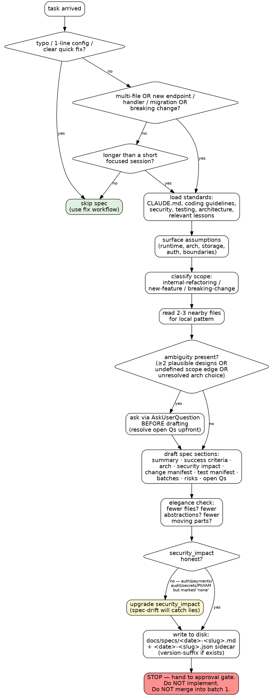

# Spec-Driven Development

## Overview

Write the implementation spec before writing code. The spec is the shared source of truth between the engineer, the command flow, and the reviewers. Code without a spec is guessing.

## When To Use

- New endpoints, handlers, routes, or views
- Database changes or migrations
- Multi-file work
- Breaking changes
- Any task where approval should happen before coding
- Any task likely to take more than a short focused session

### When NOT To Use

- Typo fixes
- One-line config updates with no behavior impact
- Small bug fixes that clearly stay within quick-fix scope

## Workflow

### Decision Graph

This graph drives the two questions models get wrong most often: *"do I need a spec at all?"* and *"can I start coding after writing one?"* The red node is the hard stop — implementation never begins inside this skill.



**Red flags inside the loop:**

| Rationalization | Reality |
|---|---|
| "I'll write the spec after I implement it" | That's documentation, not specification. The value is deciding *before* coding. |
| "Small enough to skip approval" | Multi-file work creates risk regardless of size. The gate catches bad direction early. |
| "I already know which files will change" | You have a hypothesis. Read neighboring files; prove the manifest. |
| "security_impact is `none`, it's just a small change" | If the diff touches auth / payments / audit trails / secrets / PII / IAM, it isn't `none`. spec-drift-detection blocks. |
| "I'll start batch 1 while waiting for approval" | No. The approval gate is the hard stop. |

### Steps

1. Read standards in this order:
   - `CLAUDE.md`
   - The coding guidelines from the active tech stack skill's `## Reference Files`
   - `.claude/references/security-checklist.md`
   - `.claude/references/testing-patterns.md`
   - `.claude/references/architecture-principles.md` if present
   - Relevant lessons from `tasks/lessons.md`
2. Resolve the lessons path using the main worktree when in a worktree.
3. Surface assumptions before planning. State what you believe about runtime, architecture, storage, auth, and boundaries. Do not silently fill in major gaps.
4. Classify scope:
   - `internal-refactoring`
   - `new-feature`
   - `breaking-change`
5. Read 2-3 nearby files that represent the local pattern to follow.
6. **Ambiguity gate (BEFORE drafting).** Detect whether the task has genuine ambiguity that would change the spec. Trigger if **any** of:
   - Two or more plausible designs exist and the request doesn't pick one (e.g., reflection vs source-gen, sync vs async, single vs split package).
   - Scope edges are undefined (e.g., "users" — authenticated only? including service accounts? soft-deleted?).
   - An architectural choice is unresolved (e.g., new boundary, new persistence target, cross-slice contract).
   - A success criterion would be untestable as stated.

   If triggered: stop and call `AskUserQuestion` with one question per ambiguity (max 4). Each question presents 2–4 concrete options with the tradeoff in the description. Wait for answers, then proceed to drafting with answers folded into the spec — do NOT defer them to "Open questions" in the spec body.

   If `AskUserQuestion` is deferred, load it via `ToolSearch` with `select:AskUserQuestion`. If the harness doesn't expose it, print the questions as a numbered list and stop until the engineer answers.

   Skip the gate when: the engineer's request already specifies the approach, the task follows an obvious existing pattern, or only one viable design fits the constraints. Document the skip in one line ("ambiguity gate skipped: <reason>") so it's visible in the session log.
7. Produce a spec with these sections:
   - Summary
   - Success criteria
   - Architecture and design
   - Security and compliance impact
   - Change manifest
   - Test manifest
   - Implementation batches
   - Risks and assumptions
   - Open questions
8. Run an elegance check: reduce file count, new abstractions, and moving parts if a simpler design exists.
9. Persist the spec to disk:
   - Create `docs/specs/` if it does not exist.
   - Compute the base target: `docs/specs/YYYY-MM-DD-<feature-slug>` (no extension yet).
   - **Version detection:** Check whether `docs/specs/YYYY-MM-DD-<feature-slug>.md` already exists.
     - If it does NOT exist → write to `docs/specs/YYYY-MM-DD-<feature-slug>.md` (no suffix).
     - If it DOES exist → find the highest existing `-vN` suffix:
       ```bash
       ls docs/specs/YYYY-MM-DD-<slug>*.md 2>/dev/null | grep -oE '\-v[0-9]+' | sort -V | tail -1
       ```
       If a `-vN` suffix is found, write as `-v(N+1)`. If the file exists but no `-vN` variants do, write as `-v2`.
     - The JSON sidecar gets the **same version suffix** (e.g., `docs/specs/YYYY-MM-DD-<slug>-v2.json`).
     - Emit one line before writing: `Writing spec → docs/specs/<final-filename>.md` so the engineer can confirm the version chosen.
   - **Also emit a machine-parseable sidecar** at `docs/specs/<final-filename>.json` with the schema in the next section. This sidecar drives `spec-drift-detection` after implementation.
   - This enables session recovery, human review outside chat, and reuse across sessions.
   - Add `docs/specs/` to `.gitignore` if not already present — specs are working artifacts, not committed deliverables.
10. Always stop for approval before implementation. When invoked from the implement workflow, this means handing control back to Phase 2.5 approval gate (which uses `AskUserQuestion`). Do not silently continue to implementation.

## Machine-Parseable Manifest (JSON Sidecar)

Every spec is accompanied by a structured manifest at
`docs/specs/<date>-<slug>.json`, validated against
`.claude/schemas/handoff.schema.json`. This is the source of truth for
drift detection and for the `plan` and `implement` sections appended
later by downstream skills (MetaGPT typed-handoff pattern).

```json
{
  "slug": "feature-slug",
  "date": "YYYY-MM-DD",
  "scope": "new-feature | internal-refactoring | breaking-change",
  "change_manifest": [
    { "path": "src/X.cs", "action": "create | modify | delete", "purpose": "one-line why" }
  ],
  "public_contracts": [
    { "kind": "endpoint | handler | method | event | cli-flag",
      "signature": "POST /api/orders or Namespace.Class.Method(...) or OrderCreated event",
      "change": "new | modified | removed" }
  ],
  "success_criteria": [
    { "id": "SC1", "description": "testable outcome", "verification": "name of test or command" }
  ],
  "test_manifest": [
    { "path": "tests/X_Tests.cs", "covers": ["SC1", "SC2"] }
  ],
  "out_of_scope": ["explicit non-goals"],
  "security_impact": "none | requires-audit-trail | new-auth-path | secrets-change | pii-exposure | iam-change",
  "assumptions": ["..."],
  "risks": ["..."]
}
```

Rules:

- Every entry in `change_manifest` must be intended — do not pre-populate
  with files you "might" touch.
- `public_contracts` is what callers or external consumers will see change.
  Internal helpers don't count.
- `security_impact` is NOT `none` if the diff touches auth, payments,
  audit trails, secrets, PII paths, or IAM configuration. Be honest here;
  `spec-drift-detection` will catch understated impact and block.
- Keep the JSON in sync with the markdown spec. They are one artifact in
  two shapes, not independent documents.

## Required Outputs

- A clear scope classification
- A file-level change manifest covering every file to be touched
- A test manifest covering every behavioral change
- A batch breakdown with build/test checkpoints
- A list of assumptions and unresolved risks
- Concrete, testable success criteria
- A JSON sidecar manifest at `docs/specs/<date>-<slug>.json` matching the
  Machine-Parseable Manifest schema (drives drift detection)

## Common Rationalizations

See `.claude/skills/context-engineering/SKILL.md` for the shared table. Spec-specific traps: "I'll write the spec after I implement it" (that is documentation, not specification — the value is in deciding before coding), "this is small enough to skip approval" (small multi-file work still creates risk — approval gates catch bad direction early), and "I already know which files will change" (you have a hypothesis, not a manifest — read neighboring files and prove it).

## Red Flags

- Planning after code has already started
- Files likely to be touched but omitted from the change manifest
- Missing tests for new public behavior
- Approval gate skipped or merged into implementation
- Success criteria written as vague aspirations instead of verifiable outcomes

## Verification

- [ ] The plan can be handed to another engineer with no missing context
- [ ] Every file and every test file appears in the manifest
- [ ] Success criteria are specific and testable
- [ ] Assumptions are explicit
- [ ] The scope still matches the original request
- [ ] The JSON sidecar exists at `docs/specs/<date>-<slug>.json` and matches
      the markdown spec's change_manifest, test_manifest, success_criteria,
      and security_impact
- [ ] `security_impact` honestly reflects touched trust boundaries (not `none`
      if auth / payments / audit / secrets / PII / IAM are involved)
