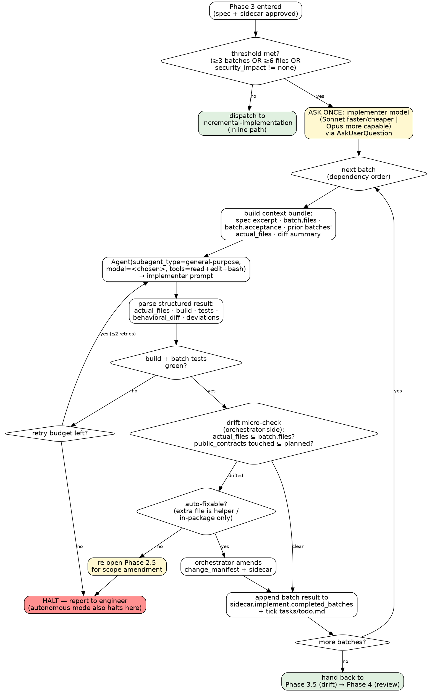

# Subagent Implementation

## Overview

Per-batch context isolation for large features. The orchestrator (main context) holds the spec, plan, and JSON sidecar; each batch's actual editing happens inside a fresh subagent that receives only what it needs and returns a structured result. Inspired by `obra/superpowers`'s subagent-driven-development; adapted to MTK's typed-handoff and Phase-4 review architecture.

This skill is a **branch** of `incremental-implementation`, not a replacement. `implement/SKILL.md` Phase 3 picks one based on the threshold below.

## When To Use

Phase 3 of `implement/SKILL.md` invokes this skill when **any** of these are true (read from `docs/specs/<date>-<slug>.json`):

- `plan.batches.length >= 3`
- `change_manifest.length >= 6`
- `security_impact != "none"`

### When NOT To Use

- 1-2 batch features → use `incremental-implementation` (inline path; cheaper).
- Quick fixes (already routed through `fix/SKILL.md`).
- Single-file refactors.
- Standalone runs without an approved spec — there is no JSON sidecar to thread.

## Workflow

### Decision Graph

The orchestrator never edits source. The implementer subagent never spawns further subagents. The drift check is fast and orchestrator-side — no reviewer agent per batch.



### Steps

1. **Threshold gate.** Read `docs/specs/<date>-<slug>.json`. If thresholds not met → return control to `implement/SKILL.md` Phase 3 with the recommendation to use `incremental-implementation` instead. Do not silently fall through.
2. **Pick implementer model.** Invoke `AskUserQuestion` once (load via `ToolSearch select:AskUserQuestion` if deferred):
   - Question: `Implementer subagent model? Affects per-batch cost and capability.`
   - Options:
     - `Sonnet (default — faster, cheaper, suits straightforward batches)`
     - `Opus (more capable — pick when the batch involves novel logic, tricky concurrency, or unfamiliar framework behavior)`
   - Persist the choice in memory for the rest of the loop. Do **not** ask again between batches. If the harness does not expose `AskUserQuestion`, default to Sonnet and emit one line: `Implementer model defaulted to Sonnet (AskUserQuestion unavailable).`
3. **For each batch in dependency order:**
   1. **Build the context bundle.** Concatenate:
      - Spec sections relevant to this batch (`Summary`, `Architecture and design`, `Security and compliance impact` if non-none)
      - The single batch object from `plan.batches[]` (id, files, acceptance, verification, boundary, depends)
      - **Prior-batch summary:** for every batch already in `sidecar.implement.completed_batches`, include `{id, actual_files, behavioral_diff}`. Do NOT include full prior diffs — just the summary.
      - Active tech stack name and the path to its skill (don't paste the skill body; the subagent will read it itself).
      - The full `change_manifest` and `out_of_scope` arrays — the subagent must know its boundary.
      - The path to `CLAUDE.md`.
   2. **Dispatch the implementer subagent** via `Agent` tool with:
      - `subagent_type: general-purpose` (no MTK-specific implementer subagent type — keep tool surface generic)
      - `model: <chosen>` (Sonnet or Opus from step 2)
      - `description: Batch <id> — <one-line intent>`
      - `prompt`: see "Implementer prompt template" below
   3. **Parse the structured result.** The implementer must return a fenced JSON block matching:
      ```json
      {
        "batch_id": "B2",
        "actual_files": ["src/Foo.cs", "tests/FooTests.cs"],
        "build": { "ok": true, "evidence": "command + tail" },
        "tests": { "ok": true, "evidence": "test summary" },
        "behavioral_diff": "what an external caller now observes that they didn't before",
        "deviations": [
          { "kind": "extra-file|skipped-file|extra-contract|other",
            "detail": "...", "justification": "..." }
        ]
      }
      ```
      If JSON parse fails → treat as build/test failure (retry once with explicit "return JSON exactly per schema" reminder; then halt).
   4. **Build/test gate.** If `build.ok == false` or `tests.ok == false`:
      - Up to 2 retries with the failure output appended to the prompt.
      - On exhaustion, halt and report to engineer (also in autonomous mode — the gate is structural, not interactive).
   5. **Drift micro-check (orchestrator-side, no agent call).**
      - `extra_files = actual_files - batch.files`
      - `missing_files = batch.files - actual_files` (excluding files explicitly deferred by the spec)
      - `public_contract_touched`: if any `actual_files` matches a path in `change_manifest` whose entry has a `public_contracts` linkage, confirm the contract change matches the planned one.
      - **Clean** → proceed to step 6.
      - **Drifted, auto-fixable** (extra file is in-package, no new public contract, security_impact unchanged) → orchestrator amends the sidecar `change_manifest` with the new file and a `deviations` note. Continue.
      - **Drifted, not auto-fixable** (cross-package leak, new public contract, security_impact escalated, or `out_of_scope` violated) → re-open Phase 2.5 approval gate. Halt the loop until the engineer answers.
   6. **Persist the batch result.**
      - Append `{batch_id, actual_files, build, tests, behavioral_diff, deviations}` to `sidecar.implement.completed_batches[]`.
      - Run `bash scripts/validate-handoff.sh docs/specs/<date>-<slug>.json` (if available) to surface schema drift early.
      - Tick the batch row in `tasks/todo.md`.
   7. **Cumulative churn check.** After every batch, run `git diff --stat <base>...HEAD` and count net lines. Mirror `incremental-implementation` thresholds: ≥300 lines without an intermediate review → trigger an early `pre-commit-review-list` pass. ≥500 lines without a review → halt and run `compliance-reviewer` before continuing.
4. **After all batches:**
   - Write a final aggregated `behavioral_diff` to `sidecar.implement.behavioral_diff`.
   - Hand control back to `implement/SKILL.md` Phase 3.5 (whole-feature spec-drift) → Phase 4 (two-stage review). Both run unchanged. Per-batch micro-checks are supplemental, not a replacement.

### Implementer prompt template

The implementer subagent has no MTK context other than what you give it. The prompt must be self-sufficient.

```
You are implementing one batch of a planned feature.

Repo root: <absolute path>
Read first (in this order):
  - CLAUDE.md
  - .claude/skills/tech-stack-<stack>/SKILL.md (build/test commands, ORM/framework patterns, reference files)
  - The coding guidelines listed in that tech stack's "## Reference Files" section

This batch:
<paste batch object: id, files, acceptance, verification, boundary, depends>

Spec context for this batch:
<paste relevant spec sections>

Whole-feature change_manifest (your hard boundary — do NOT touch files outside this list without
returning a "deviation" entry; do NOT add new public contracts not listed):
<paste change_manifest>

Out of scope (must not be touched):
<paste out_of_scope>

Prior batches already completed (you can rely on these existing; do NOT re-edit them):
<paste prior actual_files + behavioral_diff summaries>

Rules:
1. Read before editing. Match local patterns.
2. Stay within batch.files. If you discover an unavoidable extra file, edit it but record it
   as a `deviation` in your final JSON.
3. Add or update tests in this same batch — never defer to a later batch.
4. Run the build command and the relevant test command from the tech stack skill before returning.
5. If build or tests fail, return the error in `build.evidence` / `tests.evidence` with `ok: false`
   and a one-line analysis. Do not loop endlessly.
6. Do NOT spawn further subagents.
7. Do NOT ask the engineer questions — you are an inner subagent, not the orchestrator.

Return EXACTLY one fenced JSON block matching this schema, then stop:

```json
{
  "batch_id": "<id>",
  "actual_files": ["..."],
  "build":  { "ok": true|false, "evidence": "..." },
  "tests":  { "ok": true|false, "evidence": "..." },
  "behavioral_diff": "...",
  "deviations": [ { "kind": "...", "detail": "...", "justification": "..." } ]
}
```
```

## Rules

- One implementer subagent per batch. Never reuse a subagent across batches (the point is context isolation).
- Orchestrator never edits source. If editing is needed (e.g. to amend the sidecar after auto-fix), only `docs/specs/*.json`, `tasks/todo.md`, and the sidecar are fair game.
- The model selection is asked **once**, before the loop. Never per batch.
- In autonomous mode (Phase 2.5 returned `Approve & run until done`), the loop runs without further `AskUserQuestion` calls **except** the Phase 2.5 re-open required by non-auto-fixable drift. That re-open is a structural halt, not a chatty confirmation.
- Drift micro-check is orchestrator-side and synchronous. No agent call per batch.
- Phase 4 review (compliance, test, architecture, silent-failure-hunter) runs unchanged after the loop.

## Common Rationalizations

See `.claude/skills/context-engineering/SKILL.md` for the shared table. Subagent-implementation-specific traps:

| Rationalization | Reality |
|---|---|
| "I'll just edit it myself, faster than dispatching" | That defeats the entire point. Context contamination is the cost you pay invisibly. Dispatch. |
| "Let me ask the engineer between batches whether to keep going" | Phase 2.5 already answered. Per-batch confirmation = approval fatigue. Only halt on structural conditions (build fail / non-auto drift). |
| "The implementer touched one extra file, I'll quietly amend the manifest" | Auto-fix is allowed only inside the package, with no new public contract and no security_impact change. Anything else re-opens 2.5. |
| "I'll let the implementer subagent do the spec-drift review too" | No. Drift is orchestrator-side. The subagent is too close to its own diff to judge it. |
| "Let me reuse the same subagent across batches to save tokens" | Then it's not subagent-driven. Use `incremental-implementation` instead. |
| "Build failed, I'll skip this batch and continue" | No. A failing batch poisons every later batch's assumptions. Retry, then halt. |

## Red Flags

- Orchestrator using `Edit` or `Write` on source files
- Implementer subagent receiving the prior batch's full diff (should be summary only)
- Implementer subagent calling `Agent` (recursion)
- Drift detected but loop continued without sidecar amendment
- `AskUserQuestion` called more than once per loop (model pick excluded)
- Per-batch review agent dispatched (was deferred to v2; if you need this, talk to maintainers first)
- Phase 4 skipped because "every batch was already reviewed"

## Verification

- [ ] Threshold check ran and produced a documented yes/no
- [ ] Implementer model was asked once via `AskUserQuestion` (or defaulted with explicit notice)
- [ ] One fresh subagent dispatched per batch (no reuse)
- [ ] Each subagent returned a parseable JSON result matching the schema
- [ ] Drift micro-check ran for every batch, with auto-fix or 2.5 re-open as appropriate
- [ ] `sidecar.implement.completed_batches[]` reflects every batch with actual_files and behavioral_diff
- [ ] `tasks/todo.md` ticks match completed batches
- [ ] Phase 4 review still runs unchanged after the loop
- [ ] Cumulative churn thresholds (300/500 lines) honored
