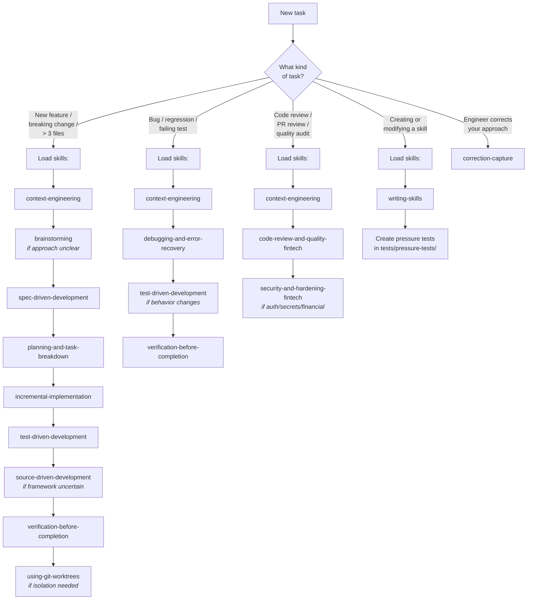
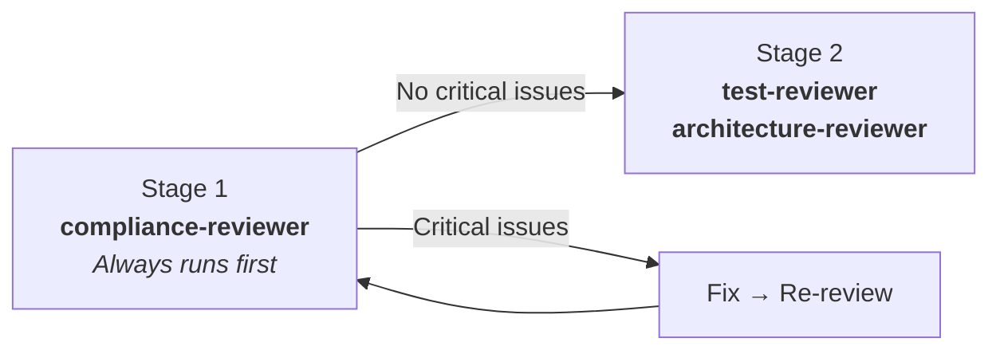

# MTK Agent Routing

This repository uses a hybrid model: **commands** are user-facing entry points, **skills** are reusable workflow blocks, and **agents** are specialist reviewers.

---

## Routing Decision Tree



---

## Command Mapping

| Command | Skill Composition |
|:---|:---|
| `/mtk:implement` | brainstorm *(optional)* → context → spec *(+ JSON sidecar)* → task breakdown → TDD → source-driven impl → **spec-drift-detection** → two-stage review → simplification |
| `/mtk:fix` | debugging/error recovery → focused verification |
| `/mtk:pre-commit-review` | static linter pass *(confidence 100)* → AI review *(confidence-scored)*, merged via `.claude/references/review-finding-schema.md` |
| `/mtk:setup-bootstrap` | bootstrap project standards, AGENTS.md, and pre-commit review assets |
| `/mtk:setup-audit` | extract architecture (default) or unify multi-repo audits (`--merge`) |

### Review Output Schema (v5.5+)

All review entry points emit a markdown table plus a fenced JSON block per
`.claude/references/review-finding-schema.md`. Findings carry
`source: "linter" | "ai" | "drift"`, a severity, and a confidence (0–100).
Default threshold 80 (configured in `.claude/review-config.json`; override
via `.claude/review-config.local.json`).

### Eval Pipeline

Ship-path skills (`security-and-hardening-fintech`, `pre-commit-review`,
`verification-before-completion`) have positive / negative / adversarial
evals under `evals/<skill>/`. Run via `bash scripts/run-evals.sh` — manual
mode by default; set `EVAL_EXECUTOR` / `EVAL_GRADER` for automation.

### Path-Scoped Reference Loading

Reference entries in `.claude/manifest.json` may declare an `applyTo`
glob array. `context-engineering` matches touched files against these
globs and loads only the matching references, avoiding session-wide
context bloat.

**Model-invoked skills** (no command — loaded automatically when triggered):
- `handoff` — capture session state when context is tight or work is paused mid-stream
- `correction-capture` — capture engineer corrections as reusable lessons

---

## Review Routing (Two-Stage)



**Stage 1 (spec compliance):** Always runs first.
- Security/compliance-sensitive work → `compliance-reviewer`

**Stage 2 (quality and coverage):** Only after Stage 1 passes with no Critical issues.
- Test completeness or missing coverage → `test-reviewer`
- Architecture or slice boundary concerns → `architecture-reviewer`

---

## Tech Stack Loading

The toolkit uses pluggable tech stacks. The active stack is recorded in `.claude/tech-stack` (a single word like `dotnet`, `python`, or `typescript`). Every command and agent reads this file in Phase 0 and loads the corresponding `.claude/skills/tech-stack-{stack}/SKILL.md`. For the `typescript` stack, `.claude/tech-stack-pm` additionally stores the auto-detected package manager (bun / pnpm / yarn / npm). That skill provides:

- Build and test commands
- ORM and framework patterns
- Stack-specific reference file paths
- Scan recipes for `setup-bootstrap` and `setup-audit`
- Settings to merge during `setup-bootstrap`

If a repo has no `.claude/tech-stack` file, run `/mtk:setup-bootstrap` first.

## Reference Loading

Load shared references **progressively** — only what the current phase needs:

| Phase | References |
|:---|:---|
| **Always** | The coding guidelines from the active tech stack's `## Reference Files` |
| **Planning** | `security-checklist.md` *(if scope touches security)*, `testing-patterns.md` |
| **Implementation** | `performance-checklist.md`, plus stack-specific ORM checklist and framework patterns from the tech stack's `## Reference Files` |
| **Review** | `quick-check-list.md` *(if present)* |

---

## Routing Rules

1. Always read `CLAUDE.md` first when present — it is the project-specific source of truth
2. If a command exists for the task, prefer it as the user-facing entry point, but still follow the underlying skills
3. Do not skip planning, testing, review, or verification when the chosen skill requires them
4. For toolkit structural health (toolkit maintainers only), run `bash scripts/validate-toolkit.sh`. For onboarding a new repo, install the MTK plugin from the marketplace (`/plugin install mtk@moberghr`) then run `/mtk:setup-bootstrap`.

## Agent Self-Escalation

All agents may report `BLOCKED` or `NEEDS_CONTEXT` instead of producing uncertain output. A clear escalation is always more valuable than a low-confidence review.

<!-- gitnexus:start -->
# GitNexus — Code Intelligence

This project is indexed by GitNexus as **claude-helpers** (18 symbols, 10 relationships, 0 execution flows). Use the GitNexus MCP tools to understand code, assess impact, and navigate safely.

> If any GitNexus tool warns the index is stale, run `npx gitnexus analyze` in terminal first.

## Always Do

- **MUST run impact analysis before editing any symbol.** Before modifying a function, class, or method, run `gitnexus_impact({target: "symbolName", direction: "upstream"})` and report the blast radius (direct callers, affected processes, risk level) to the user.
- **MUST run `gitnexus_detect_changes()` before committing** to verify your changes only affect expected symbols and execution flows.
- **MUST warn the user** if impact analysis returns HIGH or CRITICAL risk before proceeding with edits.
- When exploring unfamiliar code, use `gitnexus_query({query: "concept"})` to find execution flows instead of grepping. It returns process-grouped results ranked by relevance.
- When you need full context on a specific symbol — callers, callees, which execution flows it participates in — use `gitnexus_context({name: "symbolName"})`.

## When Debugging

1. `gitnexus_query({query: "<error or symptom>"})` — find execution flows related to the issue
2. `gitnexus_context({name: "<suspect function>"})` — see all callers, callees, and process participation
3. `READ gitnexus://repo/claude-helpers/process/{processName}` — trace the full execution flow step by step
4. For regressions: `gitnexus_detect_changes({scope: "compare", base_ref: "main"})` — see what your branch changed

## When Refactoring

- **Renaming**: MUST use `gitnexus_rename({symbol_name: "old", new_name: "new", dry_run: true})` first. Review the preview — graph edits are safe, text_search edits need manual review. Then run with `dry_run: false`.
- **Extracting/Splitting**: MUST run `gitnexus_context({name: "target"})` to see all incoming/outgoing refs, then `gitnexus_impact({target: "target", direction: "upstream"})` to find all external callers before moving code.
- After any refactor: run `gitnexus_detect_changes({scope: "all"})` to verify only expected files changed.

## Never Do

- NEVER edit a function, class, or method without first running `gitnexus_impact` on it.
- NEVER ignore HIGH or CRITICAL risk warnings from impact analysis.
- NEVER rename symbols with find-and-replace — use `gitnexus_rename` which understands the call graph.
- NEVER commit changes without running `gitnexus_detect_changes()` to check affected scope.

## Tools Quick Reference

| Tool | When to use | Command |
|------|-------------|---------|
| `query` | Find code by concept | `gitnexus_query({query: "auth validation"})` |
| `context` | 360-degree view of one symbol | `gitnexus_context({name: "validateUser"})` |
| `impact` | Blast radius before editing | `gitnexus_impact({target: "X", direction: "upstream"})` |
| `detect_changes` | Pre-commit scope check | `gitnexus_detect_changes({scope: "staged"})` |
| `rename` | Safe multi-file rename | `gitnexus_rename({symbol_name: "old", new_name: "new", dry_run: true})` |
| `cypher` | Custom graph queries | `gitnexus_cypher({query: "MATCH ..."})` |

## Impact Risk Levels

| Depth | Meaning | Action |
|-------|---------|--------|
| d=1 | WILL BREAK — direct callers/importers | MUST update these |
| d=2 | LIKELY AFFECTED — indirect deps | Should test |
| d=3 | MAY NEED TESTING — transitive | Test if critical path |

## Resources

| Resource | Use for |
|----------|---------|
| `gitnexus://repo/claude-helpers/context` | Codebase overview, check index freshness |
| `gitnexus://repo/claude-helpers/clusters` | All functional areas |
| `gitnexus://repo/claude-helpers/processes` | All execution flows |
| `gitnexus://repo/claude-helpers/process/{name}` | Step-by-step execution trace |

## Self-Check Before Finishing

Before completing any code modification task, verify:
1. `gitnexus_impact` was run for all modified symbols
2. No HIGH/CRITICAL risk warnings were ignored
3. `gitnexus_detect_changes()` confirms changes match expected scope
4. All d=1 (WILL BREAK) dependents were updated

## Keeping the Index Fresh

After committing code changes, the GitNexus index becomes stale. Re-run analyze to update it:

```bash
npx gitnexus analyze
```

If the index previously included embeddings, preserve them by adding `--embeddings`:

```bash
npx gitnexus analyze --embeddings
```

To check whether embeddings exist, inspect `.gitnexus/meta.json` — the `stats.embeddings` field shows the count (0 means no embeddings). **Running analyze without `--embeddings` will delete any previously generated embeddings.**

> Claude Code users: A PostToolUse hook handles this automatically after `git commit` and `git merge`.

## CLI

| Task | Read this skill file |
|------|---------------------|
| Understand architecture / "How does X work?" | `.claude/skills/gitnexus/gitnexus-exploring/SKILL.md` |
| Blast radius / "What breaks if I change X?" | `.claude/skills/gitnexus/gitnexus-impact-analysis/SKILL.md` |
| Trace bugs / "Why is X failing?" | `.claude/skills/gitnexus/gitnexus-debugging/SKILL.md` |
| Rename / extract / split / refactor | `.claude/skills/gitnexus/gitnexus-refactoring/SKILL.md` |
| Tools, resources, schema reference | `.claude/skills/gitnexus/gitnexus-guide/SKILL.md` |
| Index, status, clean, wiki CLI commands | `.claude/skills/gitnexus/gitnexus-cli/SKILL.md` |

<!-- gitnexus:end -->
