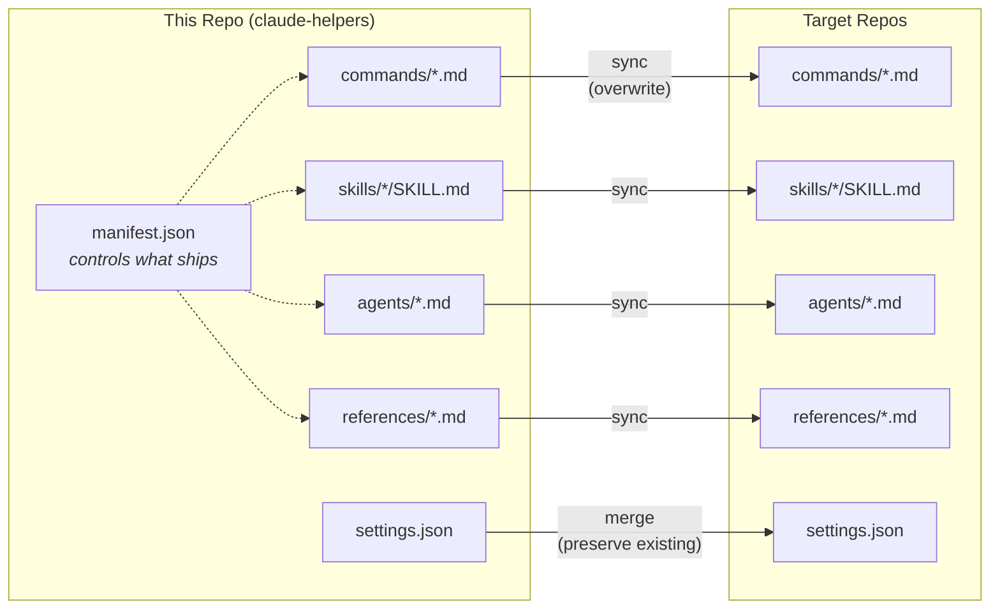
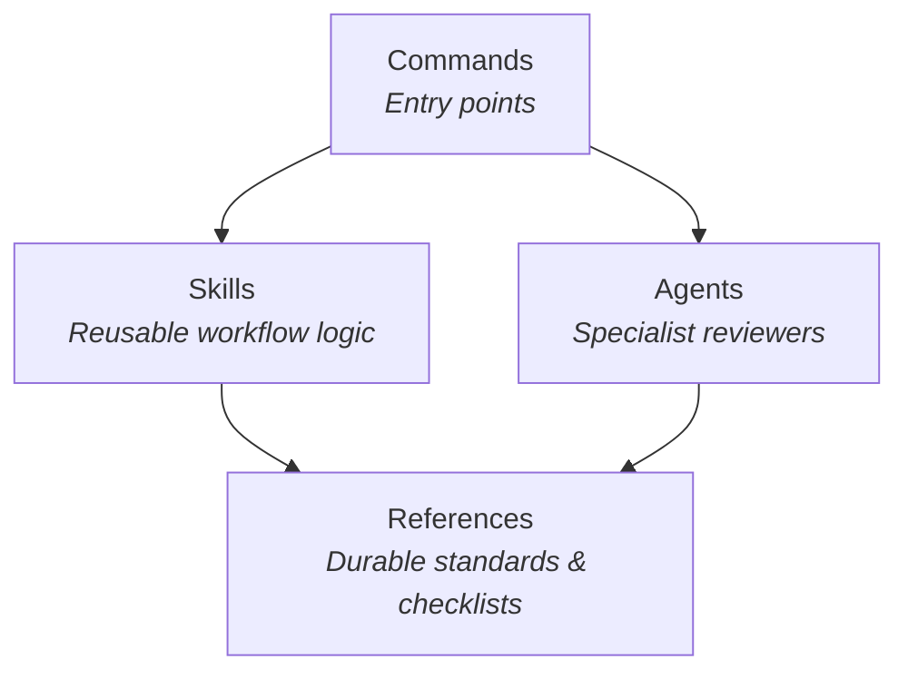
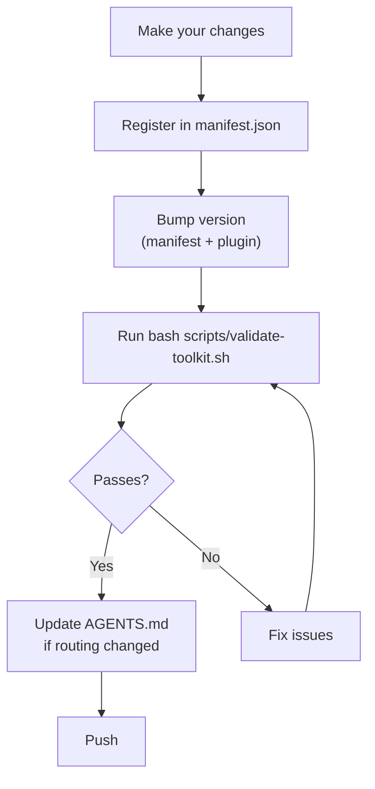

# Contributing to MTK (Moberg Toolkit)

MTK is the shared source of truth for AI-assisted development at Moberg HR. Anyone on the team can extend it — add commands, skills, agents, references, or validation rules.

---

## How the Toolkit Works



`manifest.json` is the registry. It lists every distributed file, its source, how it ships (`sync` = overwrite, `merge` = intelligent union), and which files are `protected`.

---

## Architecture Guidelines



- **Commands** are entry points — user-facing, thin orchestration
- **Skills** hold reusable workflow logic — the building blocks
- **Agents** are specialized personas, usually for review
- **References** hold durable standards and checklists
- If a command section could be reused elsewhere, extract a skill instead of growing the command

---

## Adding a New Entry-Point Skill

1. Create `.claude/skills/your-skill/SKILL.md`:

```yaml
---
name: your-skill
description: One-line description shown in the skill list
allowed-tools: Read, Write, Edit, Bash, Glob, Grep
argument-hint: [optional] <expected arguments>
---

# Skill Title

## Workflow

## Critical Rules
```

2. Keep command-specific orchestration in the command
3. Put reusable workflow rules in a skill
4. Register in `manifest.json`
5. Bump version in both `manifest.json` and `plugin.json`

---

## Adding a New Skill

1. Create `.claude/skills/<skill-name>/SKILL.md`
2. Follow [docs/skill-anatomy.md](docs/skill-anatomy.md) — minimum structure:

```yaml
---
name: skill-name
description: Short description of the reusable workflow
---

# Skill Title

## Overview
## When To Use
## Workflow
## Verification
```

3. Register in `manifest.json`
4. Reference from a command or `AGENTS.md`
5. Bump version

---

## Adding a New Agent

1. Create `.claude/agents/your-agent.md`
2. Keep agent tools narrow — usually read-only
3. Use `model: sonnet` unless there is a clear reason not to
4. Register in `manifest.json`
5. Bump version

---

## Adding References

1. Place the file in `.claude/references/your-reference.md`
2. Register in `manifest.json` with `"action": "sync"`
3. If it is repo-specific and should never be overwritten, add to `protected` instead

---

## Writing Anti-Rationalization Tables

This is one of the highest-value prompt patterns in the repo.

**Good rationalizations are:**
- Specific — tied to a real scenario
- Realistic — something the model actually says
- Paired with sharp rebuttals
- Domain-aware

**Bad rationalizations are:**
- Generic advice
- Rule restatements with no consequence
- Hypothetical cases the model never actually uses

---

## Pre-Push Checklist



1. Verify command or agent syntax in Claude Code if applicable
2. Every new shipped file must be registered in `manifest.json`
3. Generated repo-local assets should be in the `protected` list
4. Bump version in both `manifest.json` and `plugin.json`
5. Run `bash scripts/validate-toolkit.sh`
6. If workflow logic is reusable, update `AGENTS.md` and commands to compose the new skill

---

## Style Guidelines

- Be opinionated
- Be concrete
- Be brief
- Number rules when they need to be cited
- Match existing patterns
- Prefer extraction over growth when a workflow is reusable
