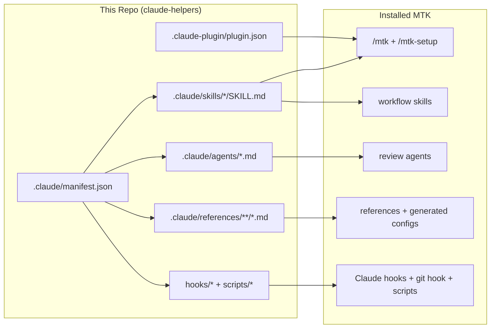

# Contributing to MTK (Moberg Toolkit)

MTK is a skills-first toolkit for disciplined AI-assisted engineering. Contributions should strengthen one of these layers:

- `.claude/skills/` — workflow logic and entry points
- `.claude/agents/` — specialist reviewers
- `.claude/references/` — durable standards and checklists
- `hooks/` and `scripts/` — deterministic enforcement and verification
- `.claude/manifest.json` and `.claude-plugin/` — what ships and how it is distributed

---

## How the Toolkit Works



`manifest.json` is the shipping registry. It declares every distributed file, where it comes from, and how it is synced. `plugin.json` and `marketplace.json` must stay version-aligned with the manifest.

---

## Architecture Model

MTK has two user-facing entry points:

- `/mtk` — natural-language router
- `/mtk-setup` — bootstrap and audit entry point

Everything else is composed underneath that surface:

- **Entry-point skills** orchestrate user-facing flows.
- **Workflow skills** hold reusable process logic.
- **Agents** provide isolated reviewer personas.
- **References** hold stable standards and checklists.
- **Hooks and scripts** enforce the parts that should be deterministic.

If something is reusable across tasks, it belongs in a skill or reference, not in an entry-point prompt blob.

---

## Adding an Entry-Point Skill

1. Create `.claude/skills/<skill-name>/SKILL.md`.
2. Use frontmatter like:

```yaml
---
name: your-skill
description: One-line description shown in the skill list
allowed-tools: Read, Glob, Grep, Bash
argument-hint: [optional] <expected arguments>
---
```

3. Keep the surface thin. Entry-point skills should route or orchestrate, not duplicate reusable workflow content.
4. Register the file in `.claude/manifest.json`.
5. Bump versions in `.claude/manifest.json`, `.claude-plugin/plugin.json`, and `.claude-plugin/marketplace.json` together.

---

## Adding a Workflow Skill

1. Create `.claude/skills/<skill-name>/SKILL.md`.
2. Follow [docs/skill-anatomy.md](docs/skill-anatomy.md).
3. Standard workflow skills should include:

```yaml
---
name: skill-name
description: Short description of the reusable workflow
---

# Skill Title

## Overview
## When To Use
## Workflow
## Verification
```

4. Reference the skill from `AGENTS.md` or an entry-point skill if it changes routing behavior.
5. Register it in the manifest.

---

## Adding an Agent

1. Create `.claude/agents/<agent-name>.md`.
2. Keep agent tools narrow and role-specific.
3. Prefer reviewer personas that emit structured, schema-conformant output.
4. Register the agent in the manifest.
5. If the agent changes routed review behavior, update `AGENTS.md` and any relevant skill docs.

---

## Adding References

1. Place the file in `.claude/references/` or a stack-specific subdirectory.
2. Register it in the manifest with `"action": "sync"`.
3. If it should only load for certain paths, add `applyTo` globs in the manifest entry.

---

## Hooks and Scripts

Use deterministic automation for anything that should not rely on model judgment.

- Put Claude/runtime hooks in `hooks/`.
- Put maintainer utilities and verification scripts in `scripts/`.
- Follow `.claude/rules/hooks-and-scripts.md`.
- Use only the allowed portable shell tooling unless the rule explicitly allows more.

When you add a new required hook or script:

1. Register it in the manifest.
2. Make it executable.
3. Update `scripts/validate-toolkit.sh` if the new file or invariant is now required.
4. Add or extend deterministic benchmarks in `scripts/run-benchmarks.sh` when behavior is testable without an LLM.

---

## Anti-Rationalization Tables

This is one of MTK's highest-value prompt patterns.

Good entries are:

- specific to real model failure modes
- phrased the way a model actually rationalizes
- paired with a sharp rebuttal
- grounded in the domain or workflow phase

Bad entries are:

- generic advice
- rule restatements with no behavioral trap
- contrived hypotheticals the model never actually uses

---

## Pre-Push Checklist

1. Register every shipped file in `.claude/manifest.json`.
2. Bump `.claude/manifest.json`, `.claude-plugin/plugin.json`, and `.claude-plugin/marketplace.json` together if you are shipping a new version.
3. Update `AGENTS.md` if routing behavior changed.
4. Run `bash scripts/validate-toolkit.sh`.
5. Run `bash scripts/run-benchmarks.sh` if hooks, scripts, or deterministic behavior changed.
6. Update `CHANGELOG.md` for user-visible behavior changes.

---

## Style Guidelines

- Be opinionated.
- Be concrete.
- Keep entry points thin.
- Prefer the smallest correct change.
- Put reusable content in skills or references, not duplicated prose.
- Keep docs honest about what is enforced versus what is guidance.
