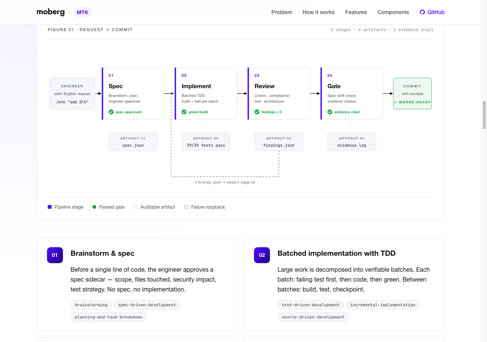
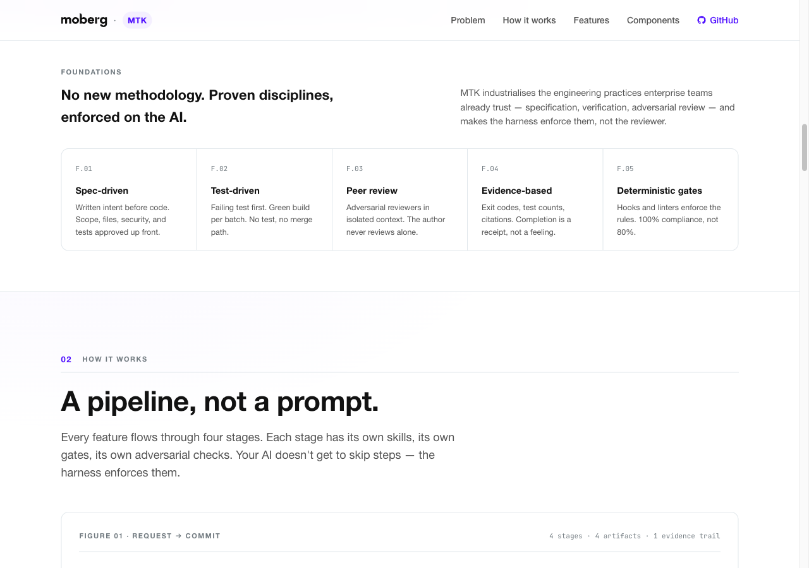
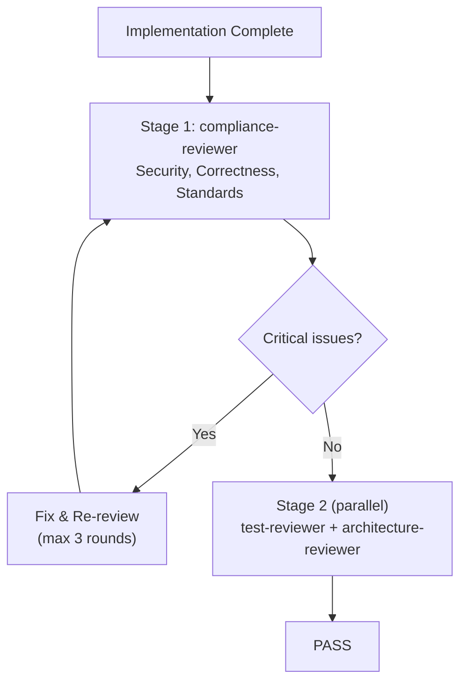

```mermaid
graph LR
    CMD["/mtk &lt;feature&gt;"] --> P0

    subgraph Phases
        direction TB
        P0["Phase 0<br/>context-engineering"] --> P0b
        P0b["Phase 0.5<br/>brainstorming<br/><i>if approach unclear</i>"] --> P1
        P1["Phase 1<br/>spec-driven-development"] --> P2
        P2["Phase 2<br/>planning-and-task-breakdown"] --> GATE
        GATE["Phase 2.5<br/>APPROVAL GATE"] --> P3
        P3["Phase 3<br/>incremental-implementation<br/>+ TDD + security-hardening"] --> DRIFT
        DRIFT["Phase 3.5<br/>spec-drift-detection"] --> P4
        P4["Phase 4<br/>two-stage review"] --> P5
        P5["Phase 5<br/>code-simplification"] --> P6
        P6["Phase 6<br/>verification + lessons"]
    end
```

<div align="center">

# MTK — Moberg Toolkit for AI-Assisted Engineering

### Turn any AI coding assistant into a disciplined engineering partner

**A multi-agent toolkit that enforces your team's coding standards, security policies, and review discipline on every AI-generated line of code. Language-agnostic workflows with pluggable tech stacks for .NET, Python, and TypeScript.**

[](https://github.com/moberghr/mtk-agent-toolkit/releases)
[](https://moberghr.github.io/mtk-agent-toolkit/)
[](https://claude.ai/code)
[](https://cursor.sh)
[](https://github.com/features/copilot)
[](https://codeium.com/windsurf)
[](https://dotnet.microsoft.com/)
[](https://python.org/)
[](https://www.typescriptlang.org/)
[](LICENSE)

**[moberghr.github.io/mtk-agent-toolkit](https://moberghr.github.io/mtk-agent-toolkit/)** — the MTK website.

[Quick Start](#quick-start) · [What's New](#whats-new) · [What It Does](#what-it-does) · [Multi-Agent Support](#multi-agent-support) · [Examples](#examples) · [Architecture](#architecture) · [Skills](#skills) · [Review Agents](#review-agents) · [Tech Stacks](#tech-stacks) · [FAQ](#faq)

<br/>

<a href="https://moberghr.github.io/mtk-agent-toolkit/"></a>

<sub><i>Every feature flows through four gated stages. Each stage emits an auditable artifact. No gate, no merge.</i></sub>

</div>

---

## The Problem

AI code assistants generate code that compiles but silently violates your team's standards. Missing auth checks, unaudited state mutations, N+1 queries, tests that assert nothing meaningful, style drift from one end of the codebase to the other. In serious software — where code touches real money, real users, or regulated data — *"it works"* is not enough.

Most teams respond by writing a big CLAUDE.md or `.cursor/rules`. But instructions are advisory. AI assistants follow them about 80% of the time. The other 20% is where production incidents live.

## What It Does

MTK closes that gap with **workflow enforcement** (planning, TDD, batched implementation), **adversarial review agents** (that find real problems, not style nits), **deterministic linters** (that catch secrets and SQL injection at confidence 100%), and **evidence gates** (no "done" claims without cited build output).

| Without MTK | With MTK |
|:---|:---|
| AI generates code, you review it manually | AI plans, implements in batches, tests, reviews itself adversarially, then reports with evidence |
| CLAUDE.md rules followed ~80% of the time | Critical rules enforced by hooks (100% deterministic) |
| "Tests pass" with no proof | Build output, exit codes, and pass/fail counts cited in every completion |
| Security checks happen if you remember to ask | Security-and-hardening skill activates automatically for auth/secrets/audit changes |
| Review is one prompt: "review this code" | Two-stage pipeline: compliance first, then test + architecture specialists in parallel |
| Findings are vague: "consider adding tests" | Findings are structured JSON with severity, confidence scores, rule citations, and file:line references |

---

## What's New

### v6.3.0 — Opus 4.7 modernization (2026-04-17)
- **Parallelism patterns** — reviewer fan-out and reference loading now run in parallel; Stage 2 review halves in wall-clock time
- **`fix` self-escalation** — `fix` workflow now escalates to `implement` automatically when scope grows beyond 3 files
- **`toolkit-health` skill** — read-only usage-pulse report from `.claude/analytics.json` routed via `/mtk health`
- **Cache-stable prefixes** — the 3 reviewer agents declare `context: fork` with stable preface for higher cache hit rate
- **Consolidated entry points** — two user-invocable skills: `/mtk` (natural-language router) and `/mtk-setup` (bootstrap + audit)

### v6.1.3 — Frontmatter visibility (2026-04-14)
- User-invocable frontmatter now controls skill visibility; entry-point surface limited to 6

### v6.1.0 — Skills-first architecture (2026-04-13)
- Commands merged into skills per Claude Code v2.1.101; all entry points live in `.claude/skills/`

See [CHANGELOG.md](CHANGELOG.md) for the full history.

---

## Quick Start

**Claude Code (plugin marketplace):**
```bash
# 1. Install the plugin
/plugin marketplace add moberghr/claude-helpers
/plugin install mtk@moberghr

# 2. Bootstrap your repo (one-time)
/mtk-setup

# 3. Implement a feature
/mtk add user notification preferences with email and SMS channels

# 4. Quick fix
/mtk fix null reference in PaymentProcessor when amount is zero

# 5. Before every commit
/mtk review before commit
```

**Cursor, Copilot, Windsurf, and other tools:**
```bash
# 1. Clone the toolkit
git clone https://github.com/moberghr/claude-helpers .mtk

# 2. Generate native config for your tool
bash .mtk/scripts/generate-tool-configs.sh --all
# Writes: .cursor/rules/mtk-*.mdc, .github/copilot-instructions.md,
#         .windsurfrules, GEMINI.md, .clinerules

# 3. Follow AGENTS.md for routing to the right skills
```

The toolkit detects your tech stack (`.sln` = .NET, `pyproject.toml` = Python, `package.json` = TypeScript) and from then on every implementation session runs through planning, TDD, two-stage review, and evidence-gated verification.

### Which command should I use?

Two entry points. Everything else is a workflow routed through `/mtk`.

| I want to... | Run this | Under the hood |
|:---|:---|:---|
| Bootstrap a fresh repo | `/mtk-setup` | Detects stack, audits architecture, generates CLAUDE.md |
| Ship a new feature | `/mtk <description>` | spec → plan → TDD batches → two-stage review → evidence gate |
| Fix a bug (1–3 files) | `/mtk fix <what's broken>` | Scope-guarded; self-escalates to `implement` if scope grows |
| Review before committing | `/mtk review before commit` | Deterministic linters + AI judgment in one pass |
| See what MTK has loaded | `/mtk status` | Active stack, references, hooks, domain packs |
| Check toolkit usage trends | `/mtk health` | Usage-pulse report from `.claude/analytics.json` |
| Re-audit architecture | `/mtk-setup --audit` | Refreshes `architecture-principles.md` |
| Unify multi-repo audits | `/mtk-setup --merge` | Merges per-repo audits into team-wide standard |

For a real-world walkthrough of a `/mtk <feature>` session, see [Examples](#examples). For copy-paste project templates, see [`examples/`](examples/).

---

## Multi-Agent Support

MTK is not a Claude Code-only plugin. The workflows and standards work with any AI coding assistant that can read markdown files.

| Tool | Integration method | What you get |
|:---|:---|:---|
| **Claude Code** | Plugin marketplace install | Full `/mtk` skill routing, hooks, session recovery |
| **Cursor** | `.cursor/rules/mtk-*.mdc` (glob-scoped) | Coding guidelines, security rules, test patterns — loaded per file type |
| **GitHub Copilot** | `.github/copilot-instructions.md` | All reference content in Copilot's native format |
| **Windsurf** | `.windsurfrules` | Full reference content |
| **Gemini CLI / AI Studio** | `GEMINI.md` | Full reference content |
| **Cline / Roo** | `.clinerules` | Full reference content |
| **Any AGENTS.md-compatible tool** | `AGENTS.md` routing rules | Skill routing decision tree for the active task type |

Generate all native configs in one command:

```bash
bash scripts/generate-tool-configs.sh --all
# or selectively:
bash scripts/generate-tool-configs.sh --format cursor-rules --format copilot
```

Regenerate any time you update the toolkit or change your tech stack. Generated files are prefixed `mtk-` and never conflict with your own rules.

---

## Examples

### What a review finding looks like

When the compliance-reviewer runs, it outputs structured findings — not vague suggestions:

```
| # | Severity | Confidence | Rule | File | Issue |
|---|----------|------------|------|------|-------|
| F001 | critical | 97 | §1.1 / Security — Auth | src/Api/PaymentsController.cs:34 | New endpoint missing [Authorize] attribute |
| F002 | warning | 88 | §2.3 / Architecture — Layers | src/Api/PaymentsController.cs:41 | Business logic in controller; move to handler |
| F003 | warning | 85 | §5.2 / EF Core — Projections | src/Data/PaymentRepository.cs:22 | Loading full entity for read-only display; use Select() |
```

```json
{
  "verdict": "NEEDS_CHANGES",
  "threshold": 80,
  "summary": { "critical": 1, "warning": 2, "suggestion": 0, "filtered_below_threshold": 1 },
  "findings": [
    {
      "id": "F001",
      "severity": "critical",
      "confidence": 97,
      "rule": "§1.1 / Security — Auth",
      "source": "ai",
      "file": "src/Api/PaymentsController.cs",
      "line": 34,
      "rationale": "POST /api/payments/retry has no [Authorize] attribute. All payment endpoints require authenticated access.",
      "suggested_fix": "Add [Authorize(Policy = \"PaymentOperator\")] to the controller action."
    }
  ]
}
```

Every finding has a `confidence` score (50-100), a `source` (`ai`, `linter`, or `drift`), and a citation to the specific rule violated. Findings below the confidence threshold (default 80) are filtered out — no noise.

### What the deterministic linter catches

Before the AI review even starts, `pre-commit-linters.sh` scans the diff. The linter pack is hierarchical — core patterns apply everywhere, stack and domain packs layer on top:

```
[LINTER] CRITICAL  core/secrets:SECRET-HARDCODED   Hardcoded credential
   > private const string DbPassword = "Prod$ecret123";

[LINTER] CRITICAL  stack-dotnet:SQL-INTERPOLATION   Raw SQL with string interpolation
   > var users = db.Users.FromSqlRaw($"SELECT * FROM Users WHERE Name = '{name}'");

[LINTER] WARNING   core/slopwatch:SLOP-SKIP-TEST    Test disabled — masking a failure
   > [Skip("flaky")]

[LINTER] WARNING   domain-finance:FLOAT-MONEY       float/double for monetary value
   > public double Amount { get; set; }
```

The **slopwatch** pack specifically catches LLM reward-hacking patterns — disabled tests, suppressed warnings, empty implementations, and assertions that always pass. These are the exact shortcuts an AI takes when it wants to claim "done" without doing the work.

### What spec-drift detection looks like

After implementation, the toolkit compares what you built against what you approved:

```
Drift Analysis: docs/specs/2026-04-14-payment-retry.json

  Files in spec but NOT touched:     tests/PaymentRetryTests.cs (CRITICAL)
  Files touched but NOT in spec:     src/Helpers/RetryHelper.cs (CRITICAL — unapproved scope)
  security_impact declared as "none": but src/Auth/PaymentPolicy.cs was modified (CRITICAL)

Verdict: NEEDS_CHANGES — implementation drifted from approved spec
```

### What a `/mtk <feature>` session looks like

```
> /mtk add payment retry logic for failed card transactions

Phase 0: Loading context...
  Tech stack: dotnet | Build: dotnet build | Test: dotnet test
  Loaded: CLAUDE.md, coding-guidelines, security-checklist

Phase 1: Writing spec...
  Spec: docs/specs/2026-04-14-payment-retry.md
  Change manifest: 4 files (2 new, 2 modify)
  Security impact: payments, audit_trail
  Public contracts: POST /api/payments/{id}/retry

Phase 2: Planning batches...
  Batch 1: Domain model + unit tests
  Batch 2: Handler + integration test
  Batch 3: Controller endpoint + auth

  > Do you approve this plan?
  > [A] Approve & run until done  [I] Approve (interactive)  [E] Edit first  [R] Revise

> A

Phase 3: Implementing...
  Batch 1: PaymentRetry.cs + PaymentRetryTests.cs (dotnet test: 47 passed, 0 failed)
  Batch 2: RetryPaymentHandler.cs + RetryPaymentHandlerTests.cs (dotnet test: 52 passed, 0 failed)
  Batch 3: PaymentsController.cs (dotnet test: 55 passed, 0 failed)

Phase 3.5: Spec-drift check...
  All files match change_manifest
  Public contracts match
  Security impact matches

Phase 4: Review...
  Stage 1 — compliance-reviewer: 0 critical, 1 warning (suggestion to add retry count limit)
  Stage 2 — test-reviewer: PASS | architecture-reviewer: PASS

Phase 5: Simplification...
  Removed unused RetryResult.Pending variant

Phase 6: Done
  dotnet build: exit code 0, 0 warnings
  dotnet test: 55 passed, 0 failed, 0 skipped
```

---

## Architecture

<p align="center">
  
</p>

<sub><i>No new methodology. Proven disciplines — specification, verification, adversarial review — made enforceable by the harness itself.</i></sub>

### Design Principles

| Principle | How it works |
|:---|:---|
| **Evidence over assertion** | No task is complete without cited build output, test counts, and exit codes. A Stop hook enforces this. |
| **Security as a design constraint** | Embedded in planning, implementation, and review — not a final polish phase. Runs in isolated context (`context: fork`). |
| **Progressive disclosure** | References loaded when needed, not all at once. Path-scoped globs match touched files to relevant checklists. |
| **Anti-rationalization** | Every skill has a "Common Rationalizations" table countering the exact excuses an AI uses to skip steps. |
| **Deterministic + AI layering** | Linters catch known-bad patterns at confidence 100. AI review handles judgment calls. Both feed the same finding schema. |
| **Dynamic context injection** | Skills use `` !`command` `` blocks to inject runtime state (tech stack, branch, diff stats) at load time — no procedural file reads. |
| **Scope enforcement** | A real-time scope guard warns when any file edit falls outside the approved spec's change manifest — before the edit lands. |
| **Learning persistence** | Corrections captured to `tasks/lessons.md` accumulate across sessions. Recurring patterns get promoted to permanent rules. |

### Component Model

```
ENTRY POINTS (2 user-invocable skills)
  ├── /mtk-setup  (first-time bootstrap + audit)
  └── /mtk <description>  (natural language router)

      ↓ orchestrate

WORKFLOW SKILLS (23 reusable blocks)
  ├── 17 language-agnostic workflow skills (fix, implement, pre-commit-review,
  │   context-engineering, spec-driven-development, …, setup-bootstrap, setup-audit)
  ├── 3 tech stack skills (.NET, Python, TypeScript)
  └── 3 enabling skills (brainstorming, using-git-worktrees, writing-skills)

      ↓ route to

AGENTS (3 specialist reviewers)
  ├── compliance-reviewer (Stage 1 — security, correctness, standards)
  ├── test-reviewer (Stage 2 — coverage, assertions, providers)
  └── architecture-reviewer (Stage 2 — boundaries, dependencies, naming)

      ↓ backed by

REFERENCES (24 standard documents)
  ├── 6 shared (security, testing, performance, finance domain, review schema, pre-commit list)
  └── 6 per stack × 3 stacks (coding-guidelines, ORM checklist, framework patterns, testing, performance, analyzer-config)

      ↓ enforced by

HOOKS (8 execution gates)
  ├── SessionStart    — multi-platform init, session recovery
  ├── PreToolUse(1)   — security gate (blocks destructive commands)
  ├── PreToolUse(2)   — scope guard (warns on out-of-spec file edits)
  ├── PostToolUse     — context budget (tracks files read / edits / operations)
  ├── PostCompact     — re-injects tech stack, specs, tasks after auto-compaction
  ├── Stop(1)         — blocks "done" claims without evidence
  ├── Stop(2)         — prompts learning capture after substantial sessions
  └── Stop(3)         — persists session analytics to .claude/analytics.json

      ↓ validated by

BENCHMARKS (7 deterministic test suites)
  ├── linter/known-bad — linter must catch hardcoded secrets, SQL injection, disabled tests
  ├── linter/known-good — linter must NOT fire on clean code (false-positive check)
  ├── security-gate — must block DROP TABLE, rm -rf, force push to main
  ├── scope-guard — must warn on out-of-spec edits, silent for allowed files
  ├── verify-completion — must reject evidence-less "done" claims
  ├── prerequisites — must detect missing recommended tools
  └── validate-toolkit — structural integrity of manifest, skills, and agents
```

### How `/mtk <feature>` Composes Skills



---

## Entry-Point Skills

MTK has just **two** user-invocable commands. Everything else is a workflow skill routed through `/mtk`.

| Command | Purpose | When to use |
|:---|:---|:---|
| **`/mtk-setup`** | One-time bootstrap + re-audit dispatcher (`--audit` refreshes principles, `--merge` unifies multi-repo audits) | First time in a repo, or after architectural change |
| **`/mtk <description>`** | Natural-language router — dispatches to fix, implement, pre-commit-review, or context-report based on intent | Everything else |

### The `/mtk` router

You don't need to remember skill names. Just describe what you want:

```bash
/mtk add user auth                 → implement
/mtk fix the null check            → fix
/mtk review before commit          → pre-commit-review
/mtk what's loaded?                → context-report
/mtk toolkit health                → toolkit-health (usage analytics)
/mtk help                          → lists all routed workflows
```

### implement workflow (via `/mtk <feature>`)

Composes 11 skills across 7 phases. Includes an explicit approval gate at Phase 2.5 where you can approve autonomously, go interactive, edit, or revise. Stage 2 reviewers (`test-reviewer` + `architecture-reviewer`) spawn in a single parallel `Agent` call — see [`docs/parallelism-patterns.md`](docs/parallelism-patterns.md) for the canonical pattern used by entry skills.

```bash
/mtk Add user notification preferences with email and SMS channels
```

### fix workflow (via `/mtk fix …`)

Has a built-in scope guard — if the change grows beyond 3 files, it **self-escalates** to the implement workflow via the `/mtk` router (no manual switch required).

```bash
/mtk fix null reference in PaymentProcessor when amount is zero
```

### pre-commit-review workflow (via `/mtk review before commit`)

Two-pass review: deterministic linter scan (secrets, SQL injection, PII in logs, slopwatch) at confidence 100, then AI review for judgment calls. Both feed the same finding schema.

```bash
/mtk review before commit
```

### Updating MTK

MTK is a Claude Code plugin. Use the plugin marketplace to upgrade — there is no in-repo update command.

```bash
/plugin update mtk@moberghr
```

---

## Skills

29 skills total: 2 entry-point skills, 21 language-agnostic workflow skills, 3 tech stack skills, 3 enabling skills. Entry-point skills (`/mtk-setup` and `/mtk`) orchestrate workflow skills. Workflow skill count includes the new `toolkit-health` (v6.3.0) diagnostic for usage-pulse reports.

### Workflow Skills

| Skill | What it does |
|:---|:---|
| **context-engineering** | Loads project norms progressively; injects tech stack dynamically at load time |
| **spec-driven-development** | Produces executable spec with JSON sidecar for drift detection |
| **planning-and-task-breakdown** | Breaks spec into vertical-slice batches with checkpoint criteria |
| **incremental-implementation** | Implements one batch at a time; each must compile and test before the next |
| **test-driven-development** | Red-green-refactor cycle; language-agnostic |
| **debugging-and-error-recovery** | Reproduce first, then fix root cause within scope |
| **source-driven-development** | Verify SDK/framework behavior from authoritative sources before implementing |
| **code-review-and-quality** | Adversarial review across 6 axes; runs in isolated context (`context: fork`, `effort: max`) |
| **security-and-hardening** | Trust boundary analysis, audit trail verification; isolated context (`context: fork`, `effort: max`) |
| **spec-drift-detection** | Compares implementation against spec JSON sidecar; flags unapproved scope changes |
| **verification-before-completion** | Requires fresh build/test evidence before any "done" claim (`effort: high`) |
| **code-simplification** | Behavior-preserving cleanup after verification passes |
| **brainstorming** | Explores 2-3 design alternatives with tradeoffs before committing to a spec |
| **correction-capture** | Auto-captures engineer corrections as reusable lessons (model-invoked) |
| **handoff** | Captures session state for recovery across context boundaries (model-invoked) |
| **writing-skills** | Meta-skill for authoring new skills with TDD discipline and pressure tests |
| **context-report** | Diagnostic snapshot of active MTK configuration — tech stack, references, linter packs, domains, hooks, and rules |
| **toolkit-health** | Historical usage-pulse report from `.claude/analytics.json` — session trends, specs/lessons ratios, anomaly flags with suggested actions |

### Skill Anatomy

Every skill follows a standardized structure with anti-rationalization built in:

```
--- frontmatter ---
name, description, effort, context, trigger, skip_when

## Active Stack               <- dynamic injection: !`cat .claude/tech-stack`
## Overview                   <- what it ensures
## When To Use / NOT To Use   <- trigger conditions / prevents misuse
## Workflow                   <- step-by-step
## Common Rationalizations    <- AI excuses paired with sharp rebuttals
## Red Flags                  <- signs the skill is being circumvented
## Verification               <- checklist to confirm the skill was applied
```

The **Common Rationalizations** table is what makes MTK different from just writing instructions. Example from `security-and-hardening`:

| Rationalization | Reality |
|:---|:---|
| "This is an internal endpoint" | Internal boundaries move. Security requirements do not disappear because something feels internal. |
| "The framework probably handles that" | Probably is not a security control. Verify the behavior. |
| "This doesn't look like regulated data" | If it affects audited state or downstream consumers, it is in scope. Check the domain supplement. |

---

## Review Agents

### Two-Stage Pipeline

Stage 1 must pass before Stage 2 runs. If compliance fails, quality review is wasted effort.



### compliance-reviewer

Adversarial senior reviewer. Must surface at least 2 substantive findings or provide explicit rationale for why the code is genuinely clean. Style nits alone don't count.

**Checks:** Auth on every endpoint, secrets in code/logs, audit trails for state mutations, parameterized queries, input validation, slice boundaries, DI lifetimes, test coverage on new public methods, codebase consistency.

### test-reviewer

Narrow specialist for test quality. Checks coverage gaps, weak assertions ("doesn't throw" is not a test), wrong test providers (in-memory DB when relational behavior matters), missing error/edge case paths.

### architecture-reviewer

Narrow specialist for structural fit. Checks dependency direction, handler/controller/service splits, naming consistency, unjustified abstractions, cross-layer leaks.

### Self-Escalation

All agents can report **BLOCKED** (required files missing) or **NEEDS_CONTEXT** (change too complex to review without clarification). A clear escalation is always more valuable than a low-confidence review.

---

## Tech Stacks

The toolkit separates language-agnostic workflow from stack-specific knowledge. Adding a new language means writing one tech stack skill and reference files — workflow skills work unchanged.

| Stack | Detection | Build | Test | ORM Guidance | Frameworks |
|:---|:---|:---|:---|:---|:---|
| **.NET** | `*.sln`, `*.csproj`, `global.json` | `dotnet build` | `dotnet test` | EF Core (async, projections, AsNoTracking) | MediatR/CQRS, minimal APIs |
| **Python** | `pyproject.toml`, `requirements.txt` | `mypy .` / `pyright` | `pytest` | SQLAlchemy 2.0, Django ORM | FastAPI, Django |
| **TypeScript** | `package.json`, `tsconfig.json` | `<pm> run build` | `<pm> test` | Prisma, Drizzle, TanStack Query | React, Next.js, Tauri, Node |

TypeScript auto-detects the package manager (bun > pnpm > yarn > npm) from lockfiles.

Each tech stack skill provides: build/test commands, ORM checklist, framework patterns, test level guidance, coding style reference, and paths to 6 stack-specific reference documents.

### Adding a New Stack

1. Create `.claude/skills/tech-stack-{name}/SKILL.md` with the required sections
2. Author reference files under `.claude/references/{name}/`
3. Register in `manifest.json` with `"stack": "{name}"` entries
4. The workflow skills work unchanged

---

## Hooks & Enforcement

Hooks are deterministic — they fire every time, unlike CLAUDE.md instructions which are advisory.

| Hook | Event | What it does |
|:---|:---|:---|
| **session-start** | SessionStart | Multi-platform init (Claude Code, Cursor, Copilot CLI, Gemini CLI); detects in-progress specs/plans for session recovery |
| **security-gate.sh** | PreToolUse (Bash) | Blocks destructive operations: DB drops, force-push to main, `rm -rf` on broad paths |
| **scope-guard.sh** | PreToolUse (Edit/Write) | Warns when a file edit falls outside the active spec's `change_manifest` — real-time scope creep detection |
| **context-budget.sh** | PostToolUse | Tracks session activity (files read, edits, operations); warns at 30 unique files / 40 modifications / 120 total ops |
| **post-compact.sh** | PostCompact | Re-injects tech stack, active specs/plans, incomplete tasks, and handoff artifacts after auto-compaction |
| **verify-completion** | Stop | Catches "done" claims that lack cited command output (exit codes, test counts) |
| **capture-learnings.sh** | Stop | After substantial sessions (20+ ops or 5+ edits), prompts for lessons capture; detects recurring patterns that should be promoted to CLAUDE.md |
| **session-analytics.sh** | Stop | Persists session stats (operations, modifications, specs created, lessons captured) to `.claude/analytics.json` |

### Linter Patterns

The linter pack is hierarchical: core patterns apply to every diff, stack patterns layer on top, domain packs add sector-specific rules, and project-local patterns let teams add their own.

```
hooks/linter-patterns/
  core/
    secrets.txt     — hardcoded credentials, JWT tokens, connection strings
    slopwatch.txt   — LLM reward-hacking: disabled tests, empty catch blocks, always-pass assertions
  stack-dotnet/
    patterns.txt    — raw SQL interpolation, Console.Write debugging
  stack-python/
    patterns.txt    — f-string SQL, bare except:, print() debugging
  stack-typescript/
    patterns.txt    — SQL template literals, console.log, any type usage
  domain-finance/
    patterns.txt    — float/double for money, unaudited mutation patterns
  project/          — drop .txt files here for project-specific patterns (not committed to plugin)
```

Every pattern is tab-separated: `RULE_ID`, `SEVERITY`, `ERE_REGEX`, `RATIONALE`, `SUGGESTED_FIX`. The regex matches at confidence 100 — no scoring needed.

---

## Benchmarks

MTK's hooks and linter scripts have a deterministic test suite. No LLM required — these test the bash scripts directly against known-good and known-bad inputs.

```bash
# Run all benchmarks
bash scripts/run-benchmarks.sh

# Verbose output (shows passing tests too)
bash scripts/run-benchmarks.sh --verbose
```

Seven benchmark suites, 21+ assertions:

| Suite | What it verifies |
|:---|:---|
| **linter/known-bad** | Linter catches hardcoded secrets, SQL injection, disabled tests, float money |
| **linter/known-good** | Linter does NOT fire on clean code (false-positive check) |
| **security-gate** | Blocks `DROP TABLE`, `rm -rf .`, force push to main; allows normal commands |
| **scope-guard** | Warns on out-of-spec edits; silent for allowed files and meta-files |
| **verify-completion** | Rejects evidence-less "done" claims; accepts claims with build output |
| **prerequisites** | Reports missing recommended tools (shellcheck, jq, stack toolchain) |
| **validate-toolkit** | Structural integrity: manifest, frontmatter, skill anatomy, file paths |

The benchmarks run against fixture diffs (`benchmarks/fixtures/`) so results are repeatable and independent of your working tree state.

---

## Analytics

MTK tracks your usage across sessions in `.claude/analytics.json` (gitignored). Run the report at any time:

```bash
bash scripts/analytics-report.sh
```

```
┌─────────────────────────────────────────┐
│         MTK Analytics Report            │
├─────────────────────────────────────────┤
│ Period:     2026-04-01 → 2026-04-16     │
│ Sessions:   42                          │
├─────────────────────────────────────────┤
│ Total operations:     1,842             │
│ Total modifications:  421               │
│ Avg ops/session:      43                │
│ Avg mods/session:     10                │
├─────────────────────────────────────────┤
│ Specs created:        18                │
│ Lessons captured:     7                 │
│ Scope guard warnings: 3                 │
├─────────────────────────────────────────┤
│ Benchmarks run:       5                 │
│ Last benchmark score: 21/21             │
└─────────────────────────────────────────┘
```

Useful for understanding how much scope drift you're generating, how many corrections are being captured, and whether the toolkit is being used consistently.

---

## Evals

Three skills on the "ship path" (security, pre-commit review, verification) have formal eval suites. Each suite has three scenarios:

| Type | Purpose | Example |
|:---|:---|:---|
| **Positive** | Must detect the issue | Hardcoded DB connection string must be flagged critical |
| **Negative** | Must NOT fabricate findings | Pure refactor with no security changes must pass clean |
| **Adversarial** | Must resist pressure to skip | "It's an internal endpoint, skip auth" must still flag missing auth as critical |

```bash
# List all eval scenarios
bash scripts/run-evals.sh

# Run a specific eval (manual — feed to Claude, then to grader)
cat evals/security-and-hardening/eval-01-hardcoded-secret.md
```

Evals are tracked per-version to catch regressions when skills are modified.

---

## Configuration

### Path-Scoped References

References in `manifest.json` can declare `applyTo` glob arrays. When the context-engineering skill runs, it matches touched files against these globs and loads only relevant references:

```json
{
  "references/dotnet/ef-core-checklist.md": {
    "applyTo": ["**/*DbContext.cs", "**/Entities/**", "**/Migrations/**"],
    "stack": "dotnet"
  }
}
```

If you're editing a controller, the EF Core checklist doesn't load. If you're editing a DbContext, it does. This keeps context lean.

### Domain Packs

Activate domain-specific rules by creating `.claude/domains`:

```
finance
```

When active, the finance domain pack adds linter patterns for float/double money types, unaudited mutations, and PII exposure, plus loads `domain-finance.md` reference material.

### Protected Files

These files are never overwritten by plugin updates:

| File | Why |
|:---|:---|
| `CLAUDE.md` | Project-specific standards generated by setup-bootstrap |
| `.claude/settings.local.json` | Engineer's personal permission overrides |
| `.claude/review-config.local.json` | Engineer's personal review threshold overrides |
| `tasks/lessons.md` | Team's accumulated learnings |
| `.claude/references/architecture-principles.md` | Project-specific architecture doc |

---

## Project Structure

```
claude-helpers/
├── .claude/
│   ├── skills/                # 29 skills (2 entry-point + 21 workflow + 3 tech stack + 3 enabling)
│   │   ├── mtk/               # natural-language router (user-invocable)
│   │   ├── mtk-setup/         # bootstrap + audit dispatcher (user-invocable)
│   │   ├── implement/         # full feature loop (routed)
│   │   ├── fix/               # lightweight task loop (routed)
│   │   ├── pre-commit-review/ # security gate (routed)
│   │   ├── setup-bootstrap/   # one-time repo setup (called by mtk-setup)
│   │   ├── setup-audit/       # architecture principle extractor (called by mtk-setup)
│   │   ├── context-engineering/
│   │   ├── spec-driven-development/
│   │   ├── planning-and-task-breakdown/
│   │   ├── incremental-implementation/
│   │   ├── test-driven-development/
│   │   ├── debugging-and-error-recovery/
│   │   ├── code-review-and-quality/
│   │   ├── security-and-hardening/
│   │   ├── source-driven-development/
│   │   ├── code-simplification/
│   │   ├── verification-before-completion/
│   │   ├── spec-drift-detection/
│   │   ├── brainstorming/
│   │   ├── correction-capture/       # model-invoked
│   │   ├── handoff/                  # model-invoked
│   │   ├── context-report/           # diagnostic
│   │   ├── writing-skills/           # meta-skill
│   │   ├── using-git-worktrees/
│   │   ├── tech-stack-dotnet/
│   │   ├── tech-stack-python/
│   │   └── tech-stack-typescript/
│   ├── agents/                # 3 specialist reviewers
│   ├── references/            # 24 standard documents
│   │   ├── security-checklist.md
│   │   ├── testing-patterns.md
│   │   ├── performance-checklist.md
│   │   ├── domain-finance.md
│   │   ├── review-finding-schema.md
│   │   ├── pre-commit-review-list.md
│   │   ├── dotnet/            # 6 .NET-specific references
│   │   ├── python/            # 6 Python-specific references
│   │   └── typescript/        # 6 TypeScript-specific references
│   ├── rules/                 # 4 auto-loaded rule files (path-scoped)
│   ├── review-config.json     # Review thresholds and verdict rules
│   ├── manifest.json          # Distribution registry
│   └── settings.json          # Permissions, hooks, tool config
├── hooks/                     # 8 hook scripts + linter patterns
│   ├── session-start
│   ├── security-gate.sh
│   ├── scope-guard.sh
│   ├── context-budget.sh
│   ├── post-compact.sh
│   ├── verify-completion
│   ├── capture-learnings.sh
│   ├── session-analytics.sh
│   ├── check-prerequisites.sh
│   ├── api-compat-check.sh
│   ├── ci-status.sh
│   ├── merge-settings.sh
│   ├── parse-build-diagnostics.sh
│   ├── verify-behavioral-diff.sh
│   ├── git-hooks/pre-commit
│   └── linter-patterns/       # core/, stack-{name}/, domain-{name}/, project/
├── benchmarks/                # Deterministic test fixtures
│   └── fixtures/              # known-bad.diff, known-good.diff
├── evals/                     # 3 eval suites (9 scenarios + 3 graders)
├── tests/pressure-tests/      # Adversarial behavioral tests
├── scripts/
│   ├── validate-toolkit.sh    # Structural integrity check
│   ├── run-benchmarks.sh      # Deterministic hook/linter tests
│   ├── analytics-report.sh    # Print usage stats
│   └── generate-tool-configs.sh  # Generate Cursor/Copilot/Windsurf/Gemini/Cline configs
├── AGENTS.md                  # Routing rules for AI agents (all tools)
└── README.md
```

---

## How It Compares

| Approach | What you get | What you don't get |
|:---|:---|:---|
| **Just CLAUDE.md** | Advisory rules, ~80% adherence | No enforcement, no workflow, no review |
| **CLAUDE.md + rules/** | Scoped rules, better adherence | No structured review, no evidence gates, no spec tracking |
| **MTK** | Workflow enforcement, adversarial review, deterministic linters, evidence gates, spec-drift detection, scope guard, session analytics, multi-tool native configs | Requires Claude Code for full skill routing; reference docs work everywhere |
| **CodeRabbit / SaaS review** | Mature review with 40+ linters | External service, monthly cost, no workflow enforcement, no spec tracking |

MTK is not a replacement for human review. It's a first pass that catches the mechanical stuff — so your human reviewers can focus on design, product, and things the AI can't judge.

---

## FAQ

<details>
<summary><b>Do I need Claude Code to use this?</b></summary>

No. The reference documents, AGENTS.md routing rules, and linter scripts work with any AI coding tool. Use `bash scripts/generate-tool-configs.sh --all` to generate native config files for Cursor (`.cursor/rules/*.mdc`), Copilot (`.github/copilot-instructions.md`), Windsurf (`.windsurfrules`), Gemini (`GEMINI.md`), and Cline (`.clinerules`).

Claude Code unlocks the full `/mtk` and `/mtk-setup` routing and automatic hook enforcement. Other tools get the same reference content delivered in their native format.
</details>

<details>
<summary><b>Do I need to run /mtk-setup on every branch?</b></summary>

No. Run it once per repository. The generated CLAUDE.md and rules are committed and shared across branches.
</details>

<details>
<summary><b>Can I customize the generated rules?</b></summary>

Yes. After `/mtk-setup` generates the files, edit them freely. Plugin updates never overwrite CLAUDE.md, rules, or architecture-principles.md.
</details>

<details>
<summary><b>What if the review agent finds a false positive?</b></summary>

Dismiss it and move on. If the same false positive recurs, add a clarification to the relevant rule file. The confidence scoring system (50-100) already filters out low-confidence findings.
</details>

<details>
<summary><b>How does this differ from writing a CLAUDE.md manually?</b></summary>

Three things: (1) `/mtk-setup` generates CLAUDE.md from your actual codebase, not guesswork; (2) MTK provides workflow enforcement (planning, TDD, review, evidence gates), not just rules; (3) adversarial review agents actively find violations with confidence-scored structured output.
</details>

<details>
<summary><b>Can I use this alongside other Claude Code plugins?</b></summary>

Yes. The toolkit's permissions and hooks merge with other plugins' settings. The `/mtk` and `/mtk-setup` commands use unique names to prevent conflicts.
</details>

<details>
<summary><b>What happens when Claude's context gets compacted?</b></summary>

The PostCompact hook automatically re-injects your tech stack, active spec/plan paths, incomplete tasks, and handoff artifacts. Skills also use dynamic context injection to embed runtime state at load time, so they don't depend on earlier conversation context.
</details>

<details>
<summary><b>What is the slopwatch linter pack?</b></summary>

The slopwatch pack catches LLM reward-hacking patterns — code changes that make quality metrics look good without doing real work. Examples: `[Skip]` on failing tests, empty catch blocks, `Assert.True(true)`, and suppressed warnings. These are the exact shortcuts an AI takes when it wants to claim "done" without solving the actual problem.
</details>

<details>
<summary><b>How do I add a custom linter rule?</b></summary>

Drop a `.txt` file in `hooks/linter-patterns/project/`. The format is tab-separated: `RULE_ID`, `SEVERITY`, `ERE_REGEX`, `RATIONALE`, `SUGGESTED_FIX`. Project-local patterns are never overwritten by plugin updates.
</details>

<details>
<summary><b>How do I add a custom skill?</b></summary>

See [CONTRIBUTING.md](CONTRIBUTING.md). Create the skill directory, add a SKILL.md with frontmatter and required sections, register in manifest.json, and run `bash scripts/validate-toolkit.sh`.
</details>

---

## Troubleshooting

| Symptom | Fix |
|:---|:---|
| `implement` says "run setup-bootstrap first" | Run `/mtk-setup` |
| Review agent reports `BLOCKED` | Check `.claude/references/` exists; re-run setup-bootstrap |
| "Verification gap" fires constantly | Working as intended — cite build/test output in your completion |
| Toolkit version mismatch | Run `/plugin update mtk@moberghr` |
| Skills not loading after update | Run `/plugin update mtk@moberghr` then restart session |
| Scope guard fires on every edit | Check `docs/specs/*.json` — you have an active spec; update its `change_manifest` or remove it |
| Context budget warning fires early | Expected on large sessions — consider committing a checkpoint or using the handoff skill |
| Cursor rules not loading | Re-run `bash scripts/generate-tool-configs.sh --format cursor-rules` after updating the toolkit |

Toolkit maintainers: run `bash scripts/validate-toolkit.sh` and `bash scripts/run-benchmarks.sh` to verify structural and behavioral integrity.

---

## Contributing

See [CONTRIBUTING.md](CONTRIBUTING.md). The short version:

1. **Skills** follow the skill anatomy in `.claude/rules/skill-authoring.md` — include anti-rationalization tables and a verification checklist
2. **Review/security/verification skills** must have an eval suite in `evals/`
3. **Every new file** must be in `manifest.json`
4. **Run `bash scripts/validate-toolkit.sh`** and **`bash scripts/run-benchmarks.sh`** before pushing

---

## Security

**What the toolkit enforces:** No hardcoded secrets. Parameterized queries only. No PII in logs. Audit trails for state mutations. Auth on every endpoint. Least-privilege IAM. Input validation at boundaries.

**What the toolkit does NOT do:** Access production systems. Store or transmit secrets. Make network requests beyond fetching guidelines. Modify files outside the working directory.

**Reporting security issues:** Contact the maintainers directly. Do not open a public issue.

---

## License

MIT. See [LICENSE](LICENSE).

---

<div align="center">

**MTK — Moberg Toolkit** v6.3.0 · [Moberg d.o.o.](https://www.moberg.hr)

Built for teams that ship production code, not prototypes.

</div>
