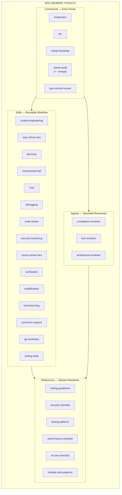
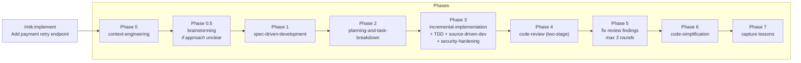
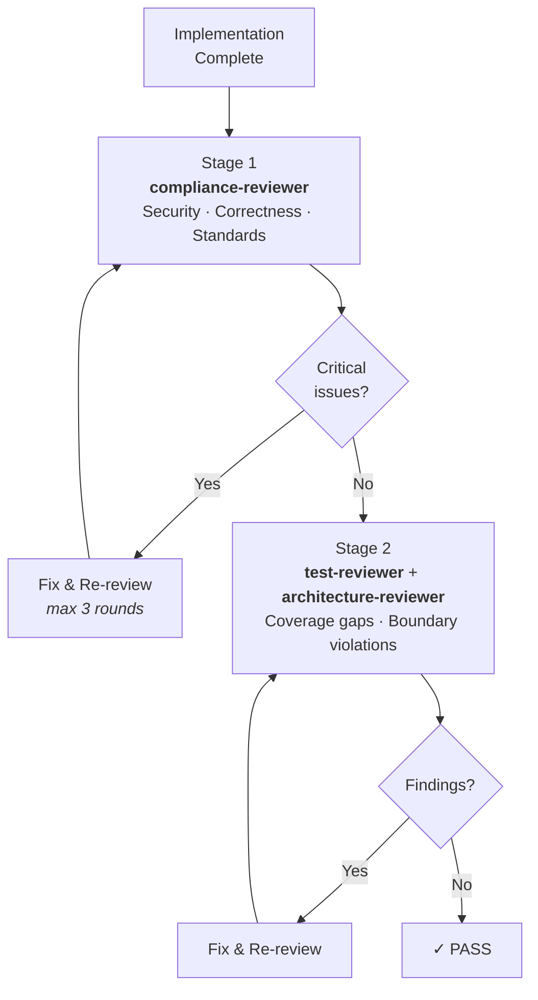
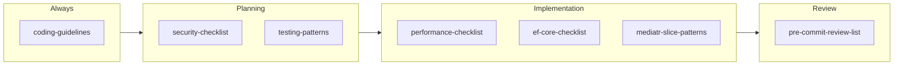
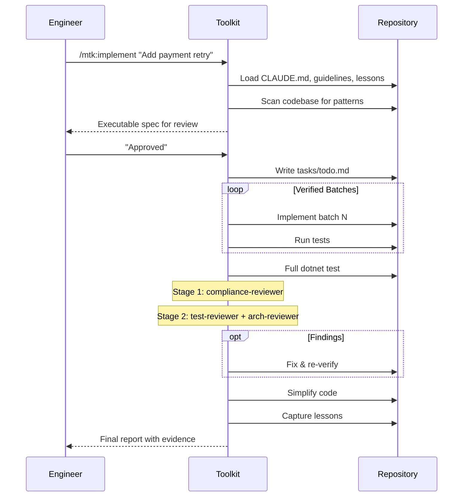
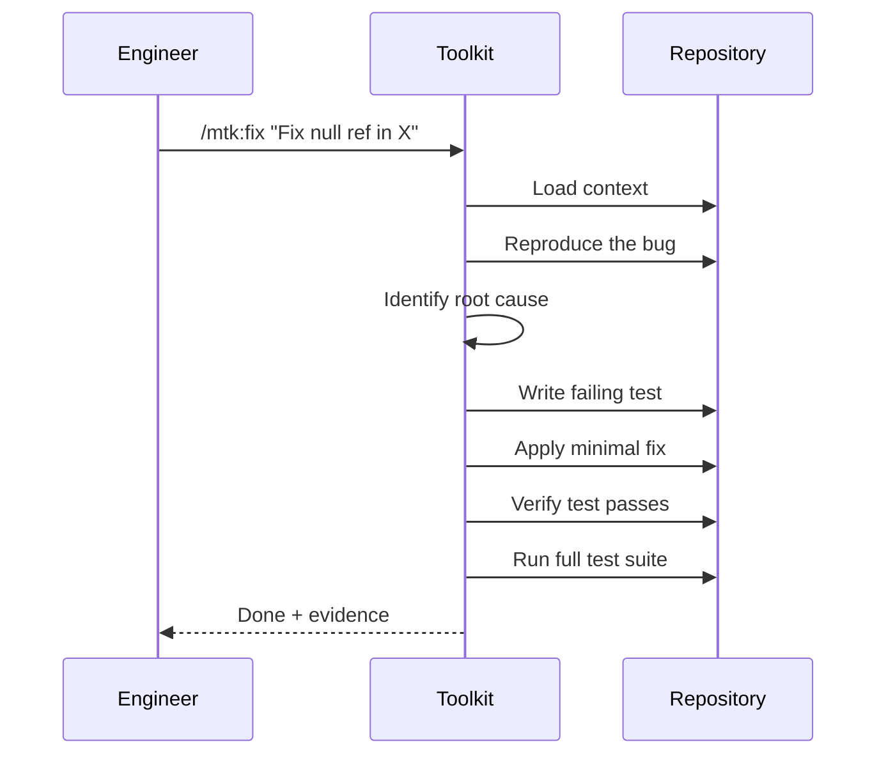
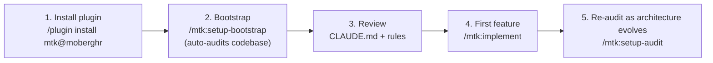
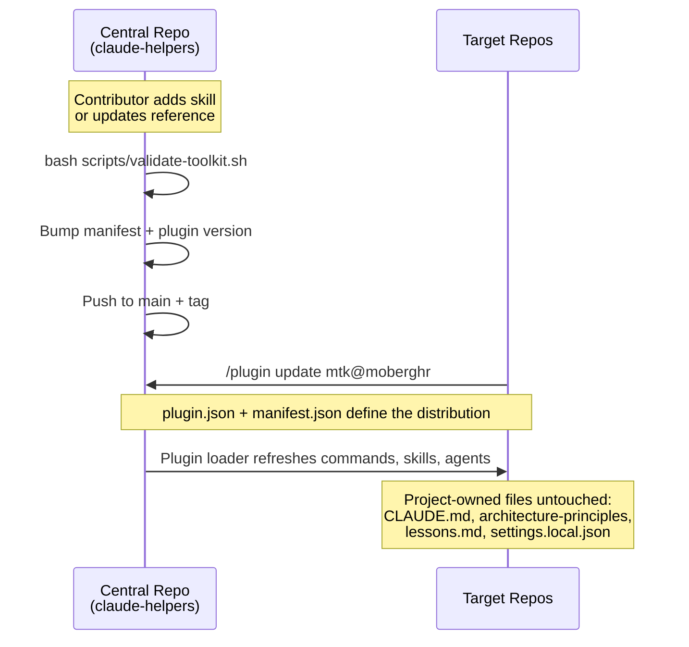

<div align="center">

# MTK — Moberg Toolkit

### AI-Assisted Development Framework with Pluggable Tech Stacks

**Language-agnostic workflow skills with tech stack plugins for .NET and Python. Enforce coding standards, security compliance, and architectural consistency across every AI-generated line of code.**

[](https://github.com/moberghr/claude-helpers/releases)
[](https://claude.ai/code)
[](https://dotnet.microsoft.com/)
[](https://python.org/)
[](LICENSE)

[Quick Start](#-quick-start) · [Architecture](#-architecture) · [Commands](#-commands) · [Skills](#-skills) · [Review Agents](#-review-agents) · [Workflows](#-workflows) · [FAQ](#-faq) · [Contributing](#-contributing)

</div>

---

## Why This Exists

AI code assistants are powerful but unpredictable. Without guardrails, they produce code that compiles but violates your team's standards — wrong patterns, missing tests, security gaps, inconsistent style. In fintech, where every line of code touches money, compliance, or customer data, *"it works"* is not enough.

MTK solves this by embedding your engineering standards directly into the AI workflow. Every feature goes through planning, implementation, verification, and adversarial review — all guided by your team's actual patterns and rules.

**What it enforces** | **What it does NOT do**
---|---
Coding standards are checked, not suggested | Replace human judgment on architecture
Security and compliance rules embedded in every phase | Auto-merge or auto-deploy anything
Tests required before code is considered complete | Work outside of Claude Code
Review agents find real problems, not style nits | Access production systems or databases
Evidence of passing builds required before "done" | Store or transmit secrets

---

## 🚀 Quick Start

### Install the Plugin

```bash
# In Claude Code
/plugin marketplace add moberghr/claude-helpers
/plugin install mtk@moberghr
```

### Bootstrap Your Repository

```bash
# Generate project-specific CLAUDE.md and .claude/rules/ from your codebase
/mtk:setup-bootstrap
```

### Start Building

```bash
# Implement a feature (full workflow: plan → build → test → review)
/mtk:implement Add user notification preferences endpoint

# Quick fix (lightweight: debug → fix → verify)
/mtk:fix Fix null reference in PaymentProcessor when amount is zero
```

---

## 🏗 Architecture

### Design Principles

| Principle | Description |
|:---|:---|
| **Evidence over assertion** | No task is complete without cited build output, test counts, and exit codes |
| **Security as a design constraint** | Embedded in planning, implementation, and review — not a final polish phase |
| **Progressive disclosure** | Context loaded when needed, not all at once |
| **Anti-rationalization** | Every step an AI might skip has an explicit rebuttal in a "Common Rationalizations" table |
| **Commands compose skills** | Commands are thin entry points; reusable workflow logic lives in skills |
| **Specialists over generalists** | Review agents are narrow experts, not one agent trying to check everything |

### Tech Stack Architecture

The toolkit separates **language-agnostic workflow skills** (planning, batched implementation, TDD, review discipline) from **stack-specific knowledge** (build commands, ORM patterns, framework conventions). The latter lives in pluggable **tech stack skills**.

| Component | Role |
|:---|:---|
| **Workflow skills** | Generic — work for any language. Examples: `spec-driven-development`, `incremental-implementation`, `test-driven-development`. |
| **Tech stack skills** | Per-language: `tech-stack-dotnet`, `tech-stack-python`. Provide build/test commands, ORM guidance, framework patterns, scan recipes, and references. |
| **`.claude/tech-stack` file** | Plain text identifier (e.g., `dotnet`). Written by `init`, read by every command and agent in Phase 0. |

Adding a new language stack means writing one tech stack skill and a small set of references — the workflow skills work unchanged.

### Component Model



### How Components Compose

Commands do not contain workflow logic directly. They orchestrate skills:



---

## 🎮 Commands

### Primary Commands

| Command | Purpose | Scope |
|:---|:---|:---|
| **`/mtk:implement`** | Full feature implementation workflow | Multi-file features, new endpoints, handlers |
| **`/mtk:fix`** | Lightweight bug fix workflow | 1–3 file changes, focused debugging |
| **`/mtk:setup-bootstrap`** | Bootstrap repo for AI-assisted dev | Run once per repository |
| **`/mtk:pre-commit-review`** | Pre-commit security review | Staged changes only |
| **`/mtk:setup-audit`** | Extract architecture principles | Outputs descriptive doc of team patterns |

#### implement

Composes 11 skills across 7 phases. Produces an executable spec, implements in verified batches with TDD, runs two-stage adversarial review, and captures lessons for future sessions.

```bash
/mtk:implement Add user notification preferences with email and SMS channels
```

**Flags:** `--terse` (minimal output) · `--verbose` (full explanations)

After planning completes, you'll always see an approval question with options to **Approve & run until done** (autonomous), **Approve (interactive)**, **Edit first**, or **Revise**.

#### fix

Composes debugging, targeted TDD, and verification. Has a built-in scope guard — if the change grows beyond 3 files, it tells you to switch to `implement`.

```bash
/mtk:fix Fix null reference in PaymentProcessor when amount is zero
```

#### setup-bootstrap

Audits the codebase, pulls shared coding guidelines, and generates a lean `CLAUDE.md` (under 200 lines), `.claude/rules/*.md` files, and a project-specific pre-commit review list.

```bash
/mtk:setup-bootstrap
```

#### pre-commit-review

Checks staged changes against the security checklist: hardcoded secrets, SQL injection, PII in logs, missing auth, audit gaps.

```bash
/mtk:pre-commit-review
```

#### setup-audit

Documents what IS, not what should be. Outputs `.claude/references/architecture-principles.md` and flags inconsistencies for the team to resolve.

```bash
/mtk:setup-audit
```

### Lifecycle Commands

| Command | Purpose |
|:---|:---|
| **`setup-audit --merge`** | Unify architecture audits from multiple repos into a single document |
| **`bash scripts/validate-toolkit.sh`** | Validate toolkit structure, manifest metadata, and skill anatomy (toolkit maintainers only) |

> **Model-invoked skills:** `handoff` (capture session state when context is tight) and `correction-capture` (record engineer corrections) load automatically — no command to type.

---

## 🧩 Skills

Skills are reusable workflow building blocks. Commands compose them; they are not invoked directly by users.

### Core Workflow

| Skill | Trigger | What It Does |
|:---|:---|:---|
| **context-engineering** | Session start, phase switch, unfamiliar code | Loads project norms progressively; anchors to CLAUDE.md |
| **spec-driven-development** | New feature, breaking change, multi-file work | Produces executable spec with change manifest and approval gates (language-agnostic) |
| **planning-and-task-breakdown** | After spec approval | Writes vertical-slice batches with checkpoint criteria |
| **incremental-implementation** | Approved multi-file work | Implements in verified batches; early review if churn > 300 lines (uses build/test from active tech stack) |
| **test-driven-development** | New behavior, bug fix, public contract change | Red → green → refactor cycle (language-agnostic) |
| **debugging-and-error-recovery** | Bug, failing test, runtime error | Reproduce first, then fix root cause within scope |
| **source-driven-development** | Unfamiliar SDK/framework behavior | Verify from authoritative sources before implementing |
| **tech-stack-dotnet** / **tech-stack-python** | Loaded based on `.claude/tech-stack` | Provides build/test commands, ORM guidance, framework patterns, scan recipes |

### Quality & Review

| Skill | Trigger | What It Does |
|:---|:---|:---|
| **code-review-and-quality** | After implementation, before merge | Adversarial review: correctness, security, architecture, performance |
| **security-and-hardening** | Auth, secrets, financial state, audit trails | Identifies trust boundaries; verifies transaction safety |
| **code-simplification** | After verification passes | Behavior-preserving cleanup: dead code, complexity, naming |
| **verification-before-completion** | Before reporting "done" | Requires fresh build output, test counts, and exit codes as evidence |

### Meta & Enabling

| Skill | Trigger | What It Does |
|:---|:---|:---|
| **brainstorming** | Approach unclear, multiple viable designs | Explores 2–3 approaches with tradeoffs; converges on direction |
| **correction-capture** | Engineer says "no" or redirects approach | Captures correction as reusable lesson; applies immediately |
| **using-git-worktrees** | Parallel development, experimentation | Safe worktree creation with gitignore and baseline verification |
| **writing-skills** | Creating new toolkit skills | Ensures anatomy, CSO principle, and adversarial pressure tests |

### Skill Anatomy

Every skill follows a standardized structure:

```
┌─────────────────────────────────────────┐
│  --- frontmatter ---                    │
│  name · description · type              │
├─────────────────────────────────────────┤
│  ## Overview           What it ensures  │
│  ## When To Use        Trigger conds    │
│  ## When NOT To Use    Prevents misuse  │
│  ## Workflow            Step-by-step    │
│  ## Verification       Confirm applied  │
│  ## Common Rationalizations             │
│     ↳ Why agents skip + sharp rebuttals │
│  ## Red Flags          Signs of drift   │
└─────────────────────────────────────────┘
```

The **Common Rationalizations** table lists the exact excuses an AI will use to skip important steps, paired with rebuttals that counter each one. See [docs/skill-anatomy.md](docs/skill-anatomy.md) for the full authoring guide.

---

## 🔍 Review Agents

### Two-Stage Review Model

Reviews are **sequential, not parallel**. Spec compliance comes first — if the implementation doesn't match the spec, quality review is wasted effort.



### compliance-reviewer

**Adversarial senior code reviewer for fintech/investment banking.** Must find at least 2 substantive issues or provide a detailed argument for why the code is genuinely flawless. Style nits alone don't count.

**Checks:** Security & compliance (auth, secrets, audit, PII) · Architecture (slices, layers, DI) · Coding style (40+ rules) · Data layer (AsNoTracking, N+1, projections) · Performance · Infrastructure (IAM, VPC, security groups) · Test coverage · Codebase consistency

### test-reviewer

**Focused reviewer for test coverage and verification quality.** Checks that new behavior has tests, mutation paths have success/failure cases, assertions are specific, and test data providers match the behavior under test.

### architecture-reviewer

**Focused reviewer for slice boundaries and architectural fit.** Checks dependency direction, handler/controller/service splits, naming consistency, abstraction justification, and cross-layer leaks.

### Agent Self-Escalation

All agents can report `BLOCKED` or `NEEDS_CONTEXT` instead of producing uncertain output. A clear escalation is always more valuable than a low-confidence review.

---

## 📚 References

Shared standards documents, loaded progressively by phase — not all upfront:



References live in two places:
- `.claude/references/*.md` — language-agnostic shared standards
- `.claude/references/{stack}/*.md` — stack-specific supplements (loaded via the active tech stack skill's `## Reference Files`)

| Reference | Location | Phase | Content |
|:---|:---|:---|:---|
| `security-checklist.md` | shared | Planning | Input validation, auth, secrets, PII, audit trails |
| `testing-patterns.md` | shared | Planning | Generic test selection and coverage rules |
| `performance-checklist.md` | shared | Implementation | Generic data access, async, connection pooling |
| `dotnet/coding-guidelines.md` | dotnet | Always | Moberg C# style: naming, LINQ, file structure, MediatR |
| `dotnet/ef-core-checklist.md` | dotnet | Implementation | EF Core query/write rules |
| `dotnet/mediatr-slice-patterns.md` | dotnet | Implementation | MediatR/CQRS slice conventions |
| `dotnet/testing-supplement.md` | dotnet | Planning | EF Core test provider rules, xUnit/NUnit conventions |
| `dotnet/performance-supplement.md` | dotnet | Implementation | AsNoTracking, projections, N+1, HttpClient factory, Lambda |
| `python/coding-guidelines.md` | python | Always | Python style guide *(placeholder — to be authored)* |
| `python/sqlalchemy-checklist.md` | python | Implementation | SQLAlchemy query/write rules, sessions, migrations |
| `python/fastapi-patterns.md` | python | Implementation | FastAPI/Django structural conventions |
| `python/testing-supplement.md` | python | Planning | pytest fixtures, async tests, real DB providers |
| `python/performance-supplement.md` | python | Implementation | async, connection pooling, GIL, Lambda cold starts |

---

## 🔄 Workflows

### Feature Implementation



### Bug Fix



### Repository Onboarding



### Toolkit Lifecycle



---

## ⚙ Configuration

### Permissions

The toolkit ships with a default permission set in `.claude/settings.json`:

| Category | Policy | Examples |
|:---|:---|:---|
| **Allowed** | Auto-approved | `Read`, `Write`, `Edit`, `dotnet build`, `dotnet test`, `git diff`, `git status` |
| **Denied** | Hard blocked | `rm -rf`, `git checkout main`, `dotnet publish` |
| **Prompted** | User decides each time | `git push`, `git commit`, any unlisted tool |

### Hooks

| Hook | Trigger | Purpose |
|:---|:---|:---|
| **Auto-format** | After writing/editing `.cs` files | Runs `dotnet format` to enforce style |
| **Verification gap** | When assistant stops | Catches completion claims without cited evidence |
| **Task completion** | When a task is marked done | Reminds agent that stale evidence doesn't count |

### Distribution & Protected Files

The `manifest.json` controls what gets distributed and how:

| Action | Behavior | Used For |
|:---|:---|:---|
| `sync` | Overwrite target file | Commands, skills, agents, references |
| `merge` | Intelligent union of settings | `settings.json` (preserves project-specific permissions) |

**Protected files** — never overwritten by `update`:

| File | Why Protected |
|:---|:---|
| `CLAUDE.md` | Project-specific standards generated by `init` |
| `.claude/settings.local.json` | Engineer's personal overrides |
| `tasks/lessons.md` | Team's accumulated learnings |
| `tasks/todo.md` | In-progress work |
| `architecture-principles.md` | Project-specific architecture doc |
| `pre-commit-review-list.md` | Project-specific verification checklist |

---

## 📐 Project Standards Generation

When you run `/mtk:setup-bootstrap`, the toolkit audits your codebase and generates standards that follow Claude Code best practices.

### CLAUDE.md Structure

The root `CLAUDE.md` is kept **under 200 lines** for maximum AI adherence:

| Section | Content |
|:---|:---|
| Command Routing | Which command for which task |
| Build & Test | Actual build/test commands for this project |
| Project Profile | Framework, data layer, patterns, hosting, test stack |
| Critical Rules (§0.x) | Top 5–10 highest-impact rules |
| Standards Reference | Pointers to `.claude/rules/` and `.claude/references/` |

### Rules Files

Detailed standards live in `.claude/rules/`, auto-loaded by Claude Code:

| File | Section | Content |
|:---|:---|:---|
| `security.md` | §1.x | Auth, secrets, audit trails, PII handling |
| `architecture.md` | §2.x | Layer structure, dependency direction, DI |
| `coding-style.md` | §3.x | Style overrides (references `coding-guidelines.md`) |
| `testing.md` | §4.x | Frameworks, naming, coverage, integration |
| `data-layer.md` | §5.x | EF Core patterns, AsNoTracking, projections |
| `performance.md` | §6.x | Async, caching, HttpClient, collections |
| `infrastructure.md` | §7.x | CDK, Lambda, Docker, AWS, IAM |
| `git-workflow.md` | §8.x | Branch naming, commit conventions, PRs |
| `project-specific.md` | §9.x | Patterns unique to the repository |

Rules are numbered (§X.Y) so review agents can cite specific violations.

---

## 🗂 Repo Structure

```
claude-helpers/
├── .claude/
│   ├── commands/              # 5 command entry points
│   │   ├── implement.md             #   Full feature workflow
│   │   ├── fix.md                   #   Lightweight bug fix
│   │   ├── setup-bootstrap.md       #   Repository bootstrap (auto-runs architecture audit)
│   │   ├── setup-audit.md           #   Architecture extraction (--merge unifies multi-repo audits)
│   │   └── pre-commit-review.md     #   Pre-commit security review
│   ├── skills/                # 18 skills: 16 workflow + 2 tech stack
│   │   ├── context-engineering/
│   │   ├── spec-driven-development/         # generic
│   │   ├── planning-and-task-breakdown/
│   │   ├── incremental-implementation/      # generic
│   │   ├── test-driven-development/         # generic
│   │   ├── debugging-and-error-recovery/
│   │   ├── code-review-and-quality-fintech/
│   │   ├── security-and-hardening-fintech/
│   │   ├── source-driven-development/
│   │   ├── code-simplification/
│   │   ├── verification-before-completion/
│   │   ├── brainstorming/
│   │   ├── correction-capture/
│   │   ├── using-git-worktrees/
│   │   ├── writing-skills/
│   │   ├── handoff/                         # model-invoked: capture session state
│   │   ├── tech-stack-dotnet/               # .NET-specific context
│   │   └── tech-stack-python/               # Python-specific context
│   ├── agents/                # 3 specialist reviewers
│   │   ├── compliance-reviewer.md
│   │   ├── test-reviewer.md
│   │   └── architecture-reviewer.md
│   ├── references/            # Shared + stack-specific standards
│   │   ├── testing-patterns.md              # generic
│   │   ├── security-checklist.md            # generic
│   │   ├── performance-checklist.md         # generic
│   │   ├── dotnet/
│   │   │   ├── coding-guidelines.md
│   │   │   ├── ef-core-checklist.md
│   │   │   ├── mediatr-slice-patterns.md
│   │   │   ├── testing-supplement.md
│   │   │   └── performance-supplement.md
│   │   ├── python/
│   │   │   ├── coding-guidelines.md         # placeholder
│   │   │   ├── sqlalchemy-checklist.md
│   │   │   ├── fastapi-patterns.md
│   │   │   ├── testing-supplement.md
│   │   │   └── performance-supplement.md
│   │   └── typescript/
│   │       ├── coding-guidelines.md         # placeholder
│   │       ├── data-layer-checklist.md
│   │       ├── framework-patterns.md
│   │       ├── testing-supplement.md
│   │       └── performance-supplement.md
│   ├── tech-stack             # plain-text active stack identifier (per repo)
│   ├── manifest.json          # Distribution registry (with `stack` field)
│   └── settings.json          # Generic permissions & hooks (stack-specific merged by init)
├── .claude-plugin/            # Plugin marketplace config
│   └── plugin.json
├── hooks/                     # Session initialization
│   ├── hooks.json
│   └── session-start
├── docs/
│   └── skill-anatomy.md       # Skill authoring guide
├── scripts/
│   └── validate-toolkit.sh    # Structure validation
├── tests/
│   └── pressure-tests/        # Adversarial skill tests
├── AGENTS.md                  # Routing rules
├── CONTRIBUTING.md            # Contribution guidelines
└── README.md                  # This file
```

---

## 🔧 Troubleshooting

| Symptom | Cause | Fix |
|:---|:---|:---|
| `implement` says "run setup-bootstrap first" | Missing `CLAUDE.md` | Run `/mtk:setup-bootstrap` |
| Review agent reports `BLOCKED` | Required files inaccessible | Check `.claude/references/`; re-run `/mtk:setup-bootstrap` to regenerate stack references |
| `dotnet format` hook fails silently | .NET SDK not on PATH | Ensure `dotnet` is in your shell profile |
| Toolkit version mismatch | Stale plugin | Run `/plugin update mtk@moberghr` |
| Skills not loading | Missing skill files | Run `/plugin update mtk@moberghr` |
| "Verification gap" fires often | Claims without evidence | Working as intended — cite build/test output |

Toolkit maintainers working inside the `claude-helpers` repo can run **`bash scripts/validate-toolkit.sh`** to verify toolkit structure.

---

## ❓ FAQ

<details>
<summary><b>Do I need to run <code>/mtk:setup-bootstrap</code> on every branch?</b></summary>

No. Run it once per repository. The generated `CLAUDE.md` and `.claude/rules/` are committed and shared across branches.
</details>

<details>
<summary><b>Can I customize the generated rules?</b></summary>

Yes. After `setup-bootstrap` generates the files, edit them freely. Plugin updates never overwrite `CLAUDE.md`, `.claude/rules/`, or `architecture-principles.md` — they live in your repo, not the plugin.
</details>

<details>
<summary><b>Does this work with non-.NET projects?</b></summary>

Yes. As of v5.0, workflow skills are language-agnostic and tech-stack support is pluggable. Python (`tech-stack-python`) and TypeScript/React/Next.js/Tauri/Node (`tech-stack-typescript`) ship out of the box. Add a new stack by creating `tech-stack-{name}/SKILL.md` and the matching reference files under `.claude/references/{name}/`. See [docs/skill-anatomy.md](docs/skill-anatomy.md) and `.claude/skills/tech-stack-dotnet/SKILL.md` as a template.
</details>

<details>
<summary><b>How does this differ from writing a CLAUDE.md manually?</b></summary>

Three key differences: (1) the toolkit generates CLAUDE.md from your actual codebase, not guesswork; (2) it provides workflow enforcement (planning, TDD, review), not just rules; (3) adversarial review agents actively find violations.
</details>

<details>
<summary><b>What if the review agent finds a false positive?</b></summary>

Review agents can be wrong. Dismiss incorrect findings and move on. If the same false positive recurs, add a clarification to the relevant `.claude/rules/` file.
</details>

<details>
<summary><b>How do I add a custom skill?</b></summary>

See [CONTRIBUTING.md](CONTRIBUTING.md) and [docs/skill-anatomy.md](docs/skill-anatomy.md). Create the skill, register in `manifest.json`, add routing in `AGENTS.md`, and run `bash scripts/validate-toolkit.sh`.
</details>

<details>
<summary><b>Can I use this alongside other Claude Code plugins?</b></summary>

Yes. The toolkit's permissions and hooks merge with other plugins' settings.
</details>

---

## 🤝 Contributing

See [CONTRIBUTING.md](CONTRIBUTING.md) for the full guide. The short version:

1. **Commands** are entry points — keep orchestration here, workflow logic in skills
2. **Skills** follow [docs/skill-anatomy.md](docs/skill-anatomy.md) — include anti-rationalization tables
3. **Agents** are narrow specialists — keep tools read-only, use `model: sonnet`
4. **References** are durable standards — register with `"action": "sync"` in manifest
5. **Every new file** must be in `manifest.json` with a version bump
6. **Run `bash scripts/validate-toolkit.sh`** before pushing

---

## 🔒 Security

**What the toolkit enforces:**
- No hardcoded secrets, connection strings, or API keys
- Parameterized queries only (SQL injection prevention)
- No PII in logs, errors, or exception messages
- Audit trails for financial state changes (in the same transaction)
- Authentication on every endpoint; RBAC at service layer
- Least-privilege IAM and infrastructure permissions
- Input validation at API boundaries

**What the toolkit does NOT do:**
- Access production systems or databases
- Store or transmit secrets
- Make network requests beyond fetching guidelines from GitHub
- Modify files outside the working directory

**Reporting security issues:** Contact the maintainers directly. Do not open a public issue.

---

## 📄 License

MIT License. See [LICENSE](LICENSE) for details.

---

<div align="center">

**MTK — Moberg Toolkit** v5.3.0 · [Moberg d.o.o.](https://www.moberg.hr) · Built for teams that ship production code, not prototypes.

</div>
