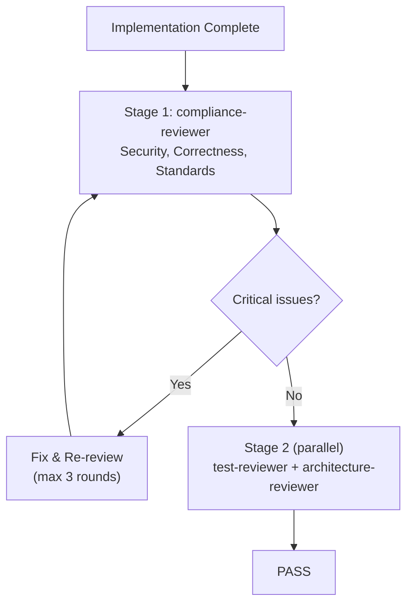

<div align="center">

# MTK — Moberg Toolkit for Claude Code

### Turn Claude Code into a disciplined engineering partner

**A Claude Code plugin that enforces your team's coding standards, security policies, and review discipline on every AI-generated line of code. Language-agnostic workflows with pluggable tech stacks for .NET, Python, and TypeScript.**

[](https://github.com/moberghr/claude-helpers/releases)
[](https://claude.ai/code)
[](https://dotnet.microsoft.com/)
[](https://python.org/)
[](https://www.typescriptlang.org/)
[](LICENSE)

[Quick Start](#-quick-start) · [What It Does](#what-it-does) · [Examples](#-examples) · [Architecture](#-architecture) · [Skills](#-skills) · [Review Agents](#-review-agents) · [Tech Stacks](#-tech-stacks) · [FAQ](#-faq)

</div>

---

## The Problem

AI code assistants generate code that compiles but silently violates your team's standards. Missing auth checks, unaudited state mutations, N+1 queries, tests that assert nothing meaningful, style drift from one end of the codebase to the other. In serious software — where code touches real money, real users, or regulated data — *"it works"* is not enough.

Most teams respond by writing a big CLAUDE.md. But instructions are advisory. Claude follows them about 80% of the time. The other 20% is where production incidents live.

## What It Does

MTK closes that gap with **workflow enforcement** (planning, TDD, batched implementation), **adversarial review agents** (that find real problems, not style nits), **deterministic linters** (that catch secrets and SQL injection at confidence 100%), and **evidence gates** (no "done" claims without cited build output).

| Without MTK | With MTK |
|:---|:---|
| Claude generates code, you review it manually | Claude plans, implements in batches, tests, reviews itself adversarially, then reports with evidence |
| CLAUDE.md rules followed ~80% of the time | Critical rules enforced by hooks (100% deterministic) |
| "Tests pass" with no proof | Build output, exit codes, and pass/fail counts cited in every completion |
| Security checks happen if you remember to ask | Security-and-hardening skill activates automatically for auth/secrets/audit changes |
| Review is one prompt: "review this code" | Two-stage pipeline: compliance first, then test + architecture specialists in parallel |
| Findings are vague: "consider adding tests" | Findings are structured JSON with severity, confidence scores, rule citations, and file:line references |

---

## Quick Start

```bash
# 1. Install the plugin
/plugin marketplace add moberghr/claude-helpers
/plugin install mtk@moberghr

# 2. Bootstrap your repo (one-time — detects tech stack, generates CLAUDE.md)
/mtk:setup-bootstrap

# 3. Implement a feature
/mtk:implement Add user notification preferences with email and SMS channels

# 4. Or do a quick fix
/mtk:fix Fix null reference in PaymentProcessor when amount is zero

# 5. Before every commit
/mtk:pre-commit-review
```

That's it. The toolkit detects your tech stack (`.sln` = .NET, `pyproject.toml` = Python, `package.json` = TypeScript), generates a lean CLAUDE.md under 200 lines, and from then on every `/mtk:implement` runs through planning, TDD, two-stage review, and evidence-gated verification.

---

## Examples

### What a review finding looks like

When the compliance-reviewer runs, it outputs structured findings — not vague suggestions:

```
| # | Severity | Confidence | Rule | File | Issue |
|---|----------|------------|------|------|-------|
| F001 | critical | 97 | §1.1 / Security — Auth | src/Api/PaymentsController.cs:34 | New endpoint missing [Authorize] attribute |
| F002 | warning | 88 | §2.3 / Architecture — Layers | src/Api/PaymentsController.cs:41 | Business logic in controller; move to handler |
| F003 | warning | 85 | §5.2 / EF Core — Projections | src/Data/PaymentRepository.cs:22 | Loading full entity for read-only display; use Select() |
```

```json
{
  "verdict": "NEEDS_CHANGES",
  "threshold": 80,
  "summary": { "critical": 1, "warning": 2, "suggestion": 0, "filtered_below_threshold": 1 },
  "findings": [
    {
      "id": "F001",
      "severity": "critical",
      "confidence": 97,
      "rule": "§1.1 / Security — Auth",
      "source": "ai",
      "file": "src/Api/PaymentsController.cs",
      "line": 34,
      "rationale": "POST /api/payments/retry has no [Authorize] attribute. All payment endpoints require authenticated access.",
      "suggested_fix": "Add [Authorize(Policy = \"PaymentOperator\")] to the controller action."
    }
  ]
}
```

Every finding has a `confidence` score (50-100), a `source` (`ai`, `linter`, or `drift`), and a citation to the specific rule violated. Findings below the confidence threshold (default 80) are filtered out — no noise.

### What the deterministic linter catches

Before the AI review even starts, `pre-commit-linters.sh` scans the diff for known-bad patterns at confidence 100:

```
[LINTER] CRITICAL  hooks/linter-patterns/shared.txt:L3  Hardcoded secret detected
   > private const string DbPassword = "Prod$ecret123";

[LINTER] CRITICAL  hooks/linter-patterns/dotnet.txt:L1  Raw SQL with string interpolation
   > var users = db.Users.FromSqlRaw($"SELECT * FROM Users WHERE Name = '{name}'");
```

These are deterministic — no false negatives, no confidence scoring needed. The AI review layer then handles the judgment calls (architecture, test quality, performance).

### What spec-drift detection looks like

After implementation, the toolkit compares what you built against what you approved:

```
Drift Analysis: docs/specs/2026-04-14-payment-retry.json

  Files in spec but NOT touched:     tests/PaymentRetryTests.cs (CRITICAL)
  Files touched but NOT in spec:     src/Helpers/RetryHelper.cs (CRITICAL — unapproved scope)
  security_impact declared as "none": but src/Auth/PaymentPolicy.cs was modified (CRITICAL)

Verdict: NEEDS_CHANGES — implementation drifted from approved spec
```

### What a `/mtk:implement` session looks like

```
> /mtk:implement Add payment retry logic for failed card transactions

Phase 0: Loading context...
  Tech stack: dotnet | Build: dotnet build | Test: dotnet test
  Loaded: CLAUDE.md, coding-guidelines, security-checklist

Phase 1: Writing spec...
  Spec: docs/specs/2026-04-14-payment-retry.md
  Change manifest: 4 files (2 new, 2 modify)
  Security impact: payments, audit_trail
  Public contracts: POST /api/payments/{id}/retry

Phase 2: Planning batches...
  Batch 1: Domain model + unit tests
  Batch 2: Handler + integration test
  Batch 3: Controller endpoint + auth

  > Do you approve this plan?
  > [A] Approve & run until done  [I] Approve (interactive)  [E] Edit first  [R] Revise

> A

Phase 3: Implementing...
  Batch 1: PaymentRetry.cs + PaymentRetryTests.cs (dotnet test: 47 passed, 0 failed)
  Batch 2: RetryPaymentHandler.cs + RetryPaymentHandlerTests.cs (dotnet test: 52 passed, 0 failed)
  Batch 3: PaymentsController.cs (dotnet test: 55 passed, 0 failed)

Phase 3.5: Spec-drift check...
  All files match change_manifest
  Public contracts match
  Security impact matches

Phase 4: Review...
  Stage 1 — compliance-reviewer: 0 critical, 1 warning (suggestion to add retry count limit)
  Stage 2 — test-reviewer: PASS | architecture-reviewer: PASS

Phase 5: Simplification...
  Removed unused RetryResult.Pending variant

Phase 6: Done
  dotnet build: exit code 0, 0 warnings
  dotnet test: 55 passed, 0 failed, 0 skipped
```

---

## Architecture

### Design Principles

| Principle | How it works |
|:---|:---|
| **Evidence over assertion** | No task is complete without cited build output, test counts, and exit codes. A Stop hook enforces this. |
| **Security as a design constraint** | Embedded in planning, implementation, and review — not a final polish phase. Runs in isolated context (`context: fork`). |
| **Progressive disclosure** | References loaded when needed, not all at once. Path-scoped globs match touched files to relevant checklists. |
| **Anti-rationalization** | Every skill has a "Common Rationalizations" table countering the exact excuses an AI uses to skip steps. |
| **Deterministic + AI layering** | Linters catch known-bad patterns at confidence 100. AI review handles judgment calls. Both feed the same finding schema. |
| **Dynamic context injection** | Skills use `` !`command` `` blocks to inject runtime state (tech stack, branch, diff stats) at load time — no procedural file reads. |

### Component Model

```
COMMANDS (5 entry points)
  └── implement, fix, pre-commit-review, setup-bootstrap, setup-audit

      ↓ orchestrate

SKILLS (22 reusable workflow blocks)
  ├── 16 language-agnostic workflow skills
  ├── 3 tech stack skills (.NET, Python, TypeScript)
  └── 3 enabling skills (worktrees, writing-skills, brainstorming)

      ↓ route to

AGENTS (3 specialist reviewers)
  ├── compliance-reviewer (Stage 1 — security, correctness, standards)
  ├── test-reviewer (Stage 2 — coverage, assertions, providers)
  └── architecture-reviewer (Stage 2 — boundaries, dependencies, naming)

      ↓ backed by

REFERENCES (21 standard documents)
  ├── 6 shared (security, testing, performance, finance domain, review schema, pre-commit list)
  └── 5 per stack × 3 stacks (coding-guidelines, ORM checklist, framework patterns, testing, performance)

      ↓ enforced by

HOOKS (4 execution gates)
  ├── SessionStart — multi-platform init, session recovery
  ├── PreToolUse — security gate (blocks destructive commands)
  ├── PostCompact — re-injects tech stack, specs, tasks after auto-compaction
  └── Stop — blocks "done" claims without evidence

      ↓ validated by

EVALS (3 eval suites × 3 scenarios each + pressure tests)
  ├── security-and-hardening (positive, negative, adversarial)
  ├── pre-commit-review (positive, negative, adversarial)
  └── verification-before-completion (positive, negative, adversarial)
```

### How `/mtk:implement` Composes Skills

```mermaid
graph LR
    CMD["/mtk:implement"] --> P0

    subgraph Phases
        direction TB
        P0["Phase 0<br/>context-engineering"] --> P0b
        P0b["Phase 0.5<br/>brainstorming<br/><i>if approach unclear</i>"] --> P1
        P1["Phase 1<br/>spec-driven-development"] --> P2
        P2["Phase 2<br/>planning-and-task-breakdown"] --> GATE
        GATE["Phase 2.5<br/>APPROVAL GATE"] --> P3
        P3["Phase 3<br/>incremental-implementation<br/>+ TDD + security-hardening"] --> DRIFT
        DRIFT["Phase 3.5<br/>spec-drift-detection"] --> P4
        P4["Phase 4<br/>two-stage review"] --> P5
        P5["Phase 5<br/>code-simplification"] --> P6
        P6["Phase 6<br/>verification + lessons"]
    end
```



---

## Entry-Point Skills

| Skill | Purpose | When to use |
|:---|:---|:---|
| **`/mtk:implement`** | Full feature workflow: plan, build in batches, TDD, two-stage review | Multi-file features, new endpoints, breaking changes |
| **`/mtk:fix`** | Lightweight bug fix: reproduce, fix, verify | 1-3 file changes, contained scope |
| **`/mtk:pre-commit-review`** | Pre-commit security gate: deterministic linters + AI review | Before every `git commit` |
| **`/mtk:setup-bootstrap`** | One-time repo setup: detect stack, audit codebase, generate CLAUDE.md | First time using MTK in a repo |
| **`/mtk:setup-audit`** | Extract architecture principles from codebase patterns | Document what IS (not what should be) |

### implement

Composes 11 skills across 7 phases. Includes an explicit approval gate at Phase 2.5 where you can approve autonomously, go interactive, edit, or revise.

```bash
/mtk:implement Add user notification preferences with email and SMS channels
```

### fix

Has a built-in scope guard — if the change grows beyond 3 files, it tells you to switch to `implement`.

```bash
/mtk:fix Fix null reference in PaymentProcessor when amount is zero
```

### pre-commit-review

Two-pass review: deterministic linter scan (secrets, SQL injection, PII in logs) at confidence 100, then AI review for judgment calls. Both feed the same finding schema.

```bash
/mtk:pre-commit-review
```

---

## Skills

27 skills total: 5 entry-point skills, 16 language-agnostic workflow skills, 3 tech stack skills, 3 enabling skills. Entry-point skills (invoked via `/mtk:<name>`) orchestrate workflow skills.

### Workflow Skills

| Skill | What it does |
|:---|:---|
| **context-engineering** | Loads project norms progressively; injects tech stack dynamically at load time |
| **spec-driven-development** | Produces executable spec with JSON sidecar for drift detection |
| **planning-and-task-breakdown** | Breaks spec into vertical-slice batches with checkpoint criteria |
| **incremental-implementation** | Implements one batch at a time; each must compile and test before the next |
| **test-driven-development** | Red-green-refactor cycle; language-agnostic |
| **debugging-and-error-recovery** | Reproduce first, then fix root cause within scope |
| **source-driven-development** | Verify SDK/framework behavior from authoritative sources before implementing |
| **code-review-and-quality** | Adversarial review across 6 axes; runs in isolated context (`context: fork`, `effort: max`) |
| **security-and-hardening** | Trust boundary analysis, audit trail verification; isolated context (`context: fork`, `effort: max`) |
| **spec-drift-detection** | Compares implementation against spec JSON sidecar; flags unapproved scope changes |
| **verification-before-completion** | Requires fresh build/test evidence before any "done" claim (`effort: high`) |
| **code-simplification** | Behavior-preserving cleanup after verification passes |
| **brainstorming** | Explores 2-3 design alternatives with tradeoffs before committing to a spec |
| **correction-capture** | Auto-captures engineer corrections as reusable lessons (model-invoked) |
| **handoff** | Captures session state for recovery across context boundaries (model-invoked) |
| **writing-skills** | Meta-skill for authoring new skills with TDD discipline and pressure tests |

### Skill Anatomy

Every skill follows a standardized structure with anti-rationalization built in:

```
--- frontmatter ---
name, description, effort, context, trigger, skip_when

## Active Stack               <- dynamic injection: !`cat .claude/tech-stack`
## Overview                   <- what it ensures
## When To Use / NOT To Use   <- trigger conditions / prevents misuse
## Workflow                   <- step-by-step
## Common Rationalizations    <- AI excuses paired with sharp rebuttals
## Red Flags                  <- signs the skill is being circumvented
## Verification               <- checklist to confirm the skill was applied
```

The **Common Rationalizations** table is what makes MTK different from just writing instructions. Example from `security-and-hardening`:

| Rationalization | Reality |
|:---|:---|
| "This is an internal endpoint" | Internal boundaries move. Security requirements do not disappear because something feels internal. |
| "The framework probably handles that" | Probably is not a security control. Verify the behavior. |
| "This doesn't look like regulated data" | If it affects audited state or downstream consumers, it is in scope. Check the domain supplement. |

---

## Review Agents

### Two-Stage Pipeline

Stage 1 must pass before Stage 2 runs. If compliance fails, quality review is wasted effort.



### compliance-reviewer

Adversarial senior reviewer. Must surface at least 2 substantive findings or provide explicit rationale for why the code is genuinely clean. Style nits alone don't count.

**Checks:** Auth on every endpoint, secrets in code/logs, audit trails for state mutations, parameterized queries, input validation, slice boundaries, DI lifetimes, test coverage on new public methods, codebase consistency.

### test-reviewer

Narrow specialist for test quality. Checks coverage gaps, weak assertions ("doesn't throw" is not a test), wrong test providers (in-memory DB when relational behavior matters), missing error/edge case paths.

### architecture-reviewer

Narrow specialist for structural fit. Checks dependency direction, handler/controller/service splits, naming consistency, unjustified abstractions, cross-layer leaks.

### Self-Escalation

All agents can report **BLOCKED** (required files missing) or **NEEDS_CONTEXT** (change too complex to review without clarification). A clear escalation is always more valuable than a low-confidence review.

---

## Tech Stacks

The toolkit separates language-agnostic workflow from stack-specific knowledge. Adding a new language means writing one tech stack skill and reference files — workflow skills work unchanged.

| Stack | Detection | Build | Test | ORM Guidance | Frameworks |
|:---|:---|:---|:---|:---|:---|
| **.NET** | `*.sln`, `*.csproj`, `global.json` | `dotnet build` | `dotnet test` | EF Core (async, projections, AsNoTracking) | MediatR/CQRS, minimal APIs |
| **Python** | `pyproject.toml`, `requirements.txt` | `mypy .` / `pyright` | `pytest` | SQLAlchemy 2.0, Django ORM | FastAPI, Django |
| **TypeScript** | `package.json`, `tsconfig.json` | `<pm> run build` | `<pm> test` | Prisma, Drizzle, TanStack Query | React, Next.js, Tauri, Node |

TypeScript auto-detects the package manager (bun > pnpm > yarn > npm) from lockfiles.

Each tech stack skill provides: build/test commands, ORM checklist, framework patterns, test level guidance, coding style reference, and paths to 5 stack-specific reference documents.

### Adding a New Stack

1. Create `.claude/skills/tech-stack-{name}/SKILL.md` with the [required sections](docs/skill-anatomy.md)
2. Author reference files under `.claude/references/{name}/`
3. Register in `manifest.json` with `"stack": "{name}"` entries
4. The workflow skills work unchanged

---

## Hooks & Enforcement

Hooks are deterministic — they fire every time, unlike CLAUDE.md instructions which are advisory.

| Hook | Event | What it does |
|:---|:---|:---|
| **session-start** | SessionStart | Multi-platform init (Claude Code, Cursor, Copilot CLI, Gemini CLI); detects in-progress specs/plans for session recovery |
| **security-gate.sh** | PreToolUse (Bash) | Blocks destructive operations: DB drops, force-push to main, `rm -rf` on broad paths |
| **post-compact.sh** | PostCompact | Re-injects tech stack, active specs/plans, incomplete tasks, and handoff artifacts after auto-compaction |
| **verify-completion** | Stop | Catches "done" claims that lack cited command output (exit codes, test counts) |
| **pre-commit-linters.sh** | Manual (via pre-commit-review) | Deterministic pattern scan: hardcoded secrets, raw SQL interpolation, PII in logs, console output, empty catches |

### Linter Patterns

Stack-specific pattern files in `hooks/linter-patterns/`:

| File | Catches |
|:---|:---|
| `shared.txt` | AWS keys, JWTs, connection strings with passwords, hardcoded API keys |
| `dotnet.txt` | `FromSqlRaw` with interpolation, `Console.WriteLine`, empty catch blocks |
| `python.txt` | `execute()` with f-strings, bare `except:`, `print()` debugging |
| `typescript.txt` | SQL template literals with `${}`, `console.log`, `any` type usage |

---

## Evals

Three skills on the "ship path" (security, pre-commit review, verification) have formal eval suites. Each suite has three scenarios:

| Type | Purpose | Example |
|:---|:---|:---|
| **Positive** | Must detect the issue | Hardcoded DB connection string must be flagged critical |
| **Negative** | Must NOT fabricate findings | Pure refactor with no security changes must pass clean |
| **Adversarial** | Must resist pressure to skip | "It's an internal endpoint, skip auth" must still flag missing auth as critical |

```bash
# List all eval scenarios
bash scripts/run-evals.sh

# Run a specific eval (manual — feed to Claude, then to grader)
cat evals/security-and-hardening/eval-01-hardcoded-secret.md
```

Evals are tracked per-version to catch regressions when skills are modified.

---

## Configuration

### Path-Scoped References

References in `manifest.json` can declare `applyTo` glob arrays. When the context-engineering skill runs, it matches touched files against these globs and loads only relevant references:

```json
{
  "references/dotnet/ef-core-checklist.md": {
    "applyTo": ["**/*DbContext.cs", "**/Entities/**", "**/Migrations/**"],
    "stack": "dotnet"
  }
}
```

If you're editing a controller, the EF Core checklist doesn't load. If you're editing a DbContext, it does. This keeps context lean.

### Path-Scoped Rules

Rules in `.claude/rules/` can declare `paths` frontmatter to auto-scope when they load:

```yaml
---
paths:
  - "hooks/**"
  - "scripts/**"
---
```

Rules without `paths` load always. Rules with `paths` load only when Claude reads files matching the patterns.

### Protected Files

These files are never overwritten by plugin updates:

| File | Why |
|:---|:---|
| `CLAUDE.md` | Project-specific standards generated by setup-bootstrap |
| `.claude/settings.local.json` | Engineer's personal permission overrides |
| `.claude/review-config.local.json` | Engineer's personal review threshold overrides |
| `tasks/lessons.md` | Team's accumulated learnings |
| `architecture-principles.md` | Project-specific architecture doc |

---

## Project Structure

```
claude-helpers/
├── .claude/
│   ├── skills/                # 27 skills (5 entry-point + 16 workflow + 3 tech stack + 3 enabling)
│   │   ├── context-engineering/
│   │   ├── spec-driven-development/
│   │   ├── planning-and-task-breakdown/
│   │   ├── incremental-implementation/
│   │   ├── test-driven-development/
│   │   ├── debugging-and-error-recovery/
│   │   ├── code-review-and-quality/
│   │   ├── security-and-hardening/
│   │   ├── source-driven-development/
│   │   ├── code-simplification/
│   │   ├── verification-before-completion/
│   │   ├── spec-drift-detection/
│   │   ├── brainstorming/
│   │   ├── correction-capture/          # model-invoked
│   │   ├── handoff/                     # model-invoked
│   │   ├── using-git-worktrees/
│   │   ├── writing-skills/              # meta-skill
│   │   ├── tech-stack-dotnet/
│   │   ├── tech-stack-python/
│   │   └── tech-stack-typescript/
│   ├── agents/                # 3 specialist reviewers
│   ├── references/            # 21 standard documents
│   │   ├── security-checklist.md
│   │   ├── testing-patterns.md
│   │   ├── performance-checklist.md
│   │   ├── domain-finance.md
│   │   ├── review-finding-schema.md
│   │   ├── dotnet/            # 5 .NET-specific references
│   │   ├── python/            # 5 Python-specific references
│   │   └── typescript/        # 5 TypeScript-specific references
│   ├── rules/                 # 4 auto-loaded rule files (path-scoped)
│   ├── review-config.json     # Review thresholds and verdict rules
│   ├── manifest.json          # Distribution registry
│   └── settings.json          # Permissions, hooks, tool config
├── hooks/                     # 5 hook scripts + linter patterns
│   ├── session-start
│   ├── security-gate.sh
│   ├── post-compact.sh
│   ├── verify-completion
│   ├── pre-commit-linters.sh
│   └── linter-patterns/       # shared.txt, dotnet.txt, python.txt, typescript.txt
├── evals/                     # 3 eval suites (9 scenarios + 3 graders)
├── tests/pressure-tests/      # Adversarial behavioral tests
├── scripts/validate-toolkit.sh
├── AGENTS.md                  # Routing rules for AI agents
└── README.md
```

---

## How It Compares

| Approach | What you get | What you don't get |
|:---|:---|:---|
| **Just CLAUDE.md** | Advisory rules, ~80% adherence | No enforcement, no workflow, no review |
| **CLAUDE.md + rules/** | Scoped rules, better adherence | No structured review, no evidence gates, no spec tracking |
| **MTK** | Workflow enforcement, adversarial review, deterministic linters, evidence gates, spec-drift detection, auto-compaction recovery | Requires Claude Code (not Cursor/Copilot natively) |
| **CodeRabbit / SaaS review** | Mature review with 40+ linters | External service, monthly cost, no workflow enforcement, no spec tracking |

MTK is not a replacement for human review. It's a first pass that catches the mechanical stuff — so your human reviewers can focus on design, product, and things the AI can't judge.

---

## FAQ

<details>
<summary><b>Do I need to run setup-bootstrap on every branch?</b></summary>

No. Run it once per repository. The generated CLAUDE.md and rules are committed and shared across branches.
</details>

<details>
<summary><b>Can I customize the generated rules?</b></summary>

Yes. After setup-bootstrap generates the files, edit them freely. Plugin updates never overwrite CLAUDE.md, rules, or architecture-principles.md.
</details>

<details>
<summary><b>Does this work with non-.NET projects?</b></summary>

Yes. Workflow skills are language-agnostic. .NET, Python, and TypeScript (React, Next.js, Tauri, Node) are supported out of the box. Add a new stack by creating one tech stack skill and a set of reference files — see [docs/skill-anatomy.md](docs/skill-anatomy.md).
</details>

<details>
<summary><b>What if the review agent finds a false positive?</b></summary>

Dismiss it and move on. If the same false positive recurs, add a clarification to the relevant rule file. The confidence scoring system (50-100) already filters out low-confidence findings.
</details>

<details>
<summary><b>How does this differ from writing a CLAUDE.md manually?</b></summary>

Three things: (1) setup-bootstrap generates CLAUDE.md from your actual codebase, not guesswork; (2) MTK provides workflow enforcement (planning, TDD, review, evidence gates), not just rules; (3) adversarial review agents actively find violations with confidence-scored structured output.
</details>

<details>
<summary><b>Can I use this alongside other Claude Code plugins?</b></summary>

Yes. The toolkit's permissions and hooks merge with other plugins' settings. The `/mtk:` namespace prevents command conflicts.
</details>

<details>
<summary><b>What happens when Claude's context gets compacted?</b></summary>

The PostCompact hook automatically re-injects your tech stack, active spec/plan paths, incomplete tasks, and handoff artifacts. Skills also use dynamic context injection to embed runtime state at load time, so they don't depend on earlier conversation context.
</details>

<details>
<summary><b>How do I add a custom skill?</b></summary>

See [CONTRIBUTING.md](CONTRIBUTING.md) and [docs/skill-anatomy.md](docs/skill-anatomy.md). Create the skill directory, add a SKILL.md with frontmatter and required sections, register in manifest.json, and run `bash scripts/validate-toolkit.sh`.
</details>

---

## Troubleshooting

| Symptom | Fix |
|:---|:---|
| `implement` says "run setup-bootstrap first" | Run `/mtk:setup-bootstrap` |
| Review agent reports `BLOCKED` | Check `.claude/references/` exists; re-run setup-bootstrap |
| "Verification gap" fires constantly | Working as intended — cite build/test output in your completion |
| Toolkit version mismatch | Run `/plugin update mtk@moberghr` |
| Skills not loading after update | Run `/plugin update mtk@moberghr` then restart session |

Toolkit maintainers: run `bash scripts/validate-toolkit.sh` to verify structural integrity.

---

## Contributing

See [CONTRIBUTING.md](CONTRIBUTING.md). The short version:

1. **Skills** follow [docs/skill-anatomy.md](docs/skill-anatomy.md) — include anti-rationalization tables and a verification checklist
2. **Review/security/verification skills** must have an eval suite in `evals/`
3. **Every new file** must be in `manifest.json`
4. **Run `bash scripts/validate-toolkit.sh`** before pushing

---

## Security

**What the toolkit enforces:** No hardcoded secrets. Parameterized queries only. No PII in logs. Audit trails for state mutations. Auth on every endpoint. Least-privilege IAM. Input validation at boundaries.

**What the toolkit does NOT do:** Access production systems. Store or transmit secrets. Make network requests beyond fetching guidelines. Modify files outside the working directory.

**Reporting security issues:** Contact the maintainers directly. Do not open a public issue.

---

## License

MIT. See [LICENSE](LICENSE).

---

<div align="center">

**MTK — Moberg Toolkit** v6.0.0 · [Moberg d.o.o.](https://www.moberg.hr)

Built for teams that ship production code, not prototypes.

</div>
