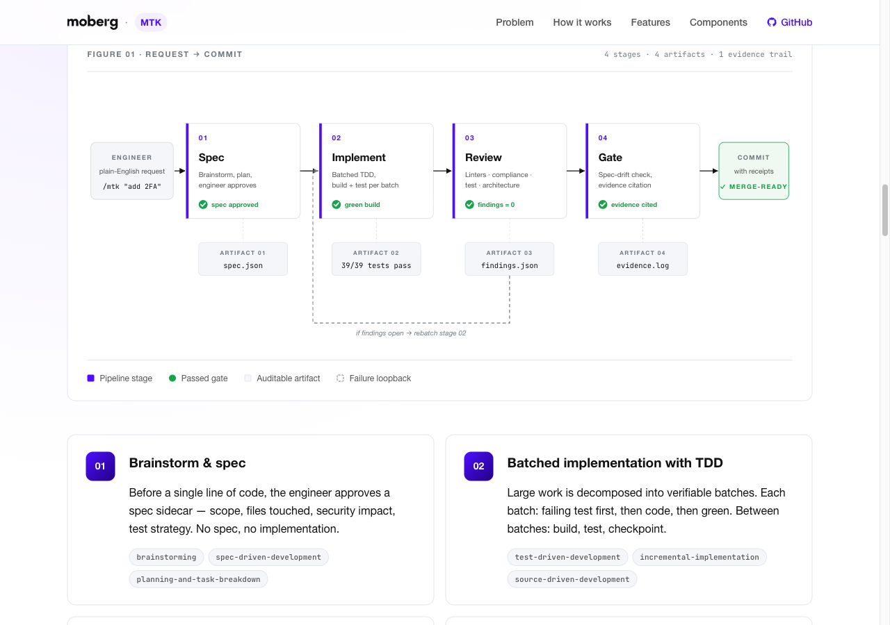
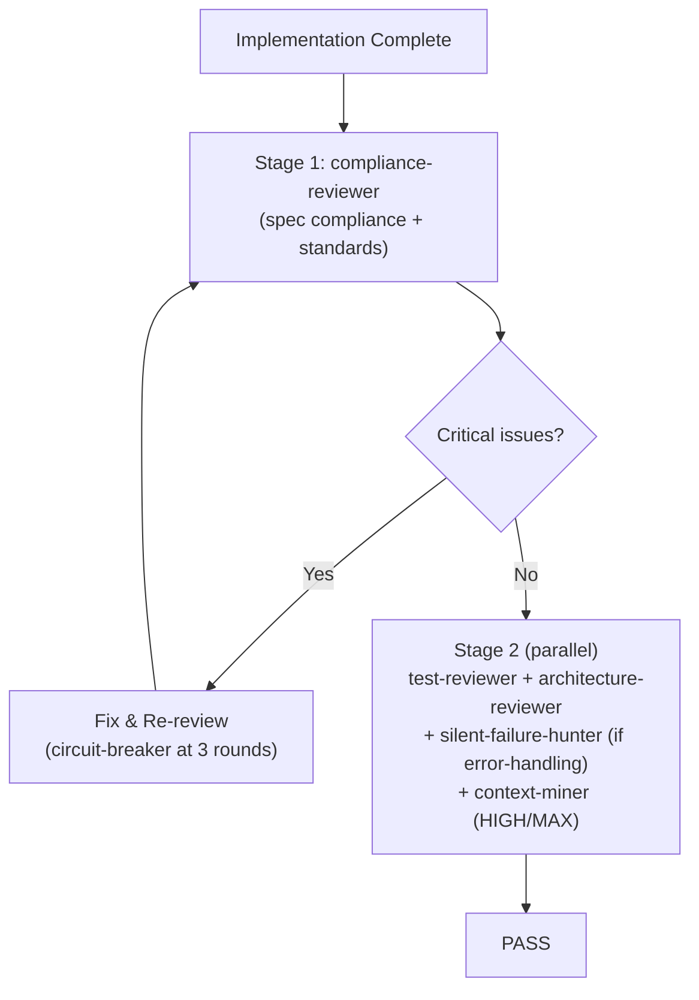
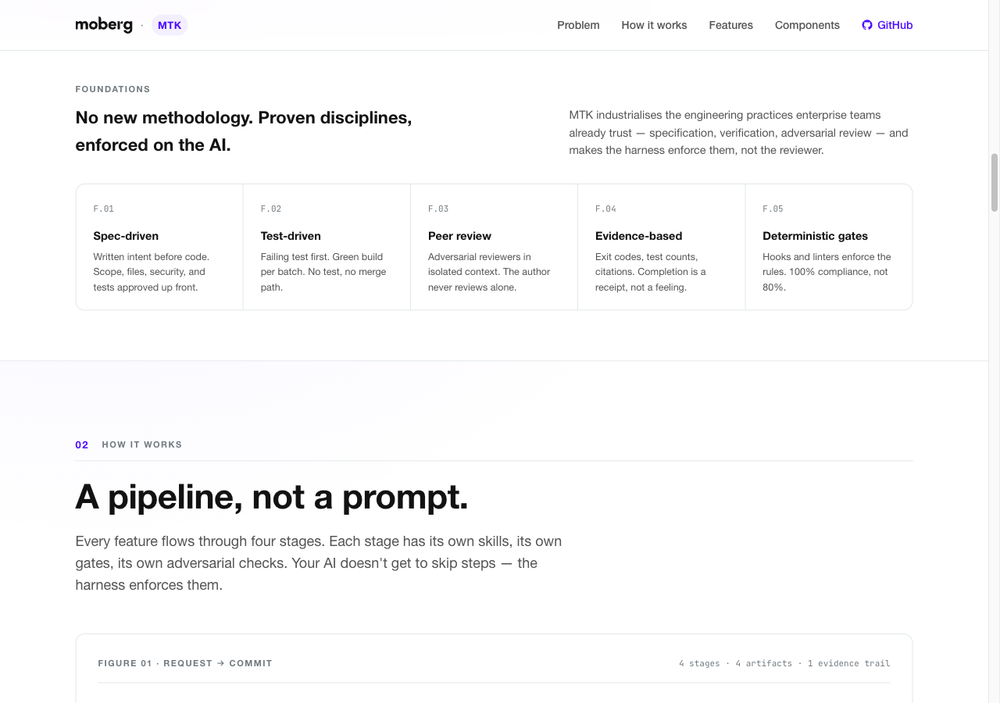

<div align="center">

# MTK — Moberg Toolkit for AI-Assisted Engineering

### Turn Claude Code into a disciplined engineering partner

**A Claude Code plugin that enforces your team's coding standards, security policies, and review discipline on every AI-generated line — while keeping ~103K tokens of that intelligence *out* of your context until the moment it's needed. Language-agnostic workflows with pluggable tech stacks for .NET, Python, and TypeScript.**

[](https://github.com/moberghr/mtk-agent-toolkit/releases)
[](https://moberghr.github.io/mtk-agent-toolkit/)
[](https://claude.ai/code)
[](https://dotnet.microsoft.com/)
[](https://python.org/)
[](https://www.typescriptlang.org/)
[](#proof-its-real)
[](LICENSE)

**[moberghr.github.io/mtk-agent-toolkit](https://moberghr.github.io/mtk-agent-toolkit/)** — the MTK website.

[Quick Start](#quick-start) · [Why MTK](#what-you-get) · [Token Economics](#token-economics) · [How It Works](#how-it-works) · [Examples](#examples) · [Skills](#skills) · [Review Agents](#review-agents) · [Proof](#proof-its-real) · [FAQ](#faq)

<br/>

<a href="https://moberghr.github.io/mtk-agent-toolkit/"></a>

<sub><i>Every feature flows through four gated stages. Each stage emits an auditable artifact. No gate, no merge.</i></sub>

</div>

---

## The Problem

AI code assistants generate code that compiles but silently violates your team's standards. Missing auth checks, unaudited state mutations, N+1 queries, tests that assert nothing, style drift from one end of the codebase to the other. In serious software — where code touches real money, real users, or regulated data — *"it works"* is not enough.

Most teams respond by writing a big `CLAUDE.md` or `.cursor/rules`. But **instructions are advisory.** AI assistants follow them about 80% of the time. The other 20% is where production incidents live — and it's exactly where the model cuts a corner under pressure: disables a test, swallows an error, skips the security check, claims "done" without proof.

**MTK makes the rules non-negotiable and the evidence mandatory** — and it does it without drowning your context window.

## What You Get

MTK closes the 80% gap with four things working together:

- **Workflow enforcement** — a real spec → plan → TDD → review → evidence-gate pipeline, not a single hopeful prompt.
- **Adversarial review agents** — six specialist reviewers that hunt for real problems in isolated context, rewarded for finding issues, not for approving.
- **Deterministic linters** — 37 pattern rules that catch secrets, SQL injection, and LLM reward-hacking at confidence 100, before the AI review even starts.
- **Evidence gates** — no "done" claim survives without cited build output, test counts, and exit codes produced *after* the last edit.

| Without MTK | With MTK |
|:---|:---|
| AI generates code, you review it manually | AI plans, implements in batches, tests, reviews itself adversarially, then reports with evidence |
| `CLAUDE.md` rules followed ~80% of the time | Critical rules enforced by hooks — 100% deterministic, every time |
| "Tests pass" with no proof | Build output, exit codes, and pass/fail counts cited in every completion — and re-armed the instant a new edit lands |
| Security checks happen if you remember to ask | `security-and-hardening` activates automatically on auth / secrets / audited-state changes |
| Review is one prompt: "review this code" | Two-stage pipeline: spec-compliance gate first, then test + architecture specialists in parallel |
| Findings are vague: "consider adding tests" | Structured JSON — severity, confidence score, rule citation, `file:line` — filtered below confidence 80 so there's no noise |
| Generated rules are trusted blindly | Every generated claim is grep-verified against your code; the ones it can't prove are downgraded in place |
| The toolkit inflates your context window | Only ~3,842 tokens load per session; ~103K tokens stay out of always-on context until relevant |

> **MTK is not a replacement for human review.** It's a rigorous first pass that catches the mechanical stuff — so your senior engineers spend their attention on design, product, and the judgment calls an AI can't make.

---

## Quick Start

**Install (Claude Code plugin marketplace):**

```bash
# 1. Install the plugin
/plugin marketplace add moberghr/mtk-agent-toolkit
/plugin install mtk@moberghr

# 2. Bootstrap your repo (one-time)
/mtk-setup

# 3. Ship a feature — full pipeline
/mtk add user notification preferences with email and SMS channels

# 4. Quick fix — scope-guarded, self-escalates if it grows
/mtk fix null reference in PaymentProcessor when amount is zero

# 5. Before every commit
/mtk review before commit
```

`/mtk-setup` detects your tech stack (`.sln` → .NET, `pyproject.toml` → Python, `package.json` → TypeScript), audits the architecture, pulls your team's coding guidelines, and generates a project-specific `CLAUDE.md`. From there, `/mtk <anything in plain English>` routes to the right workflow.

### Which command should I use?

There are just **two commands to remember** — `/mtk` and `/mtk-setup`. Everything else is a workflow the router picks for you.

| I want to… | Run this | Under the hood |
|:---|:---|:---|
| Bootstrap a fresh repo | `/mtk-setup` | Detects stack, audits architecture, generates `CLAUDE.md` + `.claudeignore` |
| Ship a new feature | `/mtk <description>` | spec → plan → TDD batches → two-stage review → evidence gate |
| Fix a bug (1–3 files) | `/mtk fix <what's broken>` | Scope-guarded; self-escalates to `implement` if scope grows |
| Review before committing | `/mtk review before commit` | Deterministic linters + AI judgment in one pass |
| See what MTK has loaded | `/mtk status` | Active stack, references, hooks, domain packs |
| Check toolkit usage trends | `/mtk health` | Usage-pulse report from `.claude/analytics.json` |
| Health-check the install | `/mtk-doctor` | PASS/WARN/FAIL — deprecated models, version sync, hook integrity, always-on token cost |
| Re-audit architecture | `/mtk-setup --audit` | Refreshes `architecture-principles.md` |
| Reconcile docs ↔ code | `/mtk-setup --refresh` / `--converge` / `--check` | Keep docs honest about code, or code honest about docs — see [Setup that keeps proving itself](#setup-that-keeps-proving-itself) |
| Promote a personal lesson | `/promote-lesson` | Move a lesson into the team-wide `tasks/lessons.md` (+ optional contribute-back PR) |

### What runs on session start

When Claude Code starts a session with this plugin enabled, the `SessionStart` hook runs **locally** and:

- Surfaces a session-recovery message if there are in-progress specs (`docs/specs/`), plans (`docs/plans/`), or incomplete `tasks/todo.md` items.
- Runs an advisory toolkit version-drift check.
- Compiles the bundled MCP server *only if* `node` is present and the source changed — a local build of code shipped in the repo, no network, no package install. The MCP server is optional; every skill has a bash fallback.

No network calls. All writes stay inside the working directory. Disable tier-2 (skill-invoking) hooks with `MTK_HOOKS_TIER2=0` in `.claude/settings.local.json`.

---

## Token Economics

> **MTK ships 43 skills, 6 agents, and 50 reference documents — yet only ~3,842 tokens load into every session. The other ~103,000 tokens stay out of always-on context (~89K deferred behind progressive disclosure, ~14K of review offloaded to isolated subagents) until the exact moment they're relevant.**

Most "big" AI toolkits pay for their power by inflating your context window: a giant `CLAUDE.md`, a wall of always-on rules, review logic that clutters the main thread. MTK is engineered the opposite way — to keep tokens **out** of context. See exactly where they go, computed from your own installed files:

```bash
bash scripts/mtk-savings.sh
```

```
MTK context footprint & savings  (approx, ~4 chars/token)
════════════════════════════════════════════════════════════

Always-on — loaded into EVERY session:
  skill descriptions       6407 chars  ~  1601 tok  (43 skills)
  CLAUDE.md                6388 chars  ~  1597 tok
  rules/INDEX.md           1559 chars  ~   389 tok
  agent descriptions       1016 chars  ~   254 tok  (6 agents)
  ── always-on floor              ~  3842 tok

Kept OUT of always-on by progressive disclosure (load only when relevant):
  references             237603 chars  ~ 59400 tok  (50 files, glob-gated)
  rule bodies             15954 chars  ~  3988 tok  (path-gated)
  manifest.json          102659 chars  ~ 25664 tok  (MCP-gated, never inlined)
  ── deferred total               ~ 89054 tok  ← would be always-on if inlined into CLAUDE.md

Review offloaded to isolated subagent context:
  6 agent bodies          55600 chars  ~ 13900 tok  (never enters the main thread)

Summary: MTK keeps ~102954 tok out of your always-on context (deferred + review offload),
compresses tool output on demand, and holds the always-on floor to ~3842 tok/session.
```

Every number is derived from on-disk files — nothing is fabricated from telemetry MTK doesn't collect. Four levers make it work:

### 1 · Progressive disclosure — load one thing at a time

The 43 skill *bodies* total ~129K tokens, but only **one loads when its skill actually runs**. Rule bodies sit behind a <60-line `rules/INDEX.md` "wake-up layer" and load only when their decision/topic/scope axes — or file globs — match the task in front of you. All 50 reference docs are glob-gated via manifest `applyTo` arrays: edit a `DbContext` and the EF Core checklist loads; edit a controller and it doesn't. **Nothing loads "just in case."**

### 2 · Review offloaded to isolated context

The six review agents (~13,900 tokens of adversarial logic) run in **forked subagent context** (`context: fork`). They read the diff in their own window and return only structured findings. The heavy review and security machinery never touches your main conversation.

### 3 · On-demand output compression

Noisy build logs, test runs, and JSON dumps are the quiet context killers. Pipe them through the shipped compressor to reclaim most of their tokens while keeping every failure and summary:

```bash
dotnet test 2>&1 | bash scripts/mtk-compress.sh        # auto-detect: tests / logs / json / html
bash scripts/mtk-compress.sh stats                     # session + all-time tokens reclaimed
```

Five content-aware modes preserve what matters (test failures, error lines, summaries) and elide what doesn't (thousands of PASS lines, long arrays, boilerplate). A `PostToolUse` hook even **flags large Bash output that bypassed compression** and tells you which mode would have reclaimed the tokens — so the savings happen even when you forget.

### 4 · A baseline that can't silently creep

- **Cache-stable prefix** — the always-loaded `CLAUDE.md` carries no per-release version banner, so the prompt-cache stays warm across releases.
- **MCP-gated manifest** — the ~25,664-token `manifest.json` is served on demand through the bundled MCP server, never inlined into context.
- **Budget enforced in CI** — `validate-toolkit.sh` caps each skill description at 200 chars and the whole catalogue at ~1,750 tokens, and prints the running total on every run. Because Claude Code reserves only ~1% of context for skill metadata, this protects routing quality even on smaller-context models.
- **`.claudeignore` at setup** — bootstrap generates a stack-aware ignore file so Claude Code natively keeps dependency and build directories out of search and reads.
- **A context-budget hook** nudges a clean handoff once a session passes 60% of the window — so quality resets at a boundary you choose, not a forced mid-edit compaction.

**The payoff:** run many plugins together and MTK stays a good citizen. Its always-on cost is under 4K tokens, and `mtk-doctor` prices that cost for you (`/mtk-doctor` → CONTEXT category).

---

## How It Works

MTK isn't a prompt — it's a pipeline. One command drives a spec-to-ship sequence where every phase has explicit exit criteria and hands off to a dedicated skill.


```mermaid
graph LR
    CMD["/mtk &lt;feature&gt;"] --> P0
    subgraph Phases
        direction TB
        P0["Phase 0<br/>context-engineering"] --> P0b
        P0b["Phase 0.5<br/>brainstorming<br/><i>if approach unclear</i>"] --> P1
        P1["Phase 1<br/>spec-driven-development"] --> P2
        P2["Phase 2<br/>planning-and-task-breakdown"] --> GATE
        GATE["Phase 2.5<br/>APPROVAL GATE"] --> P3
        P3["Phase 3<br/>incremental-implementation<br/>+ TDD + security-hardening"] --> DRIFT
        DRIFT["Phase 3.5<br/>spec-drift-detection"] --> P4
        P4["Phase 4<br/>two-stage review"] --> P5
        P5["Phase 5<br/>code-simplification"] --> P6
        P6["Phase 6<br/>verification + lessons"]
    end
```

A few things make this more than a checklist:

- **A human approval gate you can't skip (Phase 2.5).** Before any code is written, MTK prints the full todo, batch breakdown, and gate sequence to your terminal and *stops*, offering five choices: approve & run, approve interactively, edit first, revise, or show the full plan. Until you answer, source edits are blocked. Approval is a decision you make — never one the model infers from your original request.
- **Ceremony scales to blast radius.** A scored rubric sizes rigor (LIGHT / STANDARD / HIGH / MAX) from batch count, files touched, security impact, public contracts, and breaking-change status. A small fix gets a light pass; a breaking multi-batch auth change gets the full apparatus. A hard floor forces at least HIGH whenever the change hits ≥3 batches, ≥6 files, or any security impact.
- **Large features run one fresh subagent per batch,** each returning a typed JSON result (files, build, tests, deviations). An ack-only or unparseable "done!" is recorded *inconclusive* and respawned — never laundered into a pass.
- **Five named, fail-closed gates** (`plan_trust`, `phase_exit`, `failure_stop`, `memory_sync`, `skill_precedence`) are the only legal places to advance, retry, or stop — and a missing gate event counts as drift.
- **Orchestration state lives on disk** (`.mtk/workflows/{uuid}.json` + an append-only event log), so a run survives compaction and crash and resumes in a fresh session with zero chat history.
- **A remediation circuit-breaker** escalates to a human on the third fix iteration — or the moment the review score stops improving — so automated fixing never grinds forever.

### The `/mtk` router

You don't memorize skill names. You describe what you want:

```bash
/mtk add user auth                 → implement
/mtk fix the null check            → fix
/mtk review before commit          → pre-commit-review
/mtk what's loaded?                → context-report
/mtk toolkit health                → toolkit-health
/mtk help                          → lists all routed workflows
```

---

## Examples

### What a review finding looks like

Reviews output structured findings — not vague suggestions:

```
| # | Severity | Confidence | Rule | File | Issue |
|---|----------|------------|------|------|-------|
| F001 | critical | 97 | §1.1 / Security — Auth | src/Api/PaymentsController.cs:34 | New endpoint missing [Authorize] attribute |
| F002 | warning | 88 | §2.3 / Architecture — Layers | src/Api/PaymentsController.cs:41 | Business logic in controller; move to handler |
| F003 | warning | 85 | §5.2 / EF Core — Projections | src/Data/PaymentRepository.cs:22 | Loading full entity for read-only display; use Select() |
```

```json
{
  "verdict": "NEEDS_CHANGES",
  "threshold": 80,
  "summary": { "critical": 1, "warning": 2, "suggestion": 0, "filtered_below_threshold": 1 },
  "findings": [
    {
      "id": "F001",
      "severity": "critical",
      "confidence": 97,
      "rule": "§1.1 / Security — Auth",
      "source": "ai",
      "decision_origin": "system-inferred",
      "file": "src/Api/PaymentsController.cs",
      "line": 34,
      "rationale": "POST /api/payments/retry has no [Authorize] attribute. All payment endpoints require authenticated access.",
      "suggested_fix": "Add [Authorize(Policy = \"PaymentOperator\")] to the controller action."
    }
  ]
}
```

Every finding carries a `confidence` score (50–100), a `source` (`ai`, `linter`, `analyzer`, `context`, or `drift`), a `decision_origin` for provenance, and a citation to the exact rule violated. A curated 7-category false-positive exclusion list drops non-findings *before* scoring, and findings below the threshold (default 80) are filtered out — so what surfaces is real risk, not preference.

### What the deterministic linter catches

Before the AI review even starts, `pre-commit-linters.sh` scans only the added diff lines. The pack is hierarchical — `core` patterns apply everywhere, then `stack`, `domain`, and `project` packs layer on top:

```
[LINTER] CRITICAL  core/secrets:SECRET-HARDCODED   Hardcoded credential
   > private const string DbPassword = "Prod$ecret123";

[LINTER] CRITICAL  stack-dotnet:SQL-INTERPOLATION   Raw SQL with string interpolation
   > var users = db.Users.FromSqlRaw($"SELECT * FROM Users WHERE Name = '{name}'");

[LINTER] WARNING   core/slopwatch:SLOP-SKIP-TEST    Test disabled — masking a failure
   > [Skip("flaky")]

[LINTER] WARNING   domain-finance:FLOAT-MONEY       float/double for monetary value
   > public double Amount { get; set; }
```

The **slopwatch** pack specifically hunts LLM reward-hacking — disabled tests, suppressed warnings, empty catch blocks, `Assert.True(true)`. These are the exact shortcuts an AI takes to claim "done" without doing the work.

### What spec-drift detection looks like

After implementation and *before* review, MTK compares what you built against what you approved:

```
Drift Analysis: docs/specs/2026-04-14-payment-retry.json

  Files in spec but NOT touched:     tests/PaymentRetryTests.cs (CRITICAL)
  Files touched but NOT in spec:     src/Helpers/RetryHelper.cs (CRITICAL — unapproved scope)
  security_impact declared as "none": but src/Auth/PaymentPolicy.cs was modified (CRITICAL)

Verdict: NEEDS_CHANGES — implementation drifted from approved spec
```

### A full `/mtk <feature>` session

```
> /mtk add payment retry logic for failed card transactions

Phase 0: Loading context...
  Tech stack: dotnet | Build: dotnet build | Test: dotnet test
  Loaded: CLAUDE.md, coding-guidelines, security-checklist

Phase 1: Writing spec...
  Spec: docs/specs/2026-04-14-payment-retry.md
  Change manifest: 4 files (2 new, 2 modify) | Security impact: payments, audit_trail
  Public contracts: POST /api/payments/{id}/retry | Rigor: HIGH

Phase 2.5: Approval gate...
  > [A] Approve & run until done  [I] Approve (interactive)  [E] Edit first  [R] Revise  [S] Show full plan
> A

Phase 3: Implementing...
  Batch 1: PaymentRetry.cs + PaymentRetryTests.cs        (dotnet test: 47 passed, 0 failed)
  Batch 2: RetryPaymentHandler.cs + handler tests        (dotnet test: 52 passed, 0 failed)
  Batch 3: PaymentsController.cs + auth                   (dotnet test: 55 passed, 0 failed)

Phase 3.5: Spec-drift check...  All files match · contracts match · security impact matches
Phase 4: Review...  Stage 1 compliance: 0 critical, 1 warning | Stage 2 test + architecture: PASS
Phase 5: Simplification...  Removed unused RetryResult.Pending variant

Phase 6: Done
  dotnet build: exit 0, 0 warnings
  dotnet test: 55 passed, 0 failed, 0 skipped   ← evidence cited, gate satisfied
```

---

## Setup that keeps proving itself

Most AI-setup tools stop at generation: they emit a `CLAUDE.md`, a rules pack, or an agent bundle and trust it. **MTK's distinguishing move is that it never trusts its own output** — and it stays true long after day one.

- **Grep-verified claims.** Every generated rule carries an evidence anchor. `verify-claims.sh` re-greps each anchor against your working tree and **downgrades in place** anything it can't prove: `[EXTRACTED]` → `[INFERRED:0.5 unverified]`, `[ENFORCED]` → `[ASPIRATIONAL unverified]`. Hallucinated architecture never ships silently.
- **Verified commands.** The build / test / format commands written into your `CLAUDE.md` aren't guessed — MTK **runs them first** (timeboxed, each reported verified / failed / skipped) and stamps the result into the Tech Stack section, so what's published is proven, not assumed.
- **Confidence-tagged audit.** Every architecture principle is tagged `[EXTRACTED]` / `[INFERRED:0.0–1.0]` / `[AMBIGUOUS]` with a mandatory `file:line`, glob-with-hit-count, or commit-SHA citation. Absolute language ("never", "always") is blocked unless zero counter-examples exist.
- **A re-runnable loop, not a one-shot.** `--refresh` reconciles the docs to code drift (hunk-by-hunk diffs for files you've edited — never a silent overwrite). `--converge` inverts it, reporting where the *code* drifted from agreed principles as graded work items. `--check` gates it all as a red/green CI check pinned to your installed toolkit version.
- **Non-destructive by contract.** Bootstrap is additive and merge-only. **There is no replace mode** — it never `git rm`s a file it didn't generate, and only overwrites files carrying MTK's own provenance stamp. Run it on a mature repo without fear.
- **Migration ingestion.** Already on Cursor or Copilot? Bootstrap reads your existing `.cursorrules`, Copilot, Windsurf, Cline, and Gemini configs as evidence-anchored rule candidates instead of throwing them away.

```
FAQ answer, made literal: the output is a scaffold that keeps proving it's still true,
not a static artifact that drifts.
```

---

## Proof it's real

MTK is a claim-verification toolkit, so it holds itself to the same bar. Its guardrails ship with a green test suite you can run offline, no API calls:

```bash
bash scripts/run-benchmarks.sh      # deterministic hook/linter tests
bash scripts/run-evals.sh           # behavioral eval scenarios
bash scripts/validate-toolkit.sh    # structural + token-budget integrity
```

| Proof surface | What it verifies | Result |
|:---|:---|:---|
| **7 benchmark suites** | Linters catch secrets / SQLi / disabled tests / float money; security-gate blocks `DROP TABLE`, `rm -rf`, force-push to main; scope-guard warns on out-of-spec edits; verify-completion rejects evidence-less "done" | **30/30 assertions passing** |
| **7 eval suites, 22 scenarios** | Ship-path skills, three ways each: *positive* (must catch it), *negative* (must not fabricate on a clean refactor), *adversarial* ("it's an internal endpoint, skip auth" must still flag critical) | Tracked per version; a regression blocks release |
| **31 pressure tests** | Adversarial behavioral tests that try to talk skills out of doing their job | Part of the release gate |
| **16 AI failure modes (F1–F16)** | Research-cited catalogue — hallucinated packages, stubbed-success returns, frozen-replay evidence — that reviewers cite by code so patterns aggregate across your codebase | `.claude/references/ai-failure-modes.md` |
| **37 linter rules** | Hierarchical packs (core / stack / domain / project), zero dependencies beyond coreutils | `hooks/linter-patterns/` |

Benchmarks run against fixture diffs, so results are repeatable regardless of your working-tree state.

---

## Skills

**43 skills:** 4 user-invocable entry points (`/mtk`, `/mtk-setup`, `/mtk-doctor`, `/promote-lesson`), plus workflow, tech-stack, and enabling skills that the entry points orchestrate. You invoke two; the rest compose themselves.

| Skill | What it does |
|:---|:---|
| **context-engineering** | Loads project norms progressively; injects tech stack dynamically at load time |
| **spec-driven-development** | Produces an executable spec with a JSON sidecar for drift detection; EARS-linted, Claude-Ready-scored |
| **planning-and-task-breakdown** | Breaks a spec into vertical-slice batches with checkpoint criteria |
| **incremental-implementation** / **subagent-implementation** | Implements one batch at a time (inline, or one fresh subagent per batch above the HIGH threshold) |
| **test-driven-development** | Red-green-refactor; language-agnostic |
| **debugging-and-error-recovery** | Reproduce first, then fix root cause within scope |
| **source-driven-development** | Verify SDK/framework behavior from authoritative sources before implementing |
| **code-review-and-quality** | Adversarial review across 6 axes; isolated context (`context: fork`, `effort: max`) |
| **security-and-hardening** | Trust-boundary analysis, audit-trail verification; isolated context |
| **spec-drift-detection** | Compares implementation against the spec sidecar; flags unapproved scope |
| **verification-before-completion** | Requires fresh, criterion-by-criterion evidence before any "done" claim |
| **code-simplification** | Behavior-preserving cleanup after verification passes |
| **correction-capture** / **golden-path-capture** / **lesson-mining** | Three paths that feed one structured, cross-session learning store |
| **handoff** | Captures session state for recovery across context boundaries |
| **context-report** / **toolkit-health** | Diagnostics: active configuration; historical usage pulse |
| **writing-skills** | Meta-skill for authoring new skills with pressure tests |

Every skill follows a standardized anatomy with **anti-rationalization built in** — a "Common Rationalizations" table that pre-rebuts the exact excuses an AI uses to skip steps:

| Rationalization | Reality |
|:---|:---|
| "This is an internal endpoint" | Internal boundaries move. Security requirements don't disappear because something feels internal. |
| "The framework probably handles that" | Probably is not a security control. Verify the behavior. |
| "This doesn't look like regulated data" | If it affects audited state or downstream consumers, it's in scope. |

---

## Review Agents

Six adversarial reviewers, each a single narrow lens, all read-only and running in isolated forked context. Stage 1 must pass before Stage 2 runs — if the code doesn't match the approved spec, quality review is wasted effort.


```mermaid
flowchart TD
    DONE["Implementation Complete"] --> S1
    S1["Stage 1: compliance-reviewer<br/>(spec compliance + standards)"]
    S1 --> CHECK1{Critical issues?}
    CHECK1 -- Yes --> FIX1["Fix & Re-review<br/>(circuit-breaker at 3 rounds)"]
    FIX1 --> S1
    CHECK1 -- No --> S2["Stage 2 (parallel)<br/>test-reviewer + architecture-reviewer<br/>+ silent-failure-hunter (if error-handling)<br/>+ context-miner (HIGH/MAX)"]
    S2 --> PASS["PASS"]
```

| Agent | Lens |
|:---|:---|
| **compliance-reviewer** | Stage 1 — hostile senior-reviewer persona (pinned to Opus): auth, secrets, audit trails, parameterized queries, input validation, slice boundaries, test coverage. Must surface real findings or justify a clean bill. |
| **silent-failure-hunter** | Stage 2 (conditional) — swallowed catches, silenced promises, optimistic fallbacks, suppressed diagnostics, test erosion. Dispatched when the diff touches error-handling tokens; always runs at MAX rigor. |
| **test-reviewer** | Stage 2 — coverage gaps, weak assertions, wrong test providers, missing edge/error paths. |
| **architecture-reviewer** | Stage 2 — dependency direction, layer splits, naming consistency, unjustified abstractions, cross-layer leaks. |
| **context-miner** | Stage 2 (HIGH/MAX) — mines git history, PR/issue threads, and prior lessons for organizational context the diff missed: prior reverts, related open issues, recorded decisions. |
| **plan-gap-reviewer** | Pre-approval — anti-anchored plan critique, forbidden from reading lessons, prior reviewer output, or the planner's rationale, so it challenges the plan cold. |

Reviews score five dimensions (correctness, security, test coverage, architecture fit, simplicity) 1–10, each requiring a `file:line` evidence quote — a score without evidence is treated as 0, and any dimension below 7 blocks the merge. All agents can also report **BLOCKED** (files missing) or **NEEDS_CONTEXT** (too complex to review) — a clear escalation beats a low-confidence rubber stamp.

---

## Under the hood

<p align="center">
  
</p>

<sub><i>No new methodology. Proven disciplines — specification, verification, adversarial review — made enforceable by the harness itself.</i></sub>

### Design principles

| Principle | How it works |
|:---|:---|
| **Evidence over assertion** | No task is complete without cited build output, test counts, and exit codes. A Stop hook enforces it, and re-arms every criterion the instant a new edit lands. |
| **Security as a design constraint** | Embedded in planning, implementation, and review — not a final polish phase. Runs in isolated context. |
| **Progressive disclosure** | References, rules, and skill bodies load when needed, not all at once. See [Token Economics](#token-economics). |
| **Anti-rationalization** | Every skill counters the exact excuses an AI uses to skip steps. |
| **Deterministic + AI layering** | Linters catch known-bad patterns at confidence 100; AI handles judgment. Both feed one finding schema. |
| **Dynamic context injection** | Skills use `` !`command` `` blocks to inject runtime state (tech stack, branch, diff stats) at load time. |
| **Scope enforcement** | A real-time scope guard warns when an edit falls outside the approved change manifest — before it lands. |
| **Learning persistence** | Corrections accumulate across sessions; recurring patterns get promoted to permanent rules. |

### Component model

```
ENTRY POINTS (4 user-invocable skills)
  /mtk · /mtk-setup · /mtk-doctor · /promote-lesson
      ↓ orchestrate
43 SKILLS  — language-agnostic workflows + 3 tech-stack packs + enabling skills
      ↓ route to
6 REVIEW AGENTS  — compliance · silent-failure-hunter · test · architecture · context-miner · plan-gap
      ↓ backed by
50 REFERENCES  — 32 shared (security, testing, performance, finance, AI failure modes, review schema, …)
                 + 6 per stack × 3 stacks (coding-guidelines, ORM checklist, framework patterns, …)
      ↓ enforced by
14 HOOKS across 7 lifecycle events  — SessionStart · PreToolUse · PostToolUse · PreCompact
                                       · PostCompact · UserPromptSubmit · Stop
      ↓ validated by
7 BENCHMARK SUITES (30/30) · 7 EVAL SUITES (22 scenarios) · 31 PRESSURE TESTS
```

### Hooks & enforcement

Hooks are deterministic — they fire every time, unlike advisory `CLAUDE.md` instructions.

| Hook | Event | What it does |
|:---|:---|:---|
| **session-start** | SessionStart | Session recovery; compiles the bundled MCP server on first use if `node` is present |
| **security-gate** | PreToolUse (Bash) | Blocks destructive ops: DB drops, force-push to main, `rm -rf` on broad paths |
| **read-guard** | PreToolUse (Read) | Blocks secret-bearing files (`.env`, `*.pem`, `id_rsa`, …) from entering context — no self-approval path |
| **scope-guard** | PreToolUse (Edit/Write) | Warns when an edit falls outside the active spec's `change_manifest` |
| **context-budget** / **compress-monitor** | PostToolUse | Tracks files/edits/ops and nudges a reset past 60%; flags large uncompressed output |
| **post-compact** | PostCompact | Re-injects tech stack, active specs/plans, tasks, and handoff artifacts after auto-compaction |
| **verify-completion** | Stop | Rejects "done" claims lacking fresh, cited command output |
| **capture-learnings** / **session-analytics** | Stop | Prompts lesson capture after substantial sessions; persists usage stats |

### Tech stacks

Language-agnostic workflow, stack-specific knowledge. Adding a language means writing one tech-stack skill and its references — the workflow skills work unchanged.

| Stack | Detection | Build | Test | ORM & Frameworks |
|:---|:---|:---|:---|:---|
| **.NET** | `*.sln`, `*.csproj`, `global.json` | `dotnet build` | `dotnet test` | EF Core (async, projections, `AsNoTracking`); MediatR/CQRS, minimal APIs |
| **Python** | `pyproject.toml`, `requirements.txt` | `mypy .` / `pyright` | `pytest` | SQLAlchemy 2.0, Django ORM; FastAPI, Django |
| **TypeScript** | `package.json`, `tsconfig.json` | `<pm> run build` | `<pm> test` | Prisma, Drizzle, TanStack Query; React, Next.js, Tauri, Node |

TypeScript auto-detects the package manager (bun > pnpm > yarn > npm) from lockfiles.

---

## The learning loop

The same mistake never has to be corrected twice. Three capture paths feed one structured store with five-layer retrieval (proximity / recurrence / severity / validity / phase):

- **correction-capture** — the engineer says "no, not like that."
- **golden-path-capture** — the model resolves its own repeated failure and records the path.
- **lesson-mining** — a reject-by-default sweep of past session transcripts (suggest-only).

Matured lessons promote to team-wide rules via `/promote-lesson`, which can open a **fail-closed contribute-back PR** to the toolkit: CI whitelists only `lessons/contributed/`, caps it at 2 files / 20 KB, scans for secrets and prompt injection, then *labels* it — with read-only permissions, so it structurally cannot merge or write.

And because over-deference is its own failure mode, MTK computes a **sycophancy index** — π = approved / (approved + modified + rejected) over every finding's `decision_origin` tag. When π ≥ 0.70, `toolkit-health` warns that the model's recommendations are being accepted without enough pushback. Over-deference, made measurable.

---

## Configuration

<details>
<summary><b>Path-scoped references</b></summary>

References declare `applyTo` glob arrays in the manifest. When `context-engineering` runs, it matches touched files and loads only relevant references:

```json
{
  "references/dotnet/ef-core-checklist.md": {
    "applyTo": ["**/*DbContext.cs", "**/Entities/**", "**/Migrations/**"],
    "stack": "dotnet"
  }
}
```

Edit a controller and the EF Core checklist doesn't load. Edit a `DbContext` and it does.
</details>

<details>
<summary><b>Domain packs</b></summary>

Create `.claude/domains` with a domain name (e.g. `finance`) to activate sector-specific rules. The finance pack adds linter patterns for float/double money, unaudited mutations, and PII exposure, plus loads `domain-finance.md`. Finance ships as the *worked example* — copy it to `domain-<yours>.md` for healthcare, legal, or any regulated domain.
</details>

<details>
<summary><b>Protected files (never overwritten by updates)</b></summary>

`CLAUDE.md` · `.claude/settings.local.json` · `.claude/review-config.local.json` · `tasks/lessons.md` · `.claude/references/architecture-principles.md`
</details>

---

## How It Compares

| Approach | What you get | What you don't get |
|:---|:---|:---|
| **Just `CLAUDE.md`** | Advisory rules, ~80% adherence | No enforcement, no workflow, no review |
| **`CLAUDE.md` + rules/** | Scoped rules, better adherence | No structured review, no evidence gates, no spec tracking |
| **CodeRabbit / SaaS review** | Mature review with many linters | External service, monthly cost, no workflow enforcement, no spec tracking |
| **Most AI-setup tools** | A generated config, once | No claim verification, no re-runnable loop, no enforcement runtime |
| **MTK** | Workflow enforcement, adversarial review, deterministic linters, evidence gates, spec-drift, claim verification, a re-runnable setup loop, and a token-lean footprint | Full runtime enforcement requires Claude Code; other tools get exported standards and routing guidance |

---

## FAQ

<details>
<summary><b>Do I need Claude Code to use this?</b></summary>

Yes. MTK is a Claude Code plugin — hooks, skill routing, session recovery, and the bundled MCP server rely on Claude Code's runtime. The reference documents are useful reading on their own, and MTK generates native config for Cursor, Copilot, Windsurf, Gemini, and Cline, but the workflow *enforcement* runs under Claude Code.
</details>

<details>
<summary><b>Does all this slow the AI down?</b></summary>

Per-feature wall-clock is slightly longer. Net throughput is dramatically higher because the drift tax — rework, production incidents, review rounds, "that looked fine to me" postmortems — drops. And thanks to progressive disclosure, the discipline costs you almost nothing in context (~3,842 tokens/session).
</details>

<details>
<summary><b>How is this different from writing a CLAUDE.md manually — or from other setup tools?</b></summary>

Three things: (1) `/mtk-setup` generates `CLAUDE.md` from your *actual codebase*, not guesswork; (2) MTK adds workflow enforcement (planning, TDD, review, evidence gates), not just rules; (3) every generated claim is **grep-verified** against your code and downgraded if it can't be proven, and setup is a re-runnable loop (`--refresh` / `--converge` / `--check`), not a one-shot dump that drifts.
</details>

<details>
<summary><b>Is this finance-specific?</b></summary>

No. MTK is tech-stack-agnostic and domain-flexible. A finance supplement ships with it (born in a fintech team), but it's explicitly written as an example to copy for healthcare, infrastructure, or any regulated domain. The pitch is *serious software*, whatever your sector.
</details>

<details>
<summary><b>Can I use it on an existing codebase, and alongside other plugins?</b></summary>

Yes to both. `/mtk-setup` is additive and merge-only — there's no replace mode, and it ingests your existing Cursor/Copilot/Windsurf configs rather than discarding them. Its permissions and hooks merge with other plugins', and its command names are unique to avoid conflicts.
</details>

<details>
<summary><b>What is the slopwatch linter pack?</b></summary>

It catches LLM reward-hacking — code changes that make quality metrics look good without doing real work: `[Skip]` on failing tests, empty catch blocks, `Assert.True(true)`, suppressed warnings. The exact shortcuts an AI takes to claim "done" without solving the problem.
</details>

<details>
<summary><b>How do I add a custom linter rule or skill?</b></summary>

Drop a tab-separated `.txt` file in `hooks/linter-patterns/project/` (never overwritten by updates). For skills, see [CONTRIBUTING.md](CONTRIBUTING.md): add a `SKILL.md` with the required sections, register it in `manifest.json`, and run `bash scripts/validate-toolkit.sh`.
</details>

---

## Troubleshooting

| Symptom | Fix |
|:---|:---|
| `implement` says "run setup-bootstrap first" | Run `/mtk-setup` |
| Review agent reports `BLOCKED` | Check `.claude/references/` exists; re-run `/mtk-setup` |
| "Verification gap" fires constantly | Run verification *after* your latest edit, then cite that output in your completion |
| Toolkit version mismatch / skills not loading | Run `/plugin update mtk@moberghr`, then restart the session |
| Scope guard fires on every edit | You have an active spec in `docs/specs/*.json` — update its `change_manifest` or remove it |
| Skill descriptions truncated (many plugins) | Run `/context` to see the budget; use `/skills` to disable unused plugins |

Toolkit maintainers: run `bash scripts/validate-toolkit.sh` and `bash scripts/run-benchmarks.sh` to verify structural and behavioral integrity.

---

## Contributing

See [CONTRIBUTING.md](CONTRIBUTING.md). The short version:

1. **Skills** follow the anatomy in `.claude/rules/skill-authoring.md` — anti-rationalization table + verification checklist.
2. **Review / security / verification skills** must have an eval suite in `evals/`.
3. **Every new file** must be registered in `manifest.json`.
4. **Run `bash scripts/validate-toolkit.sh`** and **`bash scripts/run-benchmarks.sh`** before pushing.

---

## Security

**What the toolkit enforces:** no hardcoded secrets; parameterized queries only; no PII in logs; audit trails for state mutations; auth on every endpoint; least-privilege IAM; input validation at boundaries.

**What the toolkit does NOT do:** access production systems; store or transmit secrets; make network requests beyond fetching pinned coding guidelines; modify files outside the working directory. Skills and external content are blocked from writing to your global `~/.claude` config.

**Reporting security issues:** contact the maintainers directly. Do not open a public issue.

---

## Uninstall

```bash
# 1. Remove the plugin
/plugin uninstall mtk@moberghr
/plugin marketplace remove moberghr/mtk-agent-toolkit

# 2. (Optional) Remove generated artifacts from your repo
rm -rf .claude/references .claude/skills .claude/agents .claude/rules
rm -f  .claude/manifest.json .claude/settings.json .claude/analytics.json
rm -f  .claude/mtk-version.json .claude/references.index .claude/tech-stack
rm -f  .mtkignore .claudeignore CLAUDE.md AGENTS.md
rm -rf docs/specs docs/plans tasks/
```

The plugin writes only inside the working directory and Claude Code's standard plugin location. `CLAUDE.md` and the rules are designed to be committed and live on independently of the plugin — step 2 is optional.

---

## Changelog

Recent releases (see [CHANGELOG.md](CHANGELOG.md) for the full history):

- **v7.24.0** — Context-efficiency: `.claudeignore` generated at setup; `mtk-doctor` CONTEXT baseline (prices always-on tokens).
- **v7.23.0** — Token-optimization wave: `mtk-savings.sh` footprint report, CI-enforced skill-description budget, cache-stable `CLAUDE.md` prefix, output compression.
- **v7.19.0** — Setup improvements: `--converge`, mechanized `setup-detect.sh`, verified-commands stamp, adaptive interview, migration ingestion, CI staleness gate.
- **v7.18.0** — Setup refresh loop: `--refresh` / `--check`, hunk-by-hunk diff-proposal contract, persisted interview answers, resumable scans.
- **v7.14.0** — Evidence and the closed loop: locked verifiable-criteria contract, gate re-arm, AI failure-modes catalogue, `read-guard`, `context-miner`, contribute-back lesson PRs.
- **v7.11.0** — Delta-spec baseline, cited constitution, rule wake-up layer.
- **v7.4.0 / v7.3.0** — Durable workflow artifacts + five named gates; subagent-driven implementation.
- **v6.1.0** — Skills-first architecture; all entry points live in `.claude/skills/`.

---

<div align="center">

**MTK — Moberg Toolkit** v7.24.0 · [Moberg d.o.o.](https://www.moberg.hr)

Built for teams that ship production code, not prototypes.

</div>
