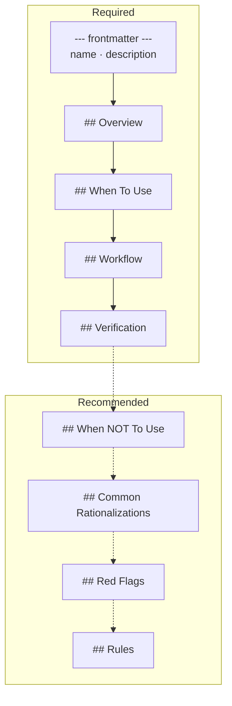
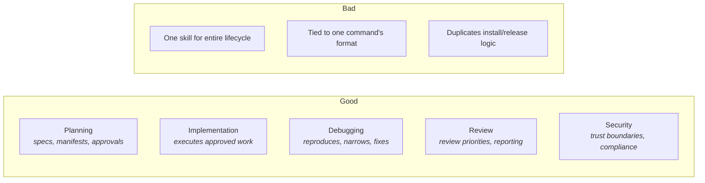

# Skill Anatomy

Definitive guide for authoring skills in this toolkit.

---

## File Location

Every skill lives in its own directory under `.claude/skills/`:

```
.claude/skills/
  skill-name/
    SKILL.md
```

---

## Required Frontmatter

```yaml
---
name: skill-name
description: What this skill does and when to use it.
---
```

- `name` must be lowercase and hyphen-separated
- `name` must match the directory name
- `description` must follow the CSO principle (see below)

---

## Structure



### Required Sections

| Section | Purpose |
|:---|:---|
| `## Overview` | What this skill ensures — one paragraph |
| `## When To Use` | Concrete trigger conditions (not a workflow summary) |
| `## Workflow` | Step-by-step process the agent follows |
| `## Verification` | How to confirm the skill was applied correctly |

### Recommended Sections

| Section | Purpose |
|:---|:---|
| `## When NOT To Use` | Prevents misapplication |
| `## Common Rationalizations` | Why agents skip steps + sharp rebuttals |
| `## Red Flags` | Signs the skill was not followed |
| `## Rules` | Numbered rules that can be cited in review findings |

---

## Authoring Principles

### 1. Process over reference text
Steps the agent executes, not paragraphs it reads.

### 2. Specific steps over vague guidance
"Run `dotnet test` and cite the exit code" > "verify tests pass."

### 3. Evidence over assumption
Every completion claim needs cited output.

### 4. Anti-rationalization for any skippable step
If an agent might rationalize skipping a step, add a Common Rationalizations entry.

### 5. Progressive disclosure
Load shared checklist material from references when possible. Load references at the phase where they are first needed, not all upfront.

### 6. Cross-reference, don't duplicate
Reference related skills instead of duplicating their workflow logic.

### 7. CSO Principle (Condition-based Skill Descriptions)

Descriptions must trigger on **conditions**, not summarize workflows. A workflow summary causes the agent to follow the description instead of reading the full SKILL.md.

| Quality | Example |
|:---|:---|
| **Bad** | "Create an executable feature spec with manifests and batches" |
| **Good** | "Use when the task is a new feature, breaking change, or multi-file change" |

Ask: *"When should this activate?"* — not *"What does this do?"*

### 8. Self-escalation
Skills and agents should explicitly permit stopping with `BLOCKED` or `NEEDS_CONTEXT` rather than producing uncertain output.

---

## Skill Boundaries



**Good boundaries:** Each skill owns one phase or concern.

**Bad boundaries:** One skill trying to do everything, or skills that exist only for a single command's output format.
